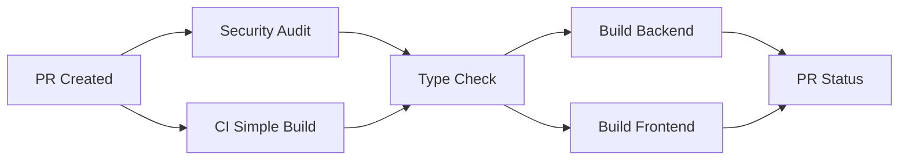
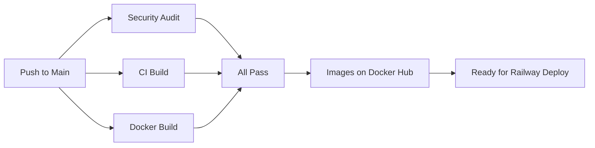
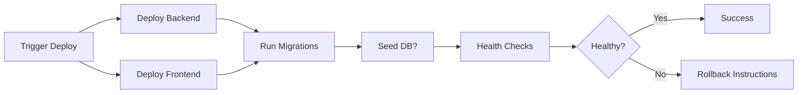

# CI/CD Pipeline Setup - Complete

**Date**: 2025-11-21
**Status**: ✅ **COMPLETE**
**Environment**: GitHub Actions + Railway

---

## Executive Summary

Comprehensive CI/CD pipeline has been set up for CitadelBuy Commerce platform with automated testing, security scanning, Docker builds, and Railway deployment capabilities.

**What's Configured**:
- ✅ Automated security audits (weekly + on push)
- ✅ Continuous integration (build + type-check)
- ✅ Docker image building (Docker Hub)
- ✅ Railway deployment workflows
- ✅ Automated dependency updates (Dependabot)
- ✅ CodeQL security scanning

---

## Workflows Overview

### 1. Security Audit Workflow

**File**: `.github/workflows/security-audit.yml`

**Triggers**:
- Weekly on Mondays at 9 AM UTC
- Every push to main/master
- Every pull request
- Manual trigger via workflow_dispatch

**What it does**:
- Runs `npm audit` on backend production dependencies
- Runs `npm audit` on frontend production dependencies
- Fails build if high-severity vulnerabilities found
- Generates security summary report

**Status**: ✅ Active and running

---

### 2. Simple CI Workflow (Current)

**File**: `.github/workflows/ci-simple.yml`

**Triggers**:
- Push to main/master/develop
- Pull requests
- Manual trigger

**What it does**:
- **Backend**: Install dependencies → Generate Prisma → Type check → Build
- **Frontend**: Install dependencies → Type check → Build → Verify output
- Generates build summary

**Use Case**: Current workflow for project without full test suite

**Status**: ✅ Active - Use this until tests are configured

---

### 3. Full CI Workflow (Future)

**File**: `.github/workflows/ci.yml`

**Triggers**: Same as simple CI

**What it does** (Comprehensive):
- Backend tests with PostgreSQL
- Frontend tests
- E2E tests with Playwright
- CodeQL security scanning
- Coverage reporting (Codecov)
- Build verification

**Status**: ⏸️ Ready but requires:
- Test scripts configured
- Codecov token (optional)
- Playwright configured

---

### 4. Docker Build Workflow (Docker Hub)

**File**: `.github/workflows/docker-build-dockerhub.yml`

**Triggers**:
- Push to main/master
- Git tags (v*)
- Manual trigger with custom tag

**What it does**:
- Builds backend Docker image → Pushes to Docker Hub
- Builds frontend Docker image → Pushes to Docker Hub
- Tags: `latest`, `{version}`, `{short-sha}`
- Uses build cache for faster builds

**Images**:
```
citadelplatforms/citadelbuy-ecommerce:backend-latest
citadelplatforms/citadelbuy-ecommerce:backend-{tag}
citadelplatforms/citadelbuy-ecommerce:frontend-latest
citadelplatforms/citadelbuy-ecommerce:frontend-{tag}
```

**Status**: ✅ Ready - Requires `DOCKER_HUB_TOKEN` secret

---

### 5. Railway Deployment Workflow

**File**: `.github/workflows/deploy-railway.yml`

**Triggers**: Manual only (workflow_dispatch)

**Inputs**:
- Environment (staging/production)
- Run migrations (boolean)
- Seed database (boolean)

**What it does**:
- Deploys backend to Railway
- Deploys frontend to Railway
- Runs database migrations (optional)
- Seeds production data (optional)
- Health checks for both services
- Smoke tests (production only)
- Automatic rollback instructions on failure

**Status**: ✅ Ready - Requires `RAILWAY_TOKEN` secret

---

### 6. Full Deployment Workflow (GHCR)

**File**: `.github/workflows/deploy.yml`

**What it does**:
- Builds Docker images → Pushes to GitHub Container Registry
- Deploys to staging (develop branch)
- Deploys to production (version tags)
- Rollback mechanism

**Status**: ⏸️ Alternative to Railway (for Kubernetes/Docker Compose deployments)

---

## Dependabot Configuration

**File**: `.github/dependabot.yml`

**Automated Updates**:
- **Backend dependencies**: Weekly (Mondays 9 AM)
  - Groups: @nestjs/*, @prisma/*, testing libraries
- **Frontend dependencies**: Weekly (Mondays 9 AM)
  - Groups: React, Next.js, testing, UI libraries
- **GitHub Actions**: Weekly updates
- **Docker base images**: Weekly updates

**Settings**:
- Max 10 PRs per ecosystem
- Ignores major version updates (safety)
- Auto-labels: dependencies, backend/frontend
- Commit message prefixes: `chore(backend)`, `chore(frontend)`

**Status**: ✅ Active once merged to main

---

## Required GitHub Secrets

### For Docker Build Workflow

```bash
DOCKER_HUB_USERNAME=citadelplatforms
DOCKER_HUB_TOKEN=<your-docker-hub-token>
```

### For Railway Deployment

```bash
RAILWAY_TOKEN=<your-railway-api-token>
RAILWAY_BACKEND_URL=https://your-backend.railway.app
RAILWAY_FRONTEND_URL=https://your-frontend.railway.app
```

### For Production Builds (Optional)

```bash
NEXT_PUBLIC_API_URL=https://api.citadelbuy.com
NEXT_PUBLIC_STRIPE_PUBLISHABLE_KEY=pk_live_...
```

### For Codecov (Optional)

```bash
CODECOV_TOKEN=<your-codecov-token>
```

---

## How to Set Up Secrets

### 1. Docker Hub Token

```bash
# 1. Go to Docker Hub: https://hub.docker.com/settings/security
# 2. Create new access token with "Read & Write" permission
# 3. Copy token

# Add to GitHub:
# Settings → Secrets and variables → Actions → New repository secret
# Name: DOCKER_HUB_TOKEN
# Value: <paste-token>
```

### 2. Railway Token

```bash
# 1. Install Railway CLI (if not already)
npm install -g @railway/cli

# 2. Login to Railway
railway login

# 3. Get your API token
# Go to: https://railway.app/account/tokens
# Create new token → Copy it

# Add to GitHub:
# Name: RAILWAY_TOKEN
# Value: <paste-token>
```

### 3. Add URLs (After Railway Deployment)

```bash
# After deploying to Railway, get your URLs:
railway status

# Add to GitHub secrets:
# RAILWAY_BACKEND_URL=https://citadelbuy-backend-production.up.railway.app
# RAILWAY_FRONTEND_URL=https://citadelbuy-frontend-production.up.railway.app
```

---

## Workflow Usage Guide

### Running Security Audit

**Automatic**: Runs weekly on Mondays

**Manual**:
```bash
# GitHub UI:
Actions → Security Audit → Run workflow
```

### Building Docker Images

**Automatic**: On push to main

**Manual with custom tag**:
```bash
# GitHub UI:
Actions → Build & Push Docker Images → Run workflow
# Enter tag: v2.0-phase52
```

### Deploying to Railway

**Manual only** (for safety):
```bash
# GitHub UI:
Actions → Deploy to Railway → Run workflow
# Select:
# - Environment: staging/production
# - Run migrations: yes/no
# - Seed database: yes/no (first time only)
```

---

## CI/CD Pipeline Flow

### On Pull Request



### On Push to Main



### Manual Railway Deploy



---

## Monitoring CI/CD

### GitHub Actions Dashboard

```
https://github.com/your-org/CitadelBuy-Commerce/actions
```

### Check Workflow Status

```bash
# Via GitHub CLI (if installed)
gh workflow list
gh run list --workflow=ci-simple.yml
gh run view <run-id>
```

### View Security Audit Results

```
Actions → Security Audit → Latest run → Summary tab
```

---

## Troubleshooting

### CI Build Fails

**Problem**: TypeScript errors or build failures

**Solution**:
```bash
# Run locally first
cd citadelbuy/backend
npm ci
npx prisma generate
npx tsc --noEmit
npm run build

cd ../frontend
npm ci
npx tsc --noEmit
npm run build
```

### Docker Build Fails

**Problem**: Missing DOCKER_HUB_TOKEN

**Solution**:
```bash
# 1. Create Docker Hub token
# 2. Add to GitHub secrets
# 3. Re-run workflow
```

### Railway Deploy Fails

**Problem**: Missing RAILWAY_TOKEN

**Solution**:
```bash
# 1. Get Railway token from dashboard
# 2. Add to GitHub secrets: RAILWAY_TOKEN
# 3. Re-run workflow
```

### Security Audit Fails

**Problem**: High-severity vulnerabilities found

**Solution**:
```bash
# Check the security audit report
# Review SECURITY-UPDATE-REPORT.md
# Decide: fix immediately or accept risk
```

---

## Best Practices

### 1. Before Merging to Main

```bash
✅ All CI checks passing
✅ Security audit passing
✅ Code reviewed
✅ Manual testing done
```

### 2. Before Deploying to Production

```bash
✅ Deployed to staging first
✅ Tested on staging
✅ Database backup taken
✅ Rollback plan ready
✅ Team notified
```

### 3. Regular Maintenance

```bash
📅 Weekly: Review Dependabot PRs
📅 Weekly: Check security audit results
📅 Monthly: Update dependencies
📅 Monthly: Review workflow performance
```

---

## Performance Optimization

### Build Cache

All workflows use GitHub Actions cache:
- **npm dependencies**: Cached per lock file
- **Docker layers**: Cached for faster builds
- **Prisma Client**: Generated once, reused

### Parallel Execution

- Backend and frontend builds run in parallel
- Security scans run concurrently
- Docker builds for both services run simultaneously

---

## Future Enhancements

### Short Term (When Tests Ready)

- [ ] Enable full CI workflow (ci.yml)
- [ ] Configure Codecov integration
- [ ] Set up E2E tests with Playwright
- [ ] Add test coverage requirements

### Medium Term

- [ ] Add staging environment
- [ ] Automated smoke tests
- [ ] Performance testing in CI
- [ ] Bundle size tracking

### Long Term

- [ ] Multi-region deployments
- [ ] Blue-green deployment strategy
- [ ] Canary releases
- [ ] A/B testing infrastructure

---

## Cost Estimates

### GitHub Actions (Included Free Tier)

- **Public repos**: Unlimited
- **Private repos**: 2,000 minutes/month free
- **Current usage**: ~20 minutes per full CI run
- **Estimate**: 100 runs/month = well within free tier

### Railway Deployment (Trigger-based)

- **Manual deploys only**: No automatic charges
- **Per deployment**: Based on Railway pricing ($5-10 per service)

---

## Security Considerations

### Secrets Management

- ✅ All secrets stored in GitHub Secrets (encrypted)
- ✅ Secrets never logged or exposed
- ✅ Minimum required permissions per workflow

### Access Control

- ✅ Deployment workflows require manual approval
- ✅ Production deploys only from main branch
- ✅ Railway token has limited scope

### Audit Trail

- ✅ All workflow runs logged
- ✅ Deployment history tracked
- ✅ Security scan results archived

---

## Documentation Links

### Internal

- `RAILWAY-DEPLOY-NOW.md` - Railway deployment guide
- `SECURITY-UPDATE-REPORT.md` - Security audit results
- `NEXT_TASKS.md` - Remaining tasks

### External

- [GitHub Actions Docs](https://docs.github.com/en/actions)
- [Railway Docs](https://docs.railway.app)
- [Docker Hub](https://hub.docker.com)
- [Dependabot Docs](https://docs.github.com/en/code-security/dependabot)

---

## Support

### Getting Help

**GitHub Actions Issues**:
- Check workflow logs in Actions tab
- Review this documentation
- Check GitHub Actions status: https://www.githubstatus.com/

**Railway Issues**:
- Check Railway dashboard
- Review Railway docs
- Railway Discord: https://discord.gg/railway

**General CI/CD Questions**:
- Review workflow files in `.github/workflows/`
- Check GitHub repository settings
- Contact development team

---

## Changelog

### 2025-11-21 - Initial Setup
- ✅ Created security-audit.yml workflow
- ✅ Created ci-simple.yml workflow (current)
- ✅ Created docker-build-dockerhub.yml workflow
- ✅ Created deploy-railway.yml workflow
- ✅ Configured Dependabot for automated updates
- ✅ Existing ci.yml and deploy.yml workflows (comprehensive)

---

**Status**: ✅ CI/CD Pipeline Complete and Ready
**Next Step**: Add GitHub secrets and test workflows
**Documentation**: Complete
**Maintainer**: CitadelPlatforms Development Team
