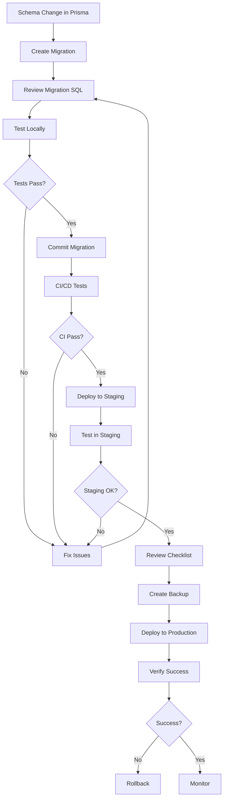

# Broxiva Database Migrations

Complete database migration management system for Broxiva.

## 📚 Documentation

This project includes comprehensive migration documentation:

| Document | Purpose | When to Use |
|----------|---------|-------------|
| [DATABASE_MIGRATION_GUIDE.md](./docs/DATABASE_MIGRATION_GUIDE.md) | Complete migration handbook | Planning, executing, troubleshooting migrations |
| [PRE_DEPLOYMENT_MIGRATION_CHECKLIST.md](./docs/PRE_DEPLOYMENT_MIGRATION_CHECKLIST.md) | Pre-deployment checklist | Before every production deployment |
| [PENDING_SCHEMA_CHANGES.md](./docs/PENDING_SCHEMA_CHANGES.md) | Current pending migrations | Understanding upcoming changes |
| [MIGRATION_QUICK_REFERENCE.md](./docs/MIGRATION_QUICK_REFERENCE.md) | Quick command reference | Daily development tasks |

## 🚀 Quick Start

### Development Environment

```bash
# 1. Check current status
npx prisma migrate status

# 2. Run pending migrations
npm run migrate
# OR
./scripts/run-migrations.sh dev

# 3. Generate Prisma Client
npx prisma generate

# 4. Start application
npm run dev
```

### Production Environment

```bash
# IMPORTANT: Always use the migration script for production!
./scripts/run-migrations.sh prod
```

## 📋 Current Status

### Pending Migrations: 7

1. `20251117022438_add_password_reset_table` - Core schema setup
2. `20251118154530_sync_schema_phase30` - Marketplace features
3. `20251119004754_add_vendor_management_system` - Vendor management
4. `20251202_add_owner_relation_and_role_permissions` - RBAC
5. `add_performance_indexes` - Performance optimization
6. `add_privacy_consent` - GDPR/CCPA compliance
7. `organization_module` - Multi-tenant organizations

**Total Impact**: 100+ new tables, 30+ indexes, 20+ enums

See [PENDING_SCHEMA_CHANGES.md](./docs/PENDING_SCHEMA_CHANGES.md) for detailed breakdown.

## 🛠️ Tools Provided

### Migration Script

`scripts/run-migrations.sh` - Safe migration execution with:
- ✅ Automatic backups
- ✅ Environment validation
- ✅ Health checks
- ✅ Rollback instructions
- ✅ Detailed logging

**Usage**:
```bash
# Development (no backup, interactive)
./scripts/run-migrations.sh dev

# Staging (with backup)
./scripts/run-migrations.sh staging

# Production (with backup and confirmation)
./scripts/run-migrations.sh prod
```

### NPM Scripts

```json
{
  "migrate": "prisma migrate dev",
  "migrate:deploy": "prisma migrate deploy",
  "migrate:reset": "prisma migrate reset",
  "db:push": "prisma db push",
  "db:seed": "ts-node prisma/seed.ts",
  "prisma:generate": "prisma generate",
  "prisma:studio": "prisma studio"
}
```

## 📖 Documentation Overview

### 1. DATABASE_MIGRATION_GUIDE.md

**Comprehensive 3000+ line guide covering**:
- Migration workflow and best practices
- Development and production procedures
- Creating new migrations
- Rollback procedures
- Common issues and fixes
- Zero-downtime migration strategies
- Advanced topics and monitoring

**Read this when**:
- Planning a migration
- Troubleshooting issues
- Learning migration best practices

### 2. PRE_DEPLOYMENT_MIGRATION_CHECKLIST.md

**Complete pre-deployment checklist with**:
- 10 critical pre-deployment checks
- Environment validation
- Testing requirements
- Backup strategy
- Performance considerations
- Team readiness checklist
- Sign-off forms

**Use this before**:
- Every staging deployment
- Every production deployment
- High-risk migrations

### 3. PENDING_SCHEMA_CHANGES.md

**Detailed analysis of pending migrations**:
- Migration-by-migration breakdown
- Risk assessment
- Impact analysis
- Testing requirements
- Rollback plans
- Communication plans

**Review this when**:
- Planning deployment timeline
- Communicating with stakeholders
- Assessing migration risk

### 4. MIGRATION_QUICK_REFERENCE.md

**Quick reference guide with**:
- Common commands
- Troubleshooting steps
- Best practices
- Emergency procedures
- Database queries
- Tips and tricks

**Use this for**:
- Daily development tasks
- Quick command lookups
- Common troubleshooting

## 🔒 Safety Features

### Automatic Backups

The migration script automatically creates backups before production migrations:

```
backups/
  └── migration_backup_20241204_143022.sql
  └── migration_backup_20241204_143022.sql.meta
```

### Health Checks

Post-migration validation includes:
- Database connectivity test
- Migration status verification
- Critical table accessibility
- Query execution test
- Prisma Client generation

### Rollback Support

Every migration includes:
- Detailed rollback instructions
- Backup restoration commands
- Verification steps
- Contact information

## ⚠️ Important Notes

### Never in Production

**NEVER** run these commands in production:
```bash
❌ npx prisma migrate dev
❌ npx prisma migrate reset
❌ npx prisma db push --accept-data-loss
```

### Always in Production

**ALWAYS** use these for production:
```bash
✅ ./scripts/run-migrations.sh prod
✅ npx prisma migrate deploy (if script unavailable)
```

### Test First

**ALWAYS** test migrations in this order:
1. Local development
2. CI/CD pipeline
3. Staging environment
4. Production

## 📊 Migration Statistics

### Schema Overview

| Component | Count |
|-----------|-------|
| Total Tables | 150+ |
| Total Indexes | 200+ |
| Total Enums | 50+ |
| Foreign Keys | 300+ |

### Pending Changes

| Type | Count |
|------|-------|
| New Tables | 80+ |
| New Columns | 500+ |
| New Indexes | 30+ |
| New Enums | 25+ |

## 🎯 Best Practices

### Before Every Migration

1. ✅ Read the migration SQL files
2. ✅ Review the checklist
3. ✅ Test in development
4. ✅ Test in staging
5. ✅ Create backup
6. ✅ Notify team
7. ✅ Schedule maintenance window

### During Migration

1. ✅ Monitor logs in real-time
2. ✅ Watch database metrics
3. ✅ Have rollback ready
4. ✅ Keep team informed

### After Migration

1. ✅ Verify migration status
2. ✅ Run health checks
3. ✅ Test critical paths
4. ✅ Monitor for 30 minutes
5. ✅ Update documentation

## 🚨 Emergency Contacts

### During Business Hours
- Database Team: #database-team
- DevOps Team: #devops
- Backend Team: #backend

### After Hours
- On-Call DBA: [Contact via PagerDuty]
- On-Call DevOps: [Contact via PagerDuty]
- Engineering Manager: [Contact via PagerDuty]

## 📞 Getting Help

### Documentation
1. Check [DATABASE_MIGRATION_GUIDE.md](./docs/DATABASE_MIGRATION_GUIDE.md)
2. Review [MIGRATION_QUICK_REFERENCE.md](./docs/MIGRATION_QUICK_REFERENCE.md)
3. Search team documentation

### Support Channels
- Slack: #broxiva-database
- Email: database-team@broxiva.com
- On-Call: PagerDuty escalation

### External Resources
- [Prisma Documentation](https://www.prisma.io/docs/)
- [PostgreSQL Documentation](https://www.postgresql.org/docs/)
- [Database Best Practices](https://wiki.postgresql.org/wiki/Don%27t_Do_This)

## 🔄 Migration Workflow



## 📈 Monitoring

### Key Metrics

Monitor these during and after migration:
- Database CPU usage
- Memory utilization
- Query response times
- Connection pool usage
- Error rates
- Application response times

### Alert Thresholds

```yaml
critical:
  - cpu_usage > 90%
  - memory_usage > 90%
  - connection_pool > 95%
  - error_rate > 5%

warning:
  - cpu_usage > 80%
  - memory_usage > 85%
  - query_time_p95 > 1000ms
  - error_rate > 1%
```

## 🎓 Training

### For Developers

1. Read [DATABASE_MIGRATION_GUIDE.md](./docs/DATABASE_MIGRATION_GUIDE.md)
2. Practice migrations in local environment
3. Review example migrations
4. Shadow a production deployment

### For DevOps

1. Understand backup/restore procedures
2. Practice rollback procedures
3. Review monitoring setup
4. Test emergency procedures

## 📝 Change Log

### Version 1.0 (December 4, 2024)
- Initial migration system setup
- Created comprehensive documentation
- Added automated migration script
- Implemented safety checks
- Added pre-deployment checklist

## 🤝 Contributing

### Adding New Migrations

1. Modify `prisma/schema.prisma`
2. Run `npx prisma migrate dev --name descriptive_name`
3. Review generated SQL
4. Test locally
5. Update documentation if needed
6. Create PR with migration

### Updating Documentation

1. Keep documentation up-to-date
2. Add new troubleshooting scenarios
3. Update examples
4. Review quarterly

## 📜 License

This migration system is part of Broxiva and follows the project's license.

---

## ✨ Features Summary

✅ **Automated Migration Script**
- Environment-aware execution
- Automatic backups
- Health checks
- Rollback instructions

✅ **Comprehensive Documentation**
- 3000+ line migration guide
- Pre-deployment checklist
- Schema change analysis
- Quick reference guide

✅ **Safety Mechanisms**
- Pre-migration validation
- Post-migration verification
- Automatic backup creation
- Detailed logging

✅ **Best Practices**
- Zero-downtime strategies
- Rollback procedures
- Testing requirements
- Monitoring guidelines

---

**Version**: 1.0
**Last Updated**: December 4, 2024
**Maintained By**: Broxiva Database Team
**Status**: Ready for Use ✅
