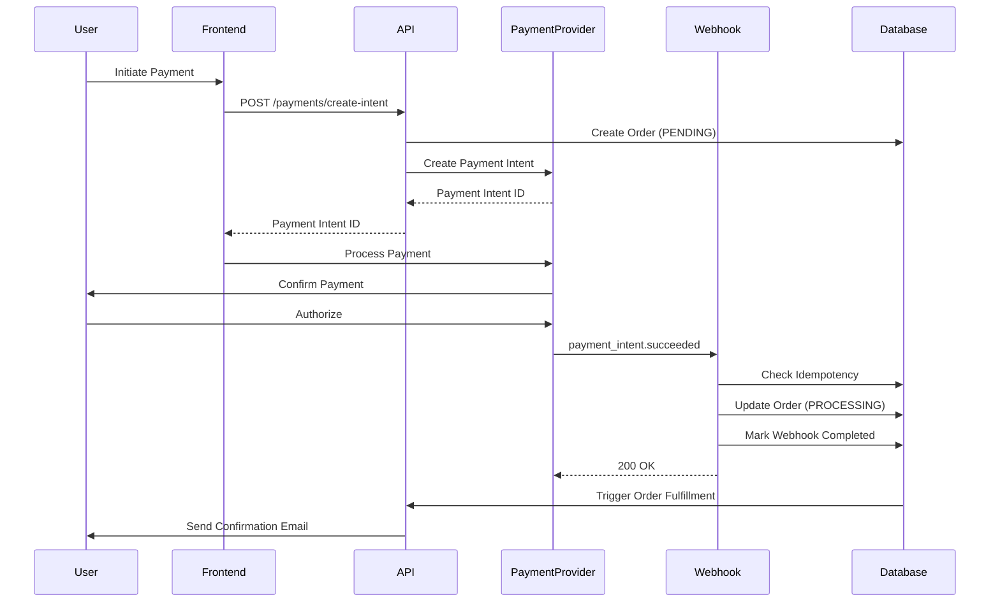

# Payment State Machine Documentation

## Overview

This document describes the payment state machine for CitadelBuy, including all payment states, state transitions, webhook event handling, retry mechanisms, and failure scenarios.

## Table of Contents

1. [Payment States](#payment-states)
2. [State Transitions](#state-transitions)
3. [Webhook Event Processing](#webhook-event-processing)
4. [Idempotency Guarantees](#idempotency-guarantees)
5. [Retry and Failure Scenarios](#retry-and-failure-scenarios)
6. [Provider-Specific Behaviors](#provider-specific-behaviors)
7. [Monitoring and Alerts](#monitoring-and-alerts)

---

## Payment States

### Core Payment States

```
PENDING → PROCESSING → COMPLETED
                    ↓
                 FAILED
                    ↓
                CANCELLED
```

### State Definitions

#### 1. PENDING
- **Description**: Payment intent created, awaiting processing
- **Duration**: Typically 0-30 seconds
- **Next States**: PROCESSING, FAILED
- **User Action**: Payment information being submitted

#### 2. PROCESSING
- **Description**: Payment is being processed by the payment provider
- **Duration**: 1-60 seconds (varies by provider)
- **Next States**: COMPLETED, FAILED
- **User Action**: Waiting for confirmation

#### 3. COMPLETED
- **Description**: Payment successfully processed and confirmed
- **Duration**: Terminal state
- **Next States**: None (can transition to REFUNDED)
- **User Action**: Order fulfillment begins

#### 4. FAILED
- **Description**: Payment processing failed
- **Duration**: Terminal state (unless retried)
- **Next States**: PENDING (if retry initiated)
- **User Action**: User notified, can retry payment

#### 5. CANCELLED
- **Description**: Payment cancelled by user or system
- **Duration**: Terminal state
- **Next States**: None
- **User Action**: None required

#### 6. REFUNDED
- **Description**: Payment was completed but has been refunded
- **Duration**: Terminal state
- **Next States**: None
- **User Action**: Refund processed, order reversed

---

## State Transitions

### Happy Path Flow



### State Transition Rules

| Current State | Event | Next State | Action |
|--------------|-------|------------|--------|
| PENDING | Payment submitted | PROCESSING | Create payment intent |
| PENDING | User cancels | CANCELLED | Cancel order |
| PENDING | Timeout (30 min) | CANCELLED | Auto-cancel expired orders |
| PROCESSING | Payment succeeds | COMPLETED | Fulfill order |
| PROCESSING | Payment fails | FAILED | Notify user, log error |
| PROCESSING | Timeout (10 min) | FAILED | Mark as failed, investigate |
| COMPLETED | Refund initiated | REFUNDED | Process refund |
| FAILED | User retries | PENDING | Create new payment intent |

---

## Webhook Event Processing

### Webhook Flow Architecture

```
Incoming Webhook
      ↓
Signature Verification
      ↓
Idempotency Check (Redis + Database)
      ↓
Event Lock Acquired?
      ↓
    YES → Process Event
      ↓
Update Order State
      ↓
Mark Event Completed
      ↓
Return 200 OK
```

### Supported Webhook Events

#### Stripe Events

| Event Type | Description | Action |
|------------|-------------|--------|
| `payment_intent.succeeded` | Payment completed successfully | Update order to COMPLETED |
| `payment_intent.payment_failed` | Payment failed | Update order to FAILED |
| `charge.refunded` | Charge was refunded | Create refund record, update order |
| `customer.subscription.created` | Subscription created | Create subscription record |
| `customer.subscription.updated` | Subscription updated | Update subscription details |
| `customer.subscription.deleted` | Subscription cancelled | Mark subscription as CANCELLED |
| `invoice.paid` | Invoice paid | Mark invoice as paid |
| `invoice.payment_failed` | Invoice payment failed | Mark subscription as SUSPENDED |

#### PayPal Events

| Event Type | Description | Action |
|------------|-------------|--------|
| `CHECKOUT.ORDER.APPROVED` | Order approved | Log approval |
| `PAYMENT.CAPTURE.COMPLETED` | Payment captured | Update order to COMPLETED |
| `PAYMENT.CAPTURE.DENIED` | Payment denied | Update order to FAILED |
| `PAYMENT.CAPTURE.REFUNDED` | Payment refunded | Create refund record |
| `BILLING.SUBSCRIPTION.ACTIVATED` | Subscription activated | Create subscription |
| `BILLING.SUBSCRIPTION.CANCELLED` | Subscription cancelled | Cancel subscription |

#### Flutterwave Events

| Event Type | Description | Action |
|------------|-------------|--------|
| `charge.completed` | Charge completed | Check status, update order |
| `transfer.completed` | Transfer completed | Update payout status |

#### Paystack Events

| Event Type | Description | Action |
|------------|-------------|--------|
| `charge.success` | Payment successful | Update order to COMPLETED |
| `charge.failed` | Payment failed | Update order to FAILED |
| `refund.processed` | Refund processed | Create refund record |
| `transfer.success` | Transfer successful | Update payout status |

---

## Idempotency Guarantees

### Idempotency Strategy

CitadelBuy implements a **dual-layer idempotency system** to ensure webhook events are processed exactly once:

#### Layer 1: Redis Cache (Fast Check)
- **Purpose**: Fast in-memory lookup
- **TTL**: 7 days
- **Key Format**: `webhook:event:{provider}:{eventId}`
- **Fallback**: Database check if Redis unavailable

#### Layer 2: Database (Persistent Storage)
- **Purpose**: Long-term tracking and audit trail
- **Table**: `payment_webhook_events`
- **Unique Constraint**: `(eventId, provider)`
- **Fields**:
  - `eventId`: Unique event ID from provider
  - `provider`: Payment provider name
  - `eventType`: Type of event
  - `status`: processing | completed | failed
  - `processedAt`: Timestamp
  - `metadata`: Additional event data

### Idempotency Flow

```typescript
async checkAndLockEvent(eventId, provider, eventType) {
  // 1. Check Redis cache
  const cachedEvent = await redis.get(`webhook:event:${provider}:${eventId}`);
  if (cachedEvent && cachedEvent.status === 'completed') {
    return false; // Already processed
  }

  // 2. Check database
  const dbEvent = await db.findUnique({
    where: { eventId_provider: { eventId, provider } }
  });
  if (dbEvent && dbEvent.status === 'completed') {
    return false; // Already processed
  }

  // 3. Check processing timeout (5 minutes)
  if (dbEvent && dbEvent.status === 'processing') {
    const processingTime = Date.now() - dbEvent.processedAt;
    if (processingTime < 5 * 60 * 1000) {
      return false; // Currently being processed
    }
    // Timeout expired, allow retry
  }

  // 4. Create lock (atomic operation)
  try {
    await db.create({
      eventId,
      provider,
      eventType,
      status: 'processing',
      processedAt: new Date()
    });
    return true; // Lock acquired
  } catch (uniqueConstraintError) {
    return false; // Race condition, another process got the lock
  }
}
```

### Processing Timeout Protection

- **Timeout Duration**: 5 minutes
- **Purpose**: Prevent stuck processing states
- **Behavior**: If an event is in "processing" state for more than 5 minutes, allow retry
- **Use Case**: Handles cases where processing crashes or times out

---

## Retry and Failure Scenarios

### Payment Provider Webhook Retries

#### Stripe Retry Schedule
- Attempt 1: Immediate
- Attempt 2: 1 hour later
- Attempt 3: 2 hours later
- Attempt 4: 4 hours later
- Attempt 5: 8 hours later
- Continues exponentially up to 3 days

**Response Codes**:
- `200 OK`: Success, stop retrying
- `500/502/503`: Temporary failure, retry
- `400/401`: Permanent failure, stop retrying

#### PayPal Retry Schedule
- Attempt 1: Immediate
- Attempt 2: 5 minutes later
- Attempt 3: 10 minutes later
- Continues up to 5 times

#### Flutterwave Retry Schedule
- Retries up to 3 times with exponential backoff
- 1 minute, 5 minutes, 15 minutes

#### Paystack Retry Schedule
- Retries up to 3 times
- 2 minutes, 5 minutes, 10 minutes

### Internal Failure Scenarios

#### Scenario 1: Webhook Signature Verification Fails
- **Response**: 400 Bad Request
- **Action**: Log error, do not retry
- **Investigation**: Check webhook secret configuration
- **User Impact**: None (provider will retry with correct signature)

#### Scenario 2: Database Connection Lost
- **Response**: 500 Internal Server Error
- **Action**: Provider retries automatically
- **Investigation**: Check database connectivity
- **User Impact**: Delayed order confirmation (resolved on retry)

#### Scenario 3: Duplicate Webhook Received
- **Response**: 200 OK (idempotency check succeeds)
- **Action**: Return success without processing
- **Investigation**: Normal behavior, no action needed
- **User Impact**: None

#### Scenario 4: Processing Timeout
- **Response**: 500 Internal Server Error (if still processing)
- **Action**: Mark event as failed, allow retry
- **Investigation**: Check application performance, identify bottleneck
- **User Impact**: Delayed order confirmation (resolved on retry)

#### Scenario 5: Order Not Found
- **Response**: 200 OK (to prevent infinite retries)
- **Action**: Log error, mark event as failed
- **Investigation**: Verify order creation flow
- **User Impact**: Order not processed, manual intervention required

#### Scenario 6: Race Condition (Simultaneous Webhooks)
- **Response**: 200 OK (second webhook sees completed state)
- **Action**: Idempotency system prevents duplicate processing
- **Investigation**: Normal behavior when provider sends duplicate webhooks
- **User Impact**: None

---

## Provider-Specific Behaviors

### Stripe

**Characteristics**:
- Sends webhooks in order (mostly)
- Excellent retry logic
- Provides webhook signing for security
- Test mode available

**Special Considerations**:
- Use `stripe.webhooks.constructEvent()` for signature verification
- Handle `rawBody` for signature validation
- Support both test and live modes

### PayPal

**Characteristics**:
- Webhooks can arrive out of order
- Requires multiple header verification
- Less aggressive retry policy

**Special Considerations**:
- Verify transmission signature, timestamp, and webhook ID
- Handle both sandbox and production webhooks
- Some events require additional API calls for full details

### Flutterwave

**Characteristics**:
- Simple hash verification
- Webhook payload includes full transaction details
- Limited retry attempts

**Special Considerations**:
- Verify hash header matches secret
- Check transaction status in webhook payload
- May need to verify transaction with API call

### Paystack

**Characteristics**:
- HMAC signature verification
- Webhooks include event and data objects
- Nigerian Naira (NGN) as base currency

**Special Considerations**:
- Verify `x-paystack-signature` header
- Use raw body for signature verification
- Handle amounts in kobo (100 kobo = 1 NGN)

---

## Monitoring and Alerts

### Key Metrics to Monitor

#### Webhook Processing
- **Webhook Success Rate**: Should be > 99%
  - Alert if < 95% over 5 minutes
- **Webhook Processing Time**: Should be < 2 seconds
  - Alert if p95 > 5 seconds
- **Webhook Retry Rate**: Should be < 5%
  - Alert if > 10% over 15 minutes
- **Idempotency Hit Rate**: Percentage of duplicate webhooks caught
  - Monitor for sudden spikes (may indicate provider issues)

#### Payment States
- **PENDING → COMPLETED Time**: Should be < 60 seconds
  - Alert if p95 > 5 minutes
- **Stuck PROCESSING Orders**: Should be 0
  - Alert if any orders stuck for > 10 minutes
- **Failed Payment Rate**: Varies by provider (typically 5-15%)
  - Alert if sudden spike (>20% increase)

#### Database
- **Webhook Event Table Size**: Monitor growth rate
  - Should grow linearly with transactions
  - Alert if sudden spike
- **Query Performance**: Idempotency checks should be < 10ms
  - Alert if p95 > 100ms

### Recommended Alerts

```yaml
alerts:
  - name: webhook_failure_rate_high
    condition: webhook_errors / webhook_total > 0.05
    duration: 5m
    severity: warning
    action: Check logs, investigate common failure reasons

  - name: webhook_processing_timeout
    condition: webhook_processing_time_p95 > 5s
    duration: 5m
    severity: warning
    action: Check application performance, scale if needed

  - name: stuck_orders
    condition: count(orders WHERE status=PROCESSING AND updated_at < now() - 10m) > 0
    duration: 1m
    severity: critical
    action: Investigate immediately, manual intervention may be required

  - name: payment_provider_down
    condition: webhook_errors_by_provider[stripe] / webhook_total_by_provider[stripe] > 0.5
    duration: 3m
    severity: critical
    action: Check Stripe status page, may need to use backup provider

  - name: idempotency_failures
    condition: idempotency_check_failures > 10
    duration: 5m
    severity: warning
    action: Check Redis and database connectivity
```

### Logging Strategy

#### What to Log

**INFO Level**:
- Webhook received (provider, event type, event ID)
- Idempotency check (hit or miss)
- Order state transitions
- Processing time metrics

**WARNING Level**:
- Duplicate webhook received
- Processing timeout (retry allowed)
- Payment failed (expected failures)

**ERROR Level**:
- Signature verification failed
- Database connection error
- Processing exception
- Unexpected payment provider response

**DEBUG Level**:
- Full webhook payload (sanitize sensitive data)
- Idempotency cache operations
- State machine transitions

#### Log Format

```json
{
  "timestamp": "2025-12-03T22:00:00Z",
  "level": "INFO",
  "service": "payments-webhook",
  "event": "webhook.received",
  "provider": "stripe",
  "eventId": "evt_1234567890",
  "eventType": "payment_intent.succeeded",
  "orderId": "ord_abc123",
  "processingTime": 234,
  "idempotencyHit": false,
  "metadata": {
    "paymentIntentId": "pi_1234567890",
    "amount": 5000,
    "currency": "usd"
  }
}
```

---

## Best Practices

### Development

1. **Always Test with Webhooks**: Use provider test modes and webhook testing tools
2. **Handle Retries Gracefully**: Design for idempotency from the start
3. **Log Extensively**: Comprehensive logging helps debug webhook issues
4. **Monitor Continuously**: Set up alerts for common failure scenarios

### Production

1. **Use Webhook Secrets**: Always verify signatures
2. **Return 200 Quickly**: Process asynchronously if needed
3. **Handle Out-of-Order Events**: Don't assume events arrive in sequence
4. **Implement Timeouts**: Prevent stuck processing states
5. **Keep Audit Trail**: Store all webhook events for compliance

### Security

1. **Verify Signatures**: Never trust unverified webhooks
2. **Use Raw Body**: Required for signature verification
3. **Rate Limit**: Protect against webhook flooding
4. **Sanitize Logs**: Remove sensitive payment data
5. **Monitor for Anomalies**: Detect suspicious webhook patterns

---

## Troubleshooting Guide

### Common Issues

#### Issue: Webhook Signature Verification Fails

**Symptoms**: 400 errors, webhooks rejected
**Diagnosis**: Check webhook secret configuration
**Resolution**:
1. Verify webhook secret in environment variables
2. Ensure raw body is used for verification
3. Check for middleware that modifies request body

#### Issue: Duplicate Order Processing

**Symptoms**: Multiple order confirmations, duplicate charges
**Diagnosis**: Idempotency not working
**Resolution**:
1. Check database unique constraint on `(eventId, provider)`
2. Verify Redis connectivity
3. Review idempotency service logs

#### Issue: Stuck PROCESSING Orders

**Symptoms**: Orders never complete or fail
**Diagnosis**: Webhook not received or processing timeout
**Resolution**:
1. Check webhook endpoint is accessible
2. Review webhook logs in provider dashboard
3. Verify timeout protection is working
4. Manually process stuck orders

#### Issue: High Webhook Failure Rate

**Symptoms**: Many webhook retries from provider
**Diagnosis**: Application errors or performance issues
**Resolution**:
1. Check application logs for errors
2. Monitor database connection pool
3. Scale application if needed
4. Review processing time metrics

---

## Migration and Rollout

### Adding Idempotency to Existing System

1. **Phase 1**: Deploy webhook event tracking table
   ```bash
   npx prisma migrate deploy
   ```

2. **Phase 2**: Deploy idempotency service (passive mode)
   - Log checks but don't enforce
   - Monitor for any issues

3. **Phase 3**: Enable enforcement
   - Start rejecting duplicate events
   - Monitor closely for 24 hours

4. **Phase 4**: Cleanup old events
   - Run cleanup job to remove events older than 30 days
   - Schedule regular cleanup via cron

### Rollback Plan

If idempotency causes issues:
1. Disable enforcement in code (allow all events)
2. Revert to previous deployment
3. Investigate root cause
4. Fix and redeploy

---

## Appendix

### Useful Commands

```bash
# Check webhook event statistics
npm run payments:webhook-stats

# Cleanup old webhook events
npm run payments:webhook-cleanup

# Replay failed webhook event
npm run payments:webhook-replay <eventId> <provider>

# Test webhook signature verification
npm run payments:test-webhook-signature
```

### Environment Variables

```bash
# Stripe
STRIPE_SECRET_KEY=sk_live_...
STRIPE_WEBHOOK_SECRET=whsec_...

# PayPal
PAYPAL_CLIENT_ID=...
PAYPAL_CLIENT_SECRET=...
PAYPAL_WEBHOOK_ID=...

# Flutterwave
FLUTTERWAVE_SECRET_KEY=...
FLUTTERWAVE_WEBHOOK_SECRET=...

# Paystack
PAYSTACK_SECRET_KEY=...
PAYSTACK_WEBHOOK_SECRET=...

# Redis (for idempotency)
REDIS_HOST=localhost
REDIS_PORT=6379
REDIS_PASSWORD=...
```

### Database Schema

```sql
-- Payment Webhook Event Tracking
CREATE TABLE payment_webhook_events (
  id UUID PRIMARY KEY DEFAULT gen_random_uuid(),
  event_id VARCHAR(255) NOT NULL,
  provider VARCHAR(50) NOT NULL,
  event_type VARCHAR(100) NOT NULL,
  processed_at TIMESTAMP NOT NULL DEFAULT NOW(),
  status VARCHAR(20) NOT NULL DEFAULT 'processing',
  metadata JSONB,
  created_at TIMESTAMP NOT NULL DEFAULT NOW(),
  updated_at TIMESTAMP NOT NULL DEFAULT NOW(),

  CONSTRAINT unique_event_provider UNIQUE (event_id, provider)
);

-- Indexes for performance
CREATE INDEX idx_payment_webhook_events_provider ON payment_webhook_events(provider);
CREATE INDEX idx_payment_webhook_events_event_type ON payment_webhook_events(event_type);
CREATE INDEX idx_payment_webhook_events_status ON payment_webhook_events(status);
CREATE INDEX idx_payment_webhook_events_processed_at ON payment_webhook_events(processed_at);
```

---

## References

- [Stripe Webhooks Documentation](https://stripe.com/docs/webhooks)
- [PayPal Webhooks Guide](https://developer.paypal.com/docs/api-basics/notifications/webhooks/)
- [Flutterwave Webhooks](https://developer.flutterwave.com/docs/integration-guides/webhooks)
- [Paystack Webhooks](https://paystack.com/docs/payments/webhooks)

---

**Document Version**: 1.0
**Last Updated**: 2025-12-03
**Maintained By**: CitadelBuy Engineering Team
