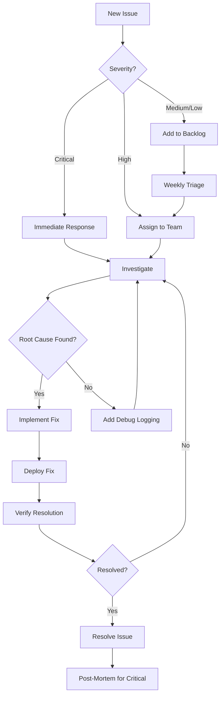

# Sentry Dashboard Configuration Guide

## Overview

This guide provides comprehensive instructions for setting up and configuring Sentry dashboards for Broxiva's multi-environment e-commerce platform. The setup includes monitoring for backend APIs, frontend applications, and mobile apps with proper alerting and team notifications.

## Table of Contents

- [Prerequisites](#prerequisites)
- [Project Structure](#project-structure)
- [Dashboard Setup](#dashboard-setup)
- [Key Metrics](#key-metrics)
- [Alert Configuration](#alert-configuration)
- [Issue Management](#issue-management)
- [Team Notifications](#team-notifications)
- [Best Practices](#best-practices)

---

## Prerequisites

### Required Access

- Sentry organization admin access
- Team lead or manager role for project configuration
- Access to Slack workspace (for notifications)
- Email access for alert notifications

### Environment Variables

Ensure the following environment variables are configured:

```bash
# Backend (.env)
SENTRY_DSN=https://[key]@[org].ingest.sentry.io/[project-id]
NODE_ENV=production|staging|development

# Frontend (.env.local)
NEXT_PUBLIC_SENTRY_DSN=https://[key]@[org].ingest.sentry.io/[project-id]
NODE_ENV=production|staging|development

# Mobile (app.config.js)
SENTRY_DSN=https://[key]@[org].ingest.sentry.io/[project-id]
```

---

## Project Structure

### Recommended Project Organization

Broxiva uses a multi-project structure in Sentry to separate concerns:

```
Broxiva Organization
├── broxiva-backend-prod
├── broxiva-backend-staging
├── broxiva-backend-dev
├── broxiva-web-prod
├── broxiva-web-staging
├── broxiva-web-dev
├── broxiva-mobile-prod
├── broxiva-mobile-staging
└── broxiva-mobile-dev
```

### Project Settings

#### Backend Projects (Node.js/NestJS)

**Platform:** Node.js
**DSN:** Configure in `SENTRY_DSN` environment variable
**Sample Rate:**
- Production: 10% traces, 10% profiles
- Staging: 50% traces, 50% profiles
- Development: 100% traces, 100% profiles

#### Frontend Projects (Next.js)

**Platform:** Next.js
**DSN:** Configure in `NEXT_PUBLIC_SENTRY_DSN`
**Features:**
- Session Replay: 10% normal sessions, 100% error sessions
- Performance Monitoring: 10% (production), 100% (dev)
- Source Maps: Enabled (upload during build)

#### Mobile Projects (React Native)

**Platform:** React Native
**DSN:** Configure in app configuration
**Features:**
- Performance Monitoring: 10% (production)
- Native Crash Reporting: Enabled
- Release Health: Enabled

---

## Dashboard Setup

### 1. Create Custom Dashboards

Navigate to **Dashboards** → **Create Dashboard** in Sentry.

### Backend API Dashboard

**Name:** Broxiva Backend - Production
**Widgets:**

#### 1. Error Rate Overview
```
Widget Type: Line Chart
Query: event.type:error
Group By: environment
Display: Time series (24h)
```

#### 2. P95 Response Time
```
Widget Type: Line Chart
Query: transaction.op:http.server
Field: p95(transaction.duration)
Group By: transaction
Display: Time series (24h)
```

#### 3. Top Errors by Count
```
Widget Type: Table
Query: event.type:error
Fields: error.type, count(), count_unique(user)
Sort: count() desc
Limit: 10
```

#### 4. Throughput by Endpoint
```
Widget Type: Bar Chart
Query: transaction.op:http.server
Field: tpm()
Group By: transaction
Limit: 10
```

#### 5. Error Rate by HTTP Status
```
Widget Type: Line Chart
Query: http.status_code:[400 TO 599]
Group By: http.status_code
Display: Time series (24h)
```

#### 6. Database Query Performance
```
Widget Type: Table
Query: transaction.op:db
Fields: transaction, p95(transaction.duration), tpm()
Sort: p95(transaction.duration) desc
Limit: 10
```

#### 7. User Impact
```
Widget Type: Big Number
Query: event.type:error
Field: count_unique(user)
Display: Users affected in last 24h
```

#### 8. Apdex Score
```
Widget Type: Big Number
Query: transaction.op:http.server
Field: apdex(300)
Display: Application Performance Index
```

#### 9. Failed Transactions
```
Widget Type: Table
Query: transaction.status:unknown OR transaction.status:aborted
Fields: transaction, count(), failure_rate()
Sort: count() desc
```

#### 10. Top Slow Transactions
```
Widget Type: Table
Query: transaction.op:http.server transaction.duration:>1s
Fields: transaction, p95(transaction.duration), count()
Sort: p95(transaction.duration) desc
Limit: 10
```

### Frontend Dashboard

**Name:** Broxiva Web - Production
**Widgets:**

#### 1. JavaScript Errors
```
Widget Type: Line Chart
Query: event.type:error platform:javascript
Group By: error.type
Display: Time series (24h)
```

#### 2. Page Load Time (LCP)
```
Widget Type: Line Chart
Query: transaction.op:pageload
Field: p75(measurements.lcp)
Group By: transaction
Display: Time series (24h)
```

#### 3. Core Web Vitals Summary
```
Widget Type: Table
Query: transaction.op:pageload
Fields:
  - p75(measurements.fcp) as "First Contentful Paint"
  - p75(measurements.lcp) as "Largest Contentful Paint"
  - p75(measurements.fid) as "First Input Delay"
  - p75(measurements.cls) as "Cumulative Layout Shift"
```

#### 4. Session Replay Count
```
Widget Type: Big Number
Query: event.type:error has:replay_id
Field: count()
Display: Sessions with replays
```

#### 5. Rage Clicks
```
Widget Type: Table
Query: event.type:error click.tag:*
Fields: click.tag, count(), count_unique(user)
Sort: count() desc
Limit: 10
```

#### 6. Browser Breakdown
```
Widget Type: Pie Chart
Query: event.type:error
Group By: browser.name
Display: Distribution of errors by browser
```

#### 7. API Request Errors
```
Widget Type: Line Chart
Query: transaction.op:http.client http.status_code:[400 TO 599]
Group By: http.status_code
Display: Time series (24h)
```

#### 8. User Journey Drop-offs
```
Widget Type: Funnel
Steps:
  1. Page Load → /
  2. Product View → /products/*
  3. Add to Cart → /cart
  4. Checkout → /checkout
  5. Order Complete → /order-confirmation
```

### Mobile Dashboard

**Name:** Broxiva Mobile - Production
**Widgets:**

#### 1. Crash-Free Sessions
```
Widget Type: Big Number
Query: session.status:crashed
Field: percentage(sessions_crashed, sessions) as crash_rate
Display: 100% - crash_rate
```

#### 2. Native Crashes
```
Widget Type: Table
Query: event.type:error error.mechanism.handled:false
Fields: error.type, count(), count_unique(user)
Sort: count() desc
```

#### 3. App Start Time
```
Widget Type: Line Chart
Query: transaction.op:app.start
Field: p75(transaction.duration)
Group By: os.name
Display: Time series (24h)
```

#### 4. Network Errors
```
Widget Type: Bar Chart
Query: transaction.op:http.client http.status_code:[400 TO 599]
Group By: http.status_code
```

#### 5. Device Performance
```
Widget Type: Table
Query: All
Fields: device.model, p75(measurements.app_start_warm), count()
Sort: count() desc
Limit: 10
```

---

## Key Metrics

### Backend Metrics to Monitor

| Metric | Target | Warning | Critical |
|--------|--------|---------|----------|
| Error Rate | < 0.1% | > 0.5% | > 1% |
| P95 Response Time | < 500ms | > 1s | > 2s |
| Apdex Score | > 0.95 | < 0.90 | < 0.80 |
| Database P95 | < 100ms | > 300ms | > 500ms |
| Throughput | - | Sudden drop > 50% | Drop > 75% |
| 5xx Errors | 0 | > 5/min | > 20/min |

### Frontend Metrics to Monitor

| Metric | Target | Warning | Critical |
|--------|--------|---------|----------|
| LCP (Largest Contentful Paint) | < 2.5s | > 4s | > 5s |
| FID (First Input Delay) | < 100ms | > 300ms | > 500ms |
| CLS (Cumulative Layout Shift) | < 0.1 | > 0.25 | > 0.5 |
| JavaScript Error Rate | < 0.5% | > 2% | > 5% |
| Page Load Time | < 3s | > 5s | > 8s |
| API Error Rate (4xx/5xx) | < 1% | > 5% | > 10% |

### Mobile Metrics to Monitor

| Metric | Target | Warning | Critical |
|--------|--------|---------|----------|
| Crash-Free Sessions | > 99.5% | < 99% | < 98% |
| Cold App Start | < 2s | > 3s | > 5s |
| Warm App Start | < 1s | > 1.5s | > 2s |
| Native Crashes | 0 | > 10/day | > 50/day |
| Network Error Rate | < 1% | > 5% | > 10% |
| ANR (App Not Responding) | 0 | > 5/day | > 20/day |

---

## Alert Configuration

### Alert Rules Overview

Sentry alerts are configured at the project level. Navigate to **Alerts** → **Create Alert Rule**.

### Critical Alerts (Immediate Response)

#### 1. High Error Rate Alert

**Alert Type:** Error
**Alert Name:** [Production] High Error Rate - Immediate Action Required
**Conditions:**
```
When: Number of events
Threshold: >= 50 errors in 5 minutes
Filters:
  - level:error,fatal
  - environment:production
```
**Actions:**
- Send Slack notification to #incidents-critical
- Send PagerDuty alert to on-call engineer
- Send email to engineering-leads@broxiva.com

#### 2. Database Connection Failures

**Alert Type:** Error
**Alert Name:** [Production] Database Connection Failures
**Conditions:**
```
When: Number of events matching filters
Threshold: >= 10 errors in 2 minutes
Filters:
  - error.type:*Database* OR error.type:*Connection*
  - environment:production
```
**Actions:**
- Send Slack notification to #incidents-critical
- Send PagerDuty alert
- Execute webhook to infrastructure team

#### 3. Payment Processing Failures

**Alert Type:** Error
**Alert Name:** [Production] Payment Processing Failures
**Conditions:**
```
When: Number of events matching filters
Threshold: >= 5 errors in 5 minutes
Filters:
  - transaction:*checkout* OR transaction:*payment*
  - level:error
  - environment:production
```
**Actions:**
- Send Slack notification to #payments-team
- Send PagerDuty alert
- Send email to payments-team@broxiva.com

#### 4. API Service Degradation

**Alert Type:** Metric
**Alert Name:** [Production] API Response Time Degradation
**Conditions:**
```
When: Avg of transaction.duration
Threshold: >= 2000ms for 5 minutes
Filters:
  - transaction.op:http.server
  - environment:production
```
**Actions:**
- Send Slack notification to #platform-alerts
- Create Jira ticket automatically
- Send email to platform-team@broxiva.com

### Warning Alerts (Monitor & Investigate)

#### 5. Increased 4xx Errors

**Alert Type:** Metric
**Alert Name:** [Production] Elevated Client Error Rate
**Conditions:**
```
When: Count of events
Threshold: >= 100 events in 10 minutes
Filters:
  - http.status_code:[400 TO 499]
  - environment:production
```
**Actions:**
- Send Slack notification to #platform-alerts
- Log to monitoring dashboard

#### 6. New Error Spike

**Alert Type:** Error
**Alert Name:** [Production] New Error Type Detected
**Conditions:**
```
When: A new issue is created
And: The issue is seen more than 10 times in 5 minutes
Filters:
  - environment:production
  - level:error,fatal
```
**Actions:**
- Send Slack notification to #platform-alerts
- Assign to on-call engineer
- Send email notification

#### 7. Performance Regression

**Alert Type:** Metric
**Alert Name:** [Production] Performance Regression Detected
**Conditions:**
```
When: P95 of transaction.duration
Threshold: Increased by 25% compared to 1 day ago
Filters:
  - transaction.op:http.server
  - environment:production
```
**Actions:**
- Send Slack notification to #performance-monitoring
- Create GitHub issue
- Send email to engineering-team@broxiva.com

#### 8. Session Replay Threshold

**Alert Type:** Metric
**Alert Name:** [Production] High Error Sessions with Replays
**Conditions:**
```
When: Count of events with replays
Threshold: >= 20 sessions in 30 minutes
Filters:
  - event.type:error
  - has:replay_id
  - environment:production
```
**Actions:**
- Send Slack notification to #ux-team
- Weekly digest email

### Informational Alerts

#### 9. Weekly Error Summary

**Alert Type:** Scheduled
**Alert Name:** Weekly Error Summary Report
**Schedule:** Every Monday at 9:00 AM
**Report Includes:**
- Top 10 errors by frequency
- New errors introduced
- Resolved issues
- Performance trends
**Actions:**
- Send email to engineering-all@broxiva.com
- Post to #weekly-metrics Slack channel

#### 10. Release Health Report

**Alert Type:** Scheduled
**Alert Name:** Post-Release Health Report
**Trigger:** 24 hours after each release
**Report Includes:**
- New errors introduced
- Performance comparison
- User adoption rate
- Crash rate comparison
**Actions:**
- Send email to release-managers@broxiva.com
- Post to #releases Slack channel

---

## Issue Management

### Issue Workflow

#### 1. Issue Assignment Rules

Configure automatic assignment in **Settings** → **Issue Owners**.

**ownership.txt Configuration:**
```
# Payment issues
path:**/checkout/** payments-team@broxiva.com
path:**/payment/** payments-team@broxiva.com
path:**/stripe/** payments-team@broxiva.com

# Authentication issues
path:**/auth/** auth-team@broxiva.com
path:**/users/** auth-team@broxiva.com

# Product catalog
path:**/products/** catalog-team@broxiva.com
path:**/categories/** catalog-team@broxiva.com

# Cart and orders
path:**/cart/** cart-team@broxiva.com
path:**/orders/** orders-team@broxiva.com

# Frontend components
path:**/components/** frontend-team@broxiva.com
path:**/pages/** frontend-team@broxiva.com

# Infrastructure
path:**/common/redis/** infra-team@broxiva.com
path:**/common/monitoring/** infra-team@broxiva.com

# Catch-all for unassigned issues
* engineering-leads@broxiva.com
```

#### 2. Issue Priority Matrix

| Severity | User Impact | Response Time | Examples |
|----------|-------------|---------------|----------|
| Critical | All users | < 15 min | Payment failures, site down, data corruption |
| High | Many users | < 2 hours | Login failures, checkout errors, major feature broken |
| Medium | Some users | < 1 day | UI bugs, performance degradation, minor feature issues |
| Low | Few users | < 1 week | Visual glitches, edge cases, cosmetic issues |

#### 3. Issue Triage Process

**Daily Triage (10:00 AM):**
1. Review all unassigned issues
2. Assign issues to appropriate teams
3. Set priority levels
4. Link to related issues
5. Add context and reproduction steps

**Weekly Review (Mondays):**
1. Review all open issues
2. Close resolved issues
3. Re-prioritize based on user impact
4. Identify patterns and recurring issues
5. Plan fixes for high-priority issues

#### 4. Issue Resolution Workflow



### Issue Tags

Use consistent tags for better organization:

- **Priority:** `p0-critical`, `p1-high`, `p2-medium`, `p3-low`
- **Type:** `bug`, `performance`, `security`, `ux`, `regression`
- **Component:** `backend`, `frontend`, `mobile`, `database`, `infrastructure`
- **Status:** `investigating`, `fix-in-progress`, `needs-reproduction`, `blocked`
- **Release:** `v2.0.0`, `v2.1.0`, etc.

---

## Team Notifications

### Slack Integration Setup

#### 1. Install Sentry Slack App

1. Navigate to **Settings** → **Integrations** → **Slack**
2. Click **Add to Slack**
3. Authorize Sentry access to your workspace
4. Configure default channel: `#sentry-notifications`

#### 2. Channel Configuration

| Channel | Purpose | Alert Types |
|---------|---------|-------------|
| #incidents-critical | Production critical issues | Critical errors, service outages, payment failures |
| #platform-alerts | Warning-level alerts | Performance degradation, elevated error rates |
| #payments-team | Payment-specific issues | Stripe errors, checkout failures, refund issues |
| #frontend-team | Frontend-specific issues | JavaScript errors, Core Web Vitals, UX issues |
| #backend-team | Backend-specific issues | API errors, database issues, background job failures |
| #releases | Release tracking | Deployment notifications, release health reports |
| #weekly-metrics | Scheduled reports | Weekly summaries, performance trends |

#### 3. Slack Alert Format

Configure alert format in **Alert Rules** → **Actions** → **Edit Slack Message**.

**Example Template:**
```
:rotating_light: *Production Alert: {title}*

*Project:* {project}
*Environment:* {tag:environment}
*Severity:* {level}

*Error Count:* {count} occurrences in {window}
*Affected Users:* {uniqueUsers}

*Latest Event:* {message}
*URL:* {url}

*Stack Trace:*
```
{culprit}
```

*Action Required:* {actionRequired}

<{link}|View in Sentry>
```

### Email Notifications

#### 1. Email Groups

Configure email groups in **Settings** → **Teams**.

**Engineering Leadership:**
- engineering-leads@broxiva.com
- Alert frequency: Critical only
- Summary: Daily digest

**Team Leads:**
- Individual team lead emails
- Alert frequency: Critical + High
- Summary: Daily digest

**On-Call Engineers:**
- oncall@broxiva.com (PagerDuty integration)
- Alert frequency: Critical real-time
- Summary: None

#### 2. Email Preferences

Configure in **User Settings** → **Notifications**.

**Recommended Settings:**
- **Deploy Notifications:** Enabled
- **Issue Alerts:** Only assigned issues
- **Workflow Notifications:** Enabled
- **Weekly Reports:** Enabled
- **Spike Protection:** Enabled (max 10 emails/hour)

### PagerDuty Integration

#### 1. Setup

1. Navigate to **Settings** → **Integrations** → **PagerDuty**
2. Connect your PagerDuty account
3. Map Sentry projects to PagerDuty services

#### 2. Service Mapping

| Sentry Project | PagerDuty Service | On-Call Schedule |
|----------------|-------------------|------------------|
| broxiva-backend-prod | Broxiva Backend | Platform Team Rotation |
| broxiva-web-prod | Broxiva Frontend | Frontend Team Rotation |
| broxiva-mobile-prod | Broxiva Mobile | Mobile Team Rotation |

#### 3. Escalation Policy

**Level 1:** On-call engineer (5 minutes)
**Level 2:** Team lead (15 minutes)
**Level 3:** Engineering manager (30 minutes)
**Level 4:** VP Engineering (60 minutes)

---

## Best Practices

### 1. Dashboard Maintenance

- **Weekly Review:** Check dashboard metrics every Monday
- **Monthly Updates:** Adjust widgets based on new features/priorities
- **Quarterly Cleanup:** Remove unused dashboards and widgets
- **Version Control:** Document dashboard changes in Git

### 2. Alert Tuning

- **Start Conservative:** Begin with higher thresholds, tune down gradually
- **Review Alert Fatigue:** Monitor alert acknowledge rates
- **Adjust Seasonally:** Account for traffic patterns (holidays, sales events)
- **Test Alerts:** Trigger test alerts monthly to verify notification delivery

### 3. Issue Management

- **Daily Triage:** Review new issues every morning
- **SLA Tracking:** Monitor response times to stay within SLAs
- **Root Cause Analysis:** Document root causes for recurring issues
- **Knowledge Base:** Maintain runbook for common issues

### 4. Performance Optimization

- **Source Maps:** Always upload source maps for frontend deployments
- **Release Tracking:** Tag all releases properly
- **Breadcrumbs:** Add custom breadcrumbs for critical user flows
- **Context:** Enrich errors with user, transaction, and business context

### 5. Security

- **Data Scrubbing:** Configure PII scrubbing rules
- **Access Control:** Use teams and role-based access
- **IP Allowlisting:** Restrict Sentry access by IP if possible
- **Audit Logs:** Regularly review Sentry audit logs

### 6. Cost Management

- **Sample Rates:** Adjust sample rates based on traffic
- **Quota Management:** Set project quotas to prevent overage
- **Data Retention:** Configure appropriate retention periods
- **Archive Old Issues:** Archive resolved issues after 90 days

---

## Troubleshooting

### Common Issues

#### Dashboard Not Loading
- Check browser console for errors
- Verify query syntax
- Reduce time range
- Check project permissions

#### Alerts Not Firing
- Verify alert is enabled
- Check alert conditions and thresholds
- Verify integration configuration (Slack/PagerDuty)
- Check Sentry status page

#### Missing Source Maps
- Verify upload during build
- Check source map file naming
- Verify release name matches
- Check auth token permissions

#### High Costs
- Review sample rates
- Check quota usage
- Identify noisy errors
- Configure rate limits

---

## Additional Resources

- [Sentry Dashboard Documentation](https://docs.sentry.io/product/dashboards/)
- [Alert Configuration Guide](https://docs.sentry.io/product/alerts/)
- [Performance Monitoring](https://docs.sentry.io/product/performance/)
- [Release Health](https://docs.sentry.io/product/releases/health/)
- [Integration Setup](https://docs.sentry.io/product/integrations/)

---

## Support Contacts

**Sentry Account Manager:** [Contact via Sentry dashboard]
**Internal Sentry Admin:** devops-team@broxiva.com
**On-Call Support:** oncall@broxiva.com
**Engineering Leadership:** engineering-leads@broxiva.com

---

**Last Updated:** 2024-12-04
**Document Owner:** Platform Engineering Team
**Review Schedule:** Quarterly
