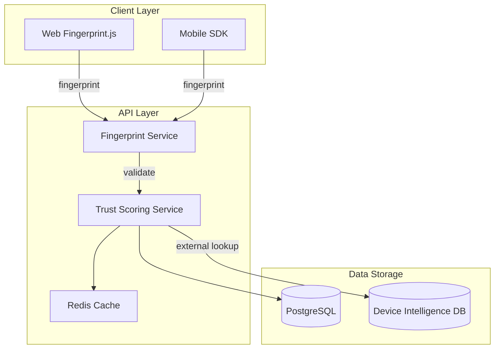

# Security Enhancement Documentation

**Document Version:** 1.0
**Created:** 2026-01-15
**Last Updated:** 2026-01-15
**Status:** Analysis Complete - Implementation Pending

---

## Executive Summary

This document provides a comprehensive analysis of the current security implementation in the Broxiva e-commerce platform and identifies gaps that need to be addressed. The analysis focuses on three key areas:

1. **2FA/MFA Implementation** - Making TOTP mandatory for sensitive operations
2. **Session Management** - Adding concurrent session limits
3. **Device Fingerprinting** - Enhancing fraud detection capabilities

---

## Table of Contents

1. [Current Security Features](#1-current-security-features)
2. [Identified Security Gaps](#2-identified-security-gaps)
3. [Recommended Enhancements](#3-recommended-enhancements)
4. [Implementation Approach](#4-implementation-approach)
5. [Priority Ranking](#5-priority-ranking)
6. [Implementation Roadmap](#6-implementation-roadmap)

---

## 1. Current Security Features

### 1.1 Authentication System

The platform implements a robust JWT-based authentication system with the following features:

| Feature | Status | Location |
|---------|--------|----------|
| JWT Authentication | Implemented | `apps/api/src/modules/auth/auth.service.ts` |
| Token Blacklisting | Implemented | `apps/api/src/modules/auth/token-blacklist.service.ts` |
| Refresh Token Flow | Implemented | `apps/api/src/modules/auth/auth.service.ts` |
| Account Lockout | Implemented | `apps/api/src/modules/auth/account-lockout.service.ts` |
| OAuth Integration | Implemented | Google, Facebook, Apple, GitHub |

### 1.2 Two-Factor Authentication (Current State)

**Location:**
- `apps/api/src/modules/auth/auth.service.ts` (lines 853-1033)
- `apps/api/src/modules/security/security.service.ts` (lines 162-279)
- `apps/api/src/modules/auth/dto/mfa.dto.ts`

**Current Capabilities:**

| Feature | Status | Notes |
|---------|--------|-------|
| TOTP Setup | Implemented | Generates base32 secret and QR code |
| TOTP Verification | Implemented | Supports +/- 1 time window for clock skew |
| Backup Codes | Implemented | 8 codes, bcrypt-hashed |
| MFA Enable/Disable | Implemented | Requires valid TOTP or backup code |
| MFA Status Check | Implemented | `/auth/mfa/status` endpoint |

**Current Implementation Details:**
- Algorithm: SHA1
- Digits: 6
- Period: 30 seconds
- Issuer: Broxiva
- Backup Codes: 8 codes generated, hashed with bcrypt

**Database Schema:**
```prisma
model UserMfa {
  id          String   @id @default(uuid())
  userId      String   @unique
  secret      String?  // TOTP secret (base32 encoded)
  backupCodes Json     // Array of bcrypt-hashed backup codes
  enabled     Boolean  @default(false)
  verifiedAt  DateTime?
}

model TwoFactorAuth {
  id          String   @id @default(uuid())
  userId      String   @unique
  secret      String   // Base32 encoded secret
  isEnabled   Boolean  @default(false)
  backupCodes String[] // Encrypted backup codes
  lastUsedAt  DateTime?
}
```

**Gap Identified:** MFA is **optional** and not enforced for any operations.

### 1.3 Session Management (Current State)

**Location:**
- `apps/api/src/modules/security/security.service.ts` (lines 281-338)
- Database schema: `UserSession` model

**Current Capabilities:**

| Feature | Status | Notes |
|---------|--------|-------|
| Session Creation | Implemented | Creates hashed session tokens |
| Session Validation | Implemented | Validates against active sessions |
| Session Revocation | Implemented | Can revoke all sessions for a user |
| Last Activity Tracking | Implemented | Updates `lastActivityAt` on validation |
| Session Expiry | Implemented | 7-day default expiry |

**Database Schema:**
```prisma
model UserSession {
  id             String   @id @default(uuid())
  userId         String
  token          String   @unique // Hashed session token
  ipAddress      String
  userAgent      String?
  deviceInfo     Json?    // Browser, OS, device type
  isActive       Boolean  @default(true)
  isRevoked      Boolean  @default(false)
  expiresAt      DateTime
  lastActivityAt DateTime @default(now())
}
```

**Gap Identified:** No limit on concurrent active sessions per user.

### 1.4 Fraud Detection (Current State)

**Location:**
- `apps/api/src/modules/ai/fraud-detection/fraud-detection.service.ts`
- `apps/api/src/modules/ai/fraud-detection/account-security.service.ts`
- `apps/api/src/modules/ai/fraud-detection/transaction-analysis.service.ts`

**Current Capabilities:**

| Feature | Status | Notes |
|---------|--------|-------|
| Fake Review Detection | Implemented | Analyzes review patterns |
| Return Fraud Detection | Implemented | Monitors return rates |
| User Risk Scoring | Implemented | Aggregates risk factors |
| Transaction Analysis | Implemented | IP, velocity, value checks |
| Account Takeover Detection | Implemented | Impossible travel, device changes |
| Fraud Alerts | Implemented | In-memory alert system |

**Account Security Analysis Features:**
- Impossible travel detection (Haversine distance calculation)
- New device detection
- IP address change detection
- Unusual login time detection
- Failed attempt pattern detection
- Credential stuffing pattern detection

**Gap Identified:** Device fingerprinting is a **placeholder** - uses passed fingerprint without actual collection/validation.

### 1.5 Security Middleware

**Location:** `apps/api/src/common/middleware/security-headers.middleware.ts`

Implements comprehensive security headers for PCI DSS compliance:
- Content Security Policy (CSP)
- HSTS (production only)
- X-Frame-Options
- X-Content-Type-Options
- Permissions Policy
- Cross-Origin policies

---

## 2. Identified Security Gaps

### 2.1 Gap: MFA Not Mandatory

**Current State:** MFA is fully implemented but entirely optional. Users can perform all operations without enabling MFA.

**Risk Level:** HIGH

**Impact:**
- Account compromise via credential stuffing
- Unauthorized access to sensitive data
- Financial fraud through account takeover
- Compliance risks for high-value transactions

**Affected User Actions:**
- Login (no MFA challenge even if enabled)
- Password changes
- Email changes
- Financial transactions
- Admin operations

### 2.2 Gap: No Concurrent Session Limits

**Current State:** Users can have unlimited active sessions across devices with no visibility or control.

**Risk Level:** MEDIUM-HIGH

**Impact:**
- Compromised credentials can be used indefinitely
- Shared account abuse
- Credential selling/sharing
- Difficult to detect account compromise
- No session visibility for users

**Missing Features:**
- Maximum concurrent session limit
- Active session listing for users
- Remote session termination
- Session anomaly detection
- Device trust management

### 2.3 Gap: Device Fingerprinting Not Implemented

**Current State:** The `AccountSecurityService` accepts device fingerprints but does not actually collect or validate them. The `TransactionAnalysisService` has placeholder code for device fingerprint analysis.

**Risk Level:** MEDIUM-HIGH

**Impact:**
- Limited fraud detection accuracy
- Cannot detect device anomalies
- No trusted device management
- Weak bot detection
- Cannot identify suspicious device patterns

**Current Placeholder Code:**
```typescript
// From account-security.service.ts
const knownDevices = history
  .map(h => h.deviceFingerprint)
  .filter((v, i, a) => a.indexOf(v) === i);
// Fingerprint is passed but never validated

// From transaction-analysis.service.ts
private async analyzeDeviceFingerprint(fingerprint: string) {
  // In production: Use device intelligence services
  return {
    fingerprint,
    suspicious: false, // Always returns false
    reason: null,
  };
}
```

---

## 3. Recommended Enhancements

### 3.1 Mandatory MFA Implementation

#### 3.1.1 Configuration Options

Create environment-configurable MFA enforcement policies:

```typescript
// Proposed configuration structure
interface MfaEnforcementConfig {
  // Global settings
  enforceForAllUsers: boolean;           // Require MFA for everyone
  enforceForRoles: UserRole[];           // Specific roles requiring MFA

  // Action-specific enforcement
  enforceForLogin: boolean;              // Require MFA at login
  enforceForPasswordChange: boolean;     // Require before password change
  enforceForEmailChange: boolean;        // Require before email change
  enforceForPayment: boolean;            // Require for transactions over threshold
  paymentThreshold: number;              // Amount triggering MFA

  // Grace period settings
  enableGracePeriod: boolean;            // Allow login without MFA temporarily
  gracePeriodDays: number;               // Days before MFA is required
  gracePeriodMaxLogins: number;          // Max logins before MFA is required

  // Remember device settings
  enableRememberDevice: boolean;         // Allow "remember this device"
  rememberDeviceDays: number;            // Days to remember device
}
```

#### 3.1.2 MFA Challenge Flow


#### 3.1.3 Implementation Files to Modify

1. **`apps/api/src/modules/auth/auth.service.ts`**
   - Add MFA challenge response in login flow
   - Create `verifyMfaChallenge` method
   - Add MFA enforcement checks

2. **`apps/api/src/modules/auth/auth.controller.ts`**
   - Add `/auth/mfa/challenge` endpoint
   - Modify login response to include MFA status

3. **`apps/api/prisma/schema.prisma`**
   - Add `MfaEnforcementSettings` model
   - Add `UserMfaGracePeriod` model
   - Add `TrustedDevice` model

4. **New file: `apps/api/src/modules/auth/mfa-enforcement.service.ts`**
   - Policy evaluation logic
   - Grace period management
   - Trusted device management

#### 3.1.4 Database Schema Additions

```prisma
model MfaEnforcementSettings {
  id                    String     @id @default(uuid())
  organizationId        String?

  // Enforcement policies
  enforceForAllUsers    Boolean    @default(false)
  enforceForRoles       UserRole[] @default([])
  enforceForLogin       Boolean    @default(true)
  enforceForPayment     Boolean    @default(true)
  paymentThreshold      Float      @default(100.00)

  // Grace period
  gracePeriodEnabled    Boolean    @default(true)
  gracePeriodDays       Int        @default(7)
  gracePeriodMaxLogins  Int        @default(3)

  createdAt             DateTime   @default(now())
  updatedAt             DateTime   @updatedAt
}

model TrustedDevice {
  id              String   @id @default(uuid())
  userId          String
  deviceId        String   // Device fingerprint hash
  deviceName      String?  // User-friendly name
  userAgent       String?
  ipAddress       String?
  lastUsedAt      DateTime @default(now())
  expiresAt       DateTime
  isActive        Boolean  @default(true)

  user            User     @relation(fields: [userId], references: [id], onDelete: Cascade)

  @@unique([userId, deviceId])
  @@index([userId])
}
```

### 3.2 Concurrent Session Limits

#### 3.2.1 Configuration Options

```typescript
interface SessionLimitConfig {
  // Global limits
  maxConcurrentSessions: number;        // Default: 5
  maxMobileSessions: number;            // Default: 3
  maxWebSessions: number;               // Default: 3

  // Enforcement behavior
  enforcementMode: 'block' | 'evict_oldest' | 'evict_idle';
  idleTimeoutMinutes: number;           // For 'evict_idle' mode

  // User visibility
  showActiveSessionsToUser: boolean;    // Allow users to see sessions
  allowRemoteLogout: boolean;           // Allow users to terminate sessions

  // Notifications
  notifyOnNewSession: boolean;          // Email/push on new device login
  notifyOnEviction: boolean;            // Notify when session is terminated

  // Role-based overrides
  roleLimits: Record<UserRole, number>; // Override limits per role
}
```

#### 3.2.2 Session Management Flow


#### 3.2.3 Implementation Files to Modify

1. **`apps/api/src/modules/security/security.service.ts`**
   - Add `getActiveSessionCount` method
   - Add `enforceSessionLimit` method
   - Add `getUserActiveSessions` method
   - Add `terminateSession` method with session ID

2. **`apps/api/src/modules/security/security.controller.ts`**
   - Add `GET /security/sessions` - List active sessions
   - Add `DELETE /security/sessions/:id` - Terminate specific session
   - Add `DELETE /security/sessions/others` - Terminate all except current

3. **`apps/api/src/modules/auth/auth.service.ts`**
   - Integrate session limit check in login flow
   - Add session creation with device info

4. **New file: `apps/api/src/modules/security/session-manager.service.ts`**
   - Session lifecycle management
   - Eviction logic
   - Device/platform categorization

#### 3.2.4 Database Schema Additions

```prisma
model SessionSettings {
  id                     String   @id @default(uuid())
  organizationId         String?

  maxConcurrentSessions  Int      @default(5)
  maxMobileSessions      Int      @default(3)
  maxWebSessions         Int      @default(3)
  enforcementMode        String   @default("evict_oldest")
  idleTimeoutMinutes     Int      @default(30)

  notifyOnNewSession     Boolean  @default(true)
  notifyOnEviction       Boolean  @default(true)

  createdAt              DateTime @default(now())
  updatedAt              DateTime @updatedAt
}

// Update UserSession model
model UserSession {
  id             String         @id @default(uuid())
  userId         String
  token          String         @unique

  // Enhanced device info
  ipAddress      String
  userAgent      String?
  deviceType     DevicePlatform @default(WEB)
  deviceId       String?        // Fingerprint hash
  deviceName     String?        // User-assigned name
  location       Json?          // Geolocation data

  // Status tracking
  isActive       Boolean        @default(true)
  isRevoked      Boolean        @default(false)
  revokedReason  String?        // Why session was terminated
  revokedAt      DateTime?

  // Timestamps
  expiresAt      DateTime
  lastActivityAt DateTime       @default(now())
  createdAt      DateTime       @default(now())

  user           User           @relation(fields: [userId], references: [id], onDelete: Cascade)

  @@index([userId, isActive])
  @@index([deviceId])
}
```

### 3.3 Device Fingerprinting

#### 3.3.1 Fingerprinting Strategy

**Client-Side Collection (Mobile/Web):**
```typescript
interface DeviceFingerprint {
  // Browser/App fingerprint
  userAgent: string;
  language: string;
  timezone: string;
  screenResolution: string;
  colorDepth: number;

  // Hardware identifiers (mobile)
  deviceId?: string;           // iOS: identifierForVendor, Android: ANDROID_ID
  advertisingId?: string;      // IDFA/GAID if available

  // Canvas/WebGL fingerprint (web)
  canvasHash?: string;
  webglHash?: string;

  // Audio fingerprint (web)
  audioHash?: string;

  // Font fingerprint (web)
  installedFonts?: string[];
  fontHash?: string;

  // Plugin/extension info
  plugins?: string[];

  // Network characteristics
  connectionType?: string;     // wifi, cellular, etc.

  // Computed hash
  fingerprintHash: string;     // Combined hash of all attributes
}
```

**Server-Side Analysis:**
```typescript
interface DeviceTrustScore {
  fingerprintHash: string;
  trustScore: number;          // 0-100
  riskIndicators: string[];

  // Detection results
  isBot: boolean;
  isEmulator: boolean;
  isProxy: boolean;
  isVpn: boolean;
  isTor: boolean;

  // Historical data
  firstSeenAt: Date;
  lastSeenAt: Date;
  associatedUsers: string[];   // Users seen with this fingerprint
  loginCount: number;
  fraudReportCount: number;
}
```

#### 3.3.2 Implementation Architecture



#### 3.3.3 Implementation Files to Create/Modify

1. **New file: `apps/api/src/modules/security/device-fingerprint.service.ts`**
   ```typescript
   @Injectable()
   export class DeviceFingerprintService {
     // Fingerprint validation
     async validateFingerprint(fingerprint: DeviceFingerprint): Promise<ValidationResult>;

     // Trust scoring
     async calculateTrustScore(fingerprint: DeviceFingerprint, userId?: string): Promise<DeviceTrustScore>;

     // Device history
     async getDeviceHistory(fingerprintHash: string): Promise<DeviceHistory>;
     async linkDeviceToUser(fingerprintHash: string, userId: string): Promise<void>;

     // Anomaly detection
     async detectAnomalies(fingerprint: DeviceFingerprint, userId: string): Promise<AnomalyResult>;

     // Bot/fraud detection
     async isSuspiciousDevice(fingerprint: DeviceFingerprint): Promise<boolean>;
   }
   ```

2. **Modify: `apps/api/src/modules/ai/fraud-detection/account-security.service.ts`**
   - Replace placeholder `deviceFingerprint` handling with actual service calls
   - Add device trust evaluation to account takeover detection

3. **Modify: `apps/api/src/modules/ai/fraud-detection/transaction-analysis.service.ts`**
   - Replace placeholder `analyzeDeviceFingerprint` with actual implementation
   - Integrate device trust score into transaction risk calculation

4. **New file: `apps/mobile/src/services/device-fingerprint.ts`**
   - Mobile SDK for collecting device attributes
   - Secure fingerprint transmission

5. **New file: `apps/web/src/lib/fingerprint.ts`**
   - Browser fingerprinting using proven libraries (FingerprintJS)
   - Canvas, WebGL, audio fingerprinting

#### 3.3.4 Database Schema Additions

```prisma
model DeviceFingerprint {
  id              String   @id @default(uuid())
  fingerprintHash String   @unique

  // Raw attributes (encrypted at rest)
  attributes      Json     // Full fingerprint data

  // Trust metrics
  trustScore      Float    @default(50)
  lastTrustUpdate DateTime @default(now())

  // Risk indicators
  isBot           Boolean  @default(false)
  isEmulator      Boolean  @default(false)
  isProxy         Boolean  @default(false)
  isVpn           Boolean  @default(false)
  isTor           Boolean  @default(false)
  riskIndicators  String[]

  // Statistics
  loginCount      Int      @default(0)
  fraudReportCount Int     @default(0)
  firstSeenAt     DateTime @default(now())
  lastSeenAt      DateTime @default(now())

  // Relations
  deviceUsers     DeviceUser[]

  @@index([fingerprintHash])
  @@index([trustScore])
}

model DeviceUser {
  id              String   @id @default(uuid())
  deviceId        String   // References DeviceFingerprint.id
  userId          String

  // Association metadata
  firstSeenAt     DateTime @default(now())
  lastSeenAt      DateTime @default(now())
  loginCount      Int      @default(1)
  isTrusted       Boolean  @default(false)

  // Relations
  device          DeviceFingerprint @relation(fields: [deviceId], references: [id], onDelete: Cascade)
  user            User     @relation(fields: [userId], references: [id], onDelete: Cascade)

  @@unique([deviceId, userId])
  @@index([userId])
  @@index([deviceId])
}
```

---

## 4. Implementation Approach

### 4.1 Phase 1: Foundation (Week 1-2)

**Database Migrations:**
1. Create new tables for session settings, MFA enforcement, and device fingerprints
2. Add new fields to existing UserSession model
3. Create indexes for performance

**Configuration Service:**
1. Create centralized security configuration service
2. Implement environment variable overrides
3. Add admin API for runtime configuration

### 4.2 Phase 2: Session Management (Week 2-3)

**Session Limit Implementation:**
1. Implement `SessionManagerService`
2. Add session limit enforcement to login flow
3. Create user-facing session management endpoints
4. Add session termination notifications

**Testing:**
1. Unit tests for session limit logic
2. Integration tests for eviction scenarios
3. Load testing for concurrent sessions

### 4.3 Phase 3: Mandatory MFA (Week 3-4)

**MFA Enforcement:**
1. Create `MfaEnforcementService`
2. Modify login flow for MFA challenge
3. Add grace period management
4. Implement trusted device feature

**User Experience:**
1. Add MFA setup prompts
2. Create MFA challenge UI components
3. Implement backup code recovery flow

### 4.4 Phase 4: Device Fingerprinting (Week 4-6)

**Client-Side Collection:**
1. Integrate FingerprintJS (or similar) in web app
2. Implement mobile fingerprint collection SDK
3. Secure transmission protocol

**Server-Side Processing:**
1. Implement `DeviceFingerprintService`
2. Create trust scoring algorithm
3. Integrate with existing fraud detection
4. Add anomaly detection rules

**Monitoring:**
1. Device reputation dashboard
2. Fraud alert integration
3. User device management interface

---

## 5. Priority Ranking

| Priority | Enhancement | Risk Level | Effort | Business Impact |
|----------|-------------|------------|--------|-----------------|
| **P0** | Mandatory MFA for Admin/Vendor | CRITICAL | Medium | High - Protects admin access |
| **P1** | Concurrent Session Limits | HIGH | Low | Medium - Prevents credential abuse |
| **P1** | Session Visibility for Users | HIGH | Low | High - User trust/transparency |
| **P2** | Mandatory MFA for Payments | HIGH | Medium | High - PCI DSS requirement |
| **P2** | Device Fingerprinting | MEDIUM | High | Medium - Fraud reduction |
| **P3** | Trusted Device Management | MEDIUM | Medium | Medium - User convenience |
| **P3** | MFA Grace Period | LOW | Low | Low - Onboarding friction |

### Priority Justification

**P0 - Mandatory MFA for Admin/Vendor:**
- Immediate risk if admin account is compromised
- Single point of failure for entire platform
- Regulatory/compliance requirement
- Implementation builds on existing MFA infrastructure

**P1 - Session Management:**
- Credential sharing is a known abuse vector
- Easy to implement with existing session infrastructure
- High user visibility (builds trust)
- Quick win with measurable impact

**P2 - Payment MFA:**
- Financial transactions require step-up authentication
- PCI DSS requirement for cardholder data access
- Direct fraud prevention
- Requires MFA challenge flow completion

**P2 - Device Fingerprinting:**
- Significant development effort
- Requires client-side changes
- Privacy considerations
- High fraud detection improvement potential

---

## 6. Implementation Roadmap

### 6.1 Immediate Actions (This Sprint)

- [ ] Create security configuration service
- [ ] Add database migrations for new models
- [ ] Implement session limit enforcement (P1)
- [ ] Add session listing endpoint for users

### 6.2 Short-term (Next Sprint)

- [ ] Implement MFA challenge flow (P0)
- [ ] Add mandatory MFA for Admin role (P0)
- [ ] Add mandatory MFA for Vendor role (P0)
- [ ] Create trusted device basic implementation

### 6.3 Medium-term (2-4 Sprints)

- [ ] Implement device fingerprinting service (P2)
- [ ] Add web fingerprint collection
- [ ] Add mobile fingerprint collection
- [ ] Integrate with fraud detection

### 6.4 Long-term (4+ Sprints)

- [ ] Advanced device intelligence
- [ ] Machine learning for trust scoring
- [ ] Behavioral biometrics integration
- [ ] Risk-based adaptive authentication

---

## Appendix A: File Reference

### Authentication & MFA
| File | Purpose |
|------|---------|
| `apps/api/src/modules/auth/auth.service.ts` | Core authentication logic, current MFA methods |
| `apps/api/src/modules/auth/auth.controller.ts` | Auth endpoints including MFA |
| `apps/api/src/modules/auth/dto/mfa.dto.ts` | MFA data transfer objects |
| `apps/api/src/modules/auth/account-lockout.service.ts` | Account lockout with exponential backoff |
| `apps/api/src/modules/auth/token-blacklist.service.ts` | JWT token blacklisting |

### Security & Sessions
| File | Purpose |
|------|---------|
| `apps/api/src/modules/security/security.service.ts` | 2FA, API keys, session management |
| `apps/api/src/modules/security/security.controller.ts` | Security endpoints |
| `apps/api/src/common/middleware/security-headers.middleware.ts` | CSP, HSTS, security headers |

### Fraud Detection
| File | Purpose |
|------|---------|
| `apps/api/src/modules/ai/fraud-detection/fraud-detection.service.ts` | Core fraud detection |
| `apps/api/src/modules/ai/fraud-detection/account-security.service.ts` | Account takeover detection |
| `apps/api/src/modules/ai/fraud-detection/transaction-analysis.service.ts` | Transaction fraud analysis |

### Database Schema
| File | Purpose |
|------|---------|
| `apps/api/prisma/schema.prisma` | Database models including UserSession, UserMfa, TwoFactorAuth |

---

## Appendix B: Related Documentation

- `docs/security/THREAT_MODEL_AUTHENTICATION.md` - Authentication threat model
- `docs/security/identity-architecture.md` - Identity and access architecture
- `docs/security/token-claim-inventory.md` - JWT token claims reference
- `docs/root/PCI_DSS_COMPLIANCE.md` - PCI compliance requirements

---

## Appendix C: Security Testing Checklist

### MFA Enforcement Testing
- [ ] MFA required for admin login
- [ ] MFA required for vendor login
- [ ] MFA bypass prevention
- [ ] Backup code functionality
- [ ] Grace period expiration
- [ ] Trusted device recognition

### Session Limit Testing
- [ ] Session count enforcement
- [ ] Oldest session eviction
- [ ] Cross-device session tracking
- [ ] Session termination notifications
- [ ] Concurrent login detection

### Device Fingerprinting Testing
- [ ] Fingerprint collection accuracy
- [ ] Bot detection effectiveness
- [ ] Emulator/VM detection
- [ ] Cross-session device linking
- [ ] Privacy compliance verification

---

*This document should be reviewed and updated quarterly or after any security incident.*
