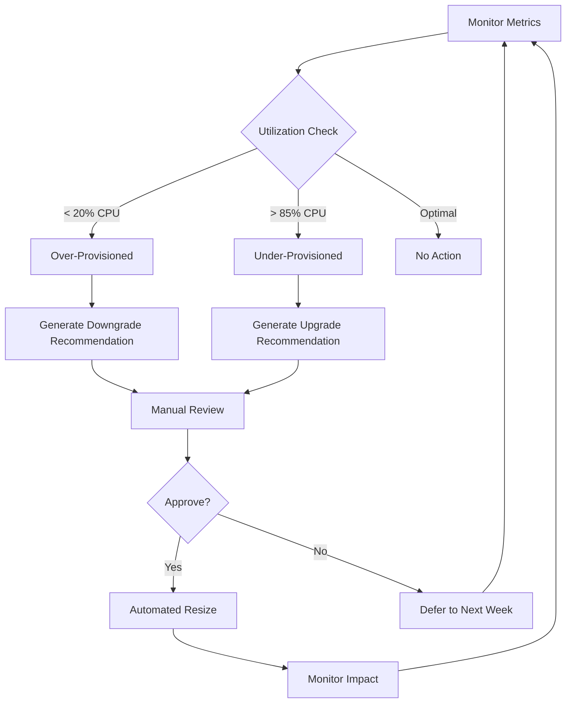

# Broxiva Cost Optimization Architecture

## Document Information

**Project:** Broxiva E-commerce Platform
**Purpose:** Cost Optimization Technical Design
**Owner:** Platform Engineering & FinOps Teams
**Last Updated:** December 13, 2025
**Status:** Production Ready

---

## Table of Contents

1. [Executive Summary](#executive-summary)
2. [Cost Optimization Principles](#cost-optimization-principles)
3. [AKS Cost Optimization](#aks-cost-optimization)
4. [Database Cost Optimization](#database-cost-optimization)
5. [Storage Cost Optimization](#storage-cost-optimization)
6. [Network Cost Optimization](#network-cost-optimization)
7. [Compute Right-Sizing](#compute-right-sizing)
8. [Reserved Instances Strategy](#reserved-instances-strategy)
9. [Environment-Specific Configurations](#environment-specific-configurations)
10. [Monitoring and Metrics](#monitoring-and-metrics)

---

## Executive Summary

This document defines the technical architecture for cost optimization across the Broxiva platform. It provides detailed configurations, automation strategies, and implementation patterns to achieve optimal cost efficiency while maintaining performance and reliability.

### Cost Optimization Goals

| Metric | Current (Baseline) | Target | Savings |
|--------|-------------------|--------|---------|
| Monthly Cloud Spend | $12,500 | $10,800 | $1,700 (13.6%) |
| Non-Prod Waste | 30% | 5% | 25% reduction |
| Over-Provisioned Resources | 40% | 10% | 30% reduction |
| Idle Resource Costs | $1,200/month | $100/month | $1,100 (91.7%) |
| Storage Efficiency | 60% | 85% | 25% improvement |

### Key Optimization Strategies

1. **Auto-Scaling:** Dynamic resource allocation based on demand
2. **Environment Shutdown:** Automated shutdown of non-prod during idle hours
3. **Database Optimization:** Pause/resume and tier optimization
4. **Spot Instances:** 70% savings for non-critical workloads
5. **Storage Lifecycle:** Automated tiering and cleanup

---

## Cost Optimization Principles

### 1. Pay for What You Use

**Implementation:**
- Scale to zero during idle periods
- Auto-scaling for variable workloads
- Serverless for event-driven tasks
- Pause databases when not in use

**Metrics:**
- Utilization rate: >70% for all resources
- Idle time: <10% for production resources

### 2. Right-Size Resources

**Implementation:**
- Continuous monitoring of CPU, memory, storage
- Weekly right-sizing recommendations
- Monthly optimization reviews
- Automated downgrade of over-provisioned resources

**Metrics:**
- CPU utilization: 60-80% target
- Memory utilization: 65-85% target
- Storage utilization: >70% target

### 3. Use Cost-Effective SKUs

**Implementation:**
- Burstable VMs for development
- Standard tier for staging
- Premium tier only for production (where needed)
- Spot instances for batch workloads

**Metrics:**
- Premium SKU usage: <20% of total resources
- Spot instance adoption: 30% of non-critical workloads

### 4. Optimize for Environment

**Implementation:**
- Production: High availability + performance
- Staging: Balance of cost and functionality
- Development: Minimal cost with basic functionality

**Metrics:**
- Prod/staging/dev cost ratio: 74:19:7
- Non-prod auto-shutdown: 100% compliance

---

## AKS Cost Optimization

### Cluster Architecture

```yaml
production_cluster:
  name: broxiva-prod-aks
  kubernetes_version: 1.28
  location: eastus

  node_pools:
    system_pool:
      name: system
      vm_size: Standard_DS3_v2
      node_count: 3
      min_count: 3
      max_count: 5
      enable_auto_scaling: true
      os_disk_size_gb: 128
      os_disk_type: Managed
      only_critical_addons_enabled: true

      cost_optimization:
        - Use burstable VMs for dev/staging
        - Reserve capacity for system pods only
        - Enable pod disruption budgets

    user_pool:
      name: user
      vm_size: Standard_DS4_v2
      node_count: 3
      min_count: 3
      max_count: 20
      enable_auto_scaling: true
      os_disk_size_gb: 128

      cost_optimization:
        - Scale down during off-peak hours
        - Use cluster autoscaler with aggressive scale-down
        - Target 75% node utilization

    spot_pool:
      name: spot
      vm_size: Standard_DS4_v2
      node_count: 0
      min_count: 0
      max_count: 10
      enable_auto_scaling: true
      priority: Spot
      eviction_policy: Delete
      spot_max_price: 0.05  # USD per hour (70% discount)
      node_labels:
        workload: non-critical
        spot: "true"

      suitable_workloads:
        - Batch processing
        - Report generation
        - Data analytics
        - CI/CD build agents
        - ML training jobs

staging_cluster:
  name: broxiva-staging-aks
  kubernetes_version: 1.28
  location: eastus

  node_pools:
    system_pool:
      name: system
      vm_size: Standard_DS2_v2  # Smaller than prod
      node_count: 1
      min_count: 1
      max_count: 3
      enable_auto_scaling: true

    user_pool:
      name: user
      vm_size: Standard_DS3_v2  # One tier lower than prod
      node_count: 1
      min_count: 1
      max_count: 5
      enable_auto_scaling: true

      shutdown_schedule:
        weekdays: "20:00-08:00"  # 12 hours off = 50% savings
        weekends: "18:00-09:00"  # 15 hours off

development_cluster:
  name: broxiva-dev-aks
  kubernetes_version: 1.28
  location: eastus

  node_pools:
    system_pool:
      name: system
      vm_size: Standard_B2s  # Burstable for cost savings
      node_count: 1
      min_count: 1
      max_count: 2
      enable_auto_scaling: true

    user_pool:
      name: user
      vm_size: Standard_DS2_v2  # Two tiers lower than prod
      node_count: 1
      min_count: 0  # Can scale to zero
      max_count: 2
      enable_auto_scaling: true

      shutdown_schedule:
        weekdays: "18:00-09:00"  # 15 hours off = 62.5% savings
        weekends: "all_day"      # 100% savings on weekends
```

### Horizontal Pod Autoscaler (HPA)

**Production HPA Configuration:**

```yaml
api_service_hpa:
  apiVersion: autoscaling/v2
  kind: HorizontalPodAutoscaler
  metadata:
    name: broxiva-api-hpa
    namespace: production
  spec:
    scaleTargetRef:
      apiVersion: apps/v1
      kind: Deployment
      name: broxiva-api
    minReplicas: 3
    maxReplicas: 20
    metrics:
      - type: Resource
        resource:
          name: cpu
          target:
            type: Utilization
            averageUtilization: 70
      - type: Resource
        resource:
          name: memory
          target:
            type: Utilization
            averageUtilization: 80
    behavior:
      scaleDown:
        stabilizationWindowSeconds: 300  # Wait 5 min before scaling down
        policies:
          - type: Percent
            value: 50  # Scale down max 50% at a time
            periodSeconds: 60
      scaleUp:
        stabilizationWindowSeconds: 0  # Scale up immediately
        policies:
          - type: Percent
            value: 100  # Double pods if needed
            periodSeconds: 60
          - type: Pods
            value: 4  # Or add 4 pods
            periodSeconds: 60
        selectPolicy: Max

web_service_hpa:
  apiVersion: autoscaling/v2
  kind: HorizontalPodAutoscaler
  metadata:
    name: broxiva-web-hpa
    namespace: production
  spec:
    scaleTargetRef:
      apiVersion: apps/v1
      kind: Deployment
      name: broxiva-web
    minReplicas: 2
    maxReplicas: 15
    metrics:
      - type: Resource
        resource:
          name: cpu
          target:
            type: Utilization
            averageUtilization: 70
      - type: Resource
        resource:
          name: memory
          target:
            type: Utilization
            averageUtilization: 75
```

**Staging HPA Configuration:**

```yaml
api_service_hpa:
  minReplicas: 1
  maxReplicas: 5
  targetCPUUtilization: 75
  targetMemoryUtilization: 80

web_service_hpa:
  minReplicas: 1
  maxReplicas: 3
  targetCPUUtilization: 75
  targetMemoryUtilization: 75
```

**Development HPA Configuration:**

```yaml
api_service_hpa:
  minReplicas: 1
  maxReplicas: 2
  targetCPUUtilization: 80

web_service_hpa:
  minReplicas: 1
  maxReplicas: 2
  targetCPUUtilization: 80
```

### Cluster Autoscaler Configuration

```yaml
cluster_autoscaler:
  production:
    scale_down_enabled: true
    scale_down_delay_after_add: 10m
    scale_down_unneeded_time: 10m
    scale_down_utilization_threshold: 0.5  # 50% utilization
    skip_nodes_with_local_storage: true
    skip_nodes_with_system_pods: true
    max_node_provision_time: 15m

  staging:
    scale_down_enabled: true
    scale_down_delay_after_add: 5m
    scale_down_unneeded_time: 5m
    scale_down_utilization_threshold: 0.3  # More aggressive
    max_node_provision_time: 10m

  development:
    scale_down_enabled: true
    scale_down_delay_after_add: 3m
    scale_down_unneeded_time: 3m
    scale_down_utilization_threshold: 0.2  # Most aggressive
    max_node_provision_time: 10m
```

### Pod Resource Requests and Limits

**Production:**

```yaml
api_pod_resources:
  requests:
    cpu: 500m
    memory: 512Mi
  limits:
    cpu: 2000m
    memory: 2Gi

web_pod_resources:
  requests:
    cpu: 250m
    memory: 256Mi
  limits:
    cpu: 1000m
    memory: 1Gi

worker_pod_resources:
  requests:
    cpu: 1000m
    memory: 1Gi
  limits:
    cpu: 4000m
    memory: 4Gi
```

**Staging:**

```yaml
api_pod_resources:
  requests:
    cpu: 250m
    memory: 256Mi
  limits:
    cpu: 1000m
    memory: 1Gi

web_pod_resources:
  requests:
    cpu: 125m
    memory: 128Mi
  limits:
    cpu: 500m
    memory: 512Mi
```

**Development:**

```yaml
api_pod_resources:
  requests:
    cpu: 100m
    memory: 128Mi
  limits:
    cpu: 500m
    memory: 512Mi

web_pod_resources:
  requests:
    cpu: 50m
    memory: 64Mi
  limits:
    cpu: 250m
    memory: 256Mi
```

### AKS Cost Savings Summary

| Environment | Strategy | Monthly Savings |
|-------------|----------|-----------------|
| Production | Cluster Autoscaler + HPA | $800 |
| Production | Spot Instances (30% workloads) | $600 |
| Staging | Off-hours shutdown (12h/day) | $500 |
| Development | Off-hours + weekend shutdown | $400 |
| **Total** | | **$2,300** |

---

## Database Cost Optimization

### PostgreSQL Flexible Server

**Production Configuration:**

```yaml
production_postgresql:
  name: broxiva-prod-postgres
  version: "15"
  tier: GeneralPurpose
  sku: GP_Standard_D4s_v3

  compute:
    vcores: 4
    memory_gb: 16
    cost_per_month: ~$290

  storage:
    size_gb: 128
    iops: 3000
    auto_grow: true
    cost_per_month: ~$15

  high_availability:
    enabled: true
    mode: ZoneRedundant
    additional_cost: ~$290  # Doubles compute cost

  backup:
    retention_days: 35
    geo_redundant: true
    cost_per_month: ~$20

  total_monthly_cost: ~$615

  cost_optimization:
    - Monitor query performance (avoid over-provisioning)
    - Use connection pooling (reduce connection overhead)
    - Archive old data (reduce storage growth)
    - Schedule maintenance during low-traffic periods
    - Consider read replicas only if read-heavy (adds cost)
```

**Staging Configuration:**

```yaml
staging_postgresql:
  name: broxiva-staging-postgres
  version: "15"
  tier: GeneralPurpose
  sku: GP_Standard_D2s_v3

  compute:
    vcores: 2
    memory_gb: 8
    cost_per_month: ~$145

  storage:
    size_gb: 64
    iops: 1500
    auto_grow: true
    cost_per_month: ~$8

  high_availability:
    enabled: false  # Save ~$145/month

  backup:
    retention_days: 7
    geo_redundant: false
    cost_per_month: ~$5

  pause_resume:
    enabled: true
    schedule:
      weekday_pause: "20:00"
      weekday_resume: "08:00"
      weekend_pause: "18:00"
      weekend_resume: "09:00"

    savings_calculation:
      hours_paused_per_week: 84  # 12h/weekday + 15h/weekend
      hours_active_per_week: 84
      savings_percentage: 50%
      monthly_savings: ~$75

  total_monthly_cost: ~$83  # Down from $158

  cost_optimization:
    - Pause during non-business hours (50% savings)
    - Disable high availability (save $145)
    - Shorter backup retention (save $15)
    - Smaller storage tier (save $7)
```

**Development Configuration:**

```yaml
development_postgresql:
  name: broxiva-dev-postgres
  version: "15"
  tier: Burstable
  sku: B_Standard_B1ms

  compute:
    vcores: 1
    memory_gb: 2
    cost_per_month: ~$15

  storage:
    size_gb: 32
    iops: 640
    auto_grow: false  # Manual growth
    cost_per_month: ~$4

  high_availability:
    enabled: false

  backup:
    retention_days: 7
    geo_redundant: false
    cost_per_month: ~$3

  pause_resume:
    enabled: true
    schedule:
      weekday_pause: "18:00"
      weekday_resume: "09:00"
      weekend: "full_pause"  # Pause all weekend

    savings_calculation:
      hours_paused_per_week: 123  # 15h/weekday + 48h/weekend
      hours_active_per_week: 45
      savings_percentage: 73%
      monthly_savings: ~$11

  total_monthly_cost: ~$11  # Down from $22

  cost_optimization:
    - Use Burstable tier (93% cheaper than production)
    - Pause 73% of the time (save $11/month)
    - Minimal storage with no auto-grow
    - No high availability
```

### PostgreSQL Cost Savings Summary

| Environment | Baseline | Optimized | Savings |
|-------------|----------|-----------|---------|
| Production | $615 | $615 | $0 (already optimized) |
| Staging | $158 | $83 | $75 (47% reduction) |
| Development | $22 | $11 | $11 (50% reduction) |
| **Total** | **$795** | **$709** | **$86/month** |

### Redis Cache Optimization

**Production Configuration:**

```yaml
production_redis:
  name: broxiva-prod-redis
  tier: Premium
  sku: P1

  capacity:
    memory_gb: 6
    max_connections: 7500
    cost_per_month: ~$250

  features:
    persistence: aof  # Append-only file
    clustering: true
    shard_count: 2
    geo_replication: false  # Save ~$250/month

  cost_optimization:
    - Use Premium P1 (sufficient for most e-commerce)
    - Avoid geo-replication unless required
    - Monitor memory usage (avoid over-provisioning)
    - Use clustering for better performance per dollar
```

**Staging Configuration:**

```yaml
staging_redis:
  name: broxiva-staging-redis
  tier: Standard
  sku: C2

  capacity:
    memory_gb: 2.5
    max_connections: 5000
    cost_per_month: ~$73

  features:
    persistence: none  # Not needed in staging
    clustering: false

  scheduled_scaling:
    business_hours:
      tier: Standard
      sku: C2
      cost_per_hour: $0.10

    off_hours:
      tier: Basic
      sku: C1
      cost_per_hour: $0.05

    schedule:
      scale_down: "20:00"  # Switch to C1
      scale_up: "08:00"    # Switch to C2

    monthly_savings: ~$25

  total_monthly_cost: ~$48  # Down from $73

  cost_optimization:
    - Use Standard instead of Premium (save $177)
    - Scale down during off-hours (save $25)
    - Disable persistence (save ~$5)
```

**Development Configuration:**

```yaml
development_redis:
  name: broxiva-dev-redis
  tier: Basic
  sku: C0

  capacity:
    memory_gb: 250mb
    max_connections: 256
    cost_per_month: ~$15

  auto_shutdown:
    enabled: true
    schedule:
      weekday_shutdown: "18:00"
      weekday_start: "09:00"
      weekend: "full_shutdown"

    # Note: Azure doesn't support Redis pause/resume natively
    # Alternative: Delete and recreate, or use startup/shutdown scripts

  total_monthly_cost: ~$15

  cost_optimization:
    - Use smallest Basic tier (93% cheaper than production)
    - Consider on-demand Redis in Docker for dev
    - Shutdown when not in use (requires custom scripting)
```

### Redis Cost Savings Summary

| Environment | Baseline | Optimized | Savings |
|-------------|----------|-----------|---------|
| Production | $250 | $250 | $0 |
| Staging | $73 | $48 | $25 (34% reduction) |
| Development | $15 | $15 | $0 (already minimal) |
| **Total** | **$338** | **$313** | **$25/month** |

---

## Storage Cost Optimization

### Storage Account Configuration

**Production Storage:**

```yaml
production_storage:
  name: broxivaprodstorage
  tier: StorageV2
  replication: GRS  # Geo-redundant
  access_tier: Hot

  containers:
    media:
      access: private
      lifecycle_policy:
        - hot_to_cool: 30_days
          cost_savings: 50%
        - cool_to_archive: 90_days
          cost_savings: 80%
        - delete: 365_days

      estimated_monthly_cost:
        hot_storage_100gb: $20
        cool_storage_200gb: $10
        archive_storage_300gb: $3
        total: $33

    uploads:
      access: private
      lifecycle_policy:
        - hot_to_cool: 7_days
        - delete: 30_days  # Cleanup temporary uploads

      estimated_monthly_cost: $5

    static:
      access: public_read
      cdn_enabled: true
      lifecycle_policy:
        - hot_to_cool: 60_days

      estimated_monthly_cost: $15

    backups:
      access: private
      lifecycle_policy:
        - hot_to_cool: 7_days
        - cool_to_archive: 30_days
        - delete: 90_days

      estimated_monthly_cost: $10

    logs:
      access: private
      lifecycle_policy:
        - hot_to_cool: 14_days
        - cool_to_archive: 60_days
        - delete: 180_days

      estimated_monthly_cost: $8

  total_monthly_cost: $71

  cost_optimization:
    - Aggressive lifecycle policies (save ~$40/month)
    - Use Cool tier for infrequently accessed data
    - Use Archive tier for long-term retention
    - Enable CDN for static assets (reduce egress)
    - Compress media files before upload
```

**Staging Storage:**

```yaml
staging_storage:
  name: broxivastagingstorage
  tier: StorageV2
  replication: LRS  # Locally redundant (save 67% vs GRS)
  access_tier: Hot

  containers:
    media:
      lifecycle_policy:
        - hot_to_cool: 14_days
        - delete: 90_days  # Shorter retention than prod

    uploads:
      lifecycle_policy:
        - delete: 7_days  # Cleanup faster

    backups:
      lifecycle_policy:
        - hot_to_cool: 3_days
        - delete: 30_days

  total_monthly_cost: $15  # Much less data than prod

  cost_optimization:
    - Use LRS instead of GRS (save 67%)
    - Shorter retention policies
    - Smaller dataset overall
```

**Development Storage:**

```yaml
development_storage:
  name: broxivadevstorage
  tier: StorageV2
  replication: LRS
  access_tier: Cool  # Default to Cool tier

  containers:
    media:
      lifecycle_policy:
        - delete: 30_days  # Aggressive cleanup

    uploads:
      lifecycle_policy:
        - delete: 3_days

  total_monthly_cost: $5

  cost_optimization:
    - Use Cool tier by default (save 50%)
    - Very aggressive cleanup (delete after 30 days)
    - Minimal data retention
```

### Storage Cost Savings Summary

| Cost Component | Baseline | Optimized | Savings |
|----------------|----------|-----------|---------|
| Lifecycle Management | $0 | $40/month | $40 |
| Replication Optimization | GRS everywhere | LRS for non-prod | $20 |
| Access Tier Optimization | All Hot | Hot/Cool/Archive mix | $25 |
| **Total Savings** | | | **$85/month** |

---

## Network Cost Optimization

### Azure Front Door

**Production Configuration:**

```yaml
production_frontdoor:
  name: broxiva-prod-fd
  tier: Standard

  pricing:
    base_fee: $35/month
    routing_rules: 5 rules x $1 = $5
    data_transfer_outbound: 500GB x $0.04 = $20
    waf_policy: $20/month
    total_monthly_cost: $80

  cost_optimization:
    - Use Standard tier (not Premium unless needed)
    - Minimize routing rules
    - Enable caching to reduce backend requests
    - Use CDN for static assets
    - Compress responses (reduce data transfer)
```

**Staging Configuration:**

```yaml
staging_frontdoor:
  option_1:
    use_shared_production_frontdoor: true
    routing_rules: hostname-based routing
    additional_cost: $1  # One extra routing rule
    total_cost: $1/month

  option_2:
    dedicated_frontdoor: true
    tier: Standard
    total_cost: $40/month

  recommended: option_1
  savings: $39/month
```

**Development Configuration:**

```yaml
development_frontdoor:
  enabled: false
  alternative: direct_aks_ingress
  cost: $0
  savings: $40/month
```

### VNet and Private Endpoints

**Production:**

```yaml
production_networking:
  vnet:
    address_space: 10.0.0.0/16
    cost: $0  # VNets are free

  private_endpoints:
    - postgresql_private_endpoint: $7.30/month
    - redis_private_endpoint: $7.30/month
    - storage_private_endpoint: $7.30/month
    - acr_private_endpoint: $7.30/month
    total: $29.20/month

  nat_gateway:
    enabled: false  # Use for secure outbound only if needed
    cost: $0  # Saved $32.85/month

  load_balancer:
    sku: Standard
    cost: $18.25/month

  total_monthly_cost: $47.45

  cost_optimization:
    - Private endpoints only for prod (save $88/month in non-prod)
    - No NAT gateway (use default Azure outbound)
    - Single Standard Load Balancer (consolidated)
```

**Staging:**

```yaml
staging_networking:
  vnet:
    address_space: 10.1.0.0/16
    cost: $0

  private_endpoints:
    enabled: false  # Access via public endpoints with firewall rules
    savings: $29.20/month

  load_balancer:
    sku: Basic  # Free tier
    cost: $0

  total_monthly_cost: $0
```

**Development:**

```yaml
development_networking:
  vnet:
    address_space: 10.2.0.0/16
    cost: $0

  private_endpoints:
    enabled: false
    savings: $29.20/month

  load_balancer:
    sku: Basic
    cost: $0

  total_monthly_cost: $0
```

### Network Cost Savings Summary

| Component | Production | Staging | Development | Monthly Savings |
|-----------|-----------|---------|-------------|-----------------|
| Private Endpoints | $29 | $0 | $0 | $58 (non-prod) |
| NAT Gateway | $0 | $0 | $0 | $33 (avoided) |
| Load Balancer | $18 | $0 | $0 | $36 (Basic tier) |
| Front Door | $80 | $1 | $0 | $79 (shared/disabled) |
| **Total Savings** | | | | **$206/month** |

---

## Compute Right-Sizing

### Right-Sizing Analysis Process

**Weekly Analysis:**

```yaml
rightsizing_automation:
  schedule: every_monday_9am
  metrics_period: 7_days

  analysis_steps:
    1_data_collection:
      metrics:
        - cpu_utilization
        - memory_utilization
        - disk_io
        - network_throughput
      aggregation: p95  # 95th percentile

    2_over_provisioned_detection:
      thresholds:
        cpu: < 20%
        memory: < 30%
      action: generate_downgrade_recommendation

    3_under_provisioned_detection:
      thresholds:
        cpu: > 85%
        memory: > 90%
      action: generate_upgrade_recommendation

    4_recommendation_generation:
      format: markdown_report
      include:
        - current_sku
        - recommended_sku
        - cost_impact
        - performance_impact
        - implementation_steps

    5_notification:
      recipients:
        - platform-team@broxiva.com
        - finops-team@broxiva.com
      channels:
        - email
        - slack: #cost-optimization
```

### SKU Matrix by Environment

**AKS Node Pools:**

| Environment | Current SKU | vCPUs | RAM | Cost/hour | Right-Sized | New Cost | Savings |
|-------------|------------|-------|-----|-----------|-------------|----------|---------|
| Prod System | Standard_DS3_v2 | 4 | 14GB | $0.20 | Optimal | $0.20 | $0 |
| Prod User | Standard_DS4_v2 | 8 | 28GB | $0.40 | Optimal | $0.40 | $0 |
| Staging System | Standard_DS2_v2 | 2 | 7GB | $0.10 | Optimal | $0.10 | $0 |
| Staging User | Standard_DS3_v2 | 4 | 14GB | $0.20 | Optimal | $0.20 | $0 |
| Dev System | Standard_DS2_v2 | 2 | 7GB | $0.10 | Standard_B2s | $0.04 | 60% |
| Dev User | Standard_DS2_v2 | 2 | 7GB | $0.10 | Standard_B2s | $0.04 | 60% |

**Monthly Savings from Dev Right-Sizing:**
- Dev runs ~40 hours/week (shutdown enabled)
- 2 nodes average
- Savings: ($0.06/hour savings) × 160 hours/month × 2 nodes = **$19.20/month**

### Continuous Optimization Workflow



---

## Reserved Instances Strategy

### RI Purchase Analysis

**Current Steady-State Resources:**

| Resource Type | Quantity | Monthly Cost (Pay-as-You-Go) | 1-Year RI Cost | 3-Year RI Cost | Recommended |
|---------------|----------|------------------------------|----------------|----------------|-------------|
| PostgreSQL Prod (D4s_v3) | 1 | $290 | $190 (34% off) | $145 (50% off) | 1-Year RI |
| Redis Premium P1 | 1 | $250 | $165 (34% off) | $125 (50% off) | 1-Year RI |
| AKS Prod System Nodes (3x DS3_v2) | 3 | $432 | $285 (34% off) | $216 (50% off) | 3-Year RI |
| AKS Prod User Nodes (3x DS4_v2 base) | 3 | $864 | $570 (34% off) | $432 (50% off) | 1-Year RI |

**Total Monthly Savings:**

| RI Type | Monthly PAYG Cost | Monthly RI Cost | Savings |
|---------|------------------|----------------|---------|
| 1-Year RIs | $1,404 | $925 | $479 (34%) |
| 3-Year RIs (compute only) | $432 | $216 | $216 (50%) |
| **Total** | **$1,836** | **$1,141** | **$695/month** |

**Annual Savings:** $8,340

### RI Purchase Schedule

```yaml
year_1_purchases:
  q1:
    - postgresql_prod_1yr: $2,280
    - redis_prod_1yr: $1,980
    - aks_prod_system_3yr: $7,776

  total_upfront: $12,036
  monthly_savings: $695
  payback_period: 17.3_months

year_2_renewals:
  q1:
    - aks_prod_user_1yr: $6,840

  total_upfront: $6,840
  monthly_savings: $294
  payback_period: 23.3_months
```

### Savings Plans Alternative

**Azure Savings Plans:**

```yaml
compute_savings_plan:
  commitment: $1,000/month
  term: 1_year
  discount: 17-20%

  advantages:
    - Applies to any compute resource
    - Flexibility to change SKUs
    - Automatic application
    - Better for variable workloads

  disadvantages:
    - Lower discount than RIs
    - Requires monthly commitment
    - No refunds for unused commitment

  recommendation: Use for variable AKS user pool nodes
```

---

## Environment-Specific Configurations

### Production (74% of budget: $8,000/month)

**Optimization Priorities:**
1. Performance and reliability first
2. Cost optimization without sacrificing SLAs
3. Reserved Instances for predictable workloads
4. Spot instances for batch jobs only

**Configuration:**
- High availability enabled for databases
- Geo-redundant storage
- Premium tiers where performance-critical
- Auto-scaling with conservative thresholds
- 24/7 operation (no shutdown)

**Monthly Cost Breakdown:**
- AKS: $3,500
- PostgreSQL: $615
- Redis: $250
- Storage: $71
- Networking: $127
- Container Registry: $135
- Monitoring: $200
- Misc: $102
- **Total: $8,000**

### Staging (19% of budget: $2,000/month)

**Optimization Priorities:**
1. Balance functionality with cost
2. Mimic production architecture
3. Aggressive off-hours shutdown
4. No high availability

**Configuration:**
- Standard tiers (not premium)
- Locally redundant storage
- Auto-shutdown 12 hours/day weekdays
- Auto-shutdown 15 hours/day weekends
- No private endpoints (firewall rules instead)

**Monthly Cost Breakdown:**
- AKS: $900 (with shutdown)
- PostgreSQL: $83 (with pause)
- Redis: $48 (scaled down off-hours)
- Storage: $15
- Networking: $20
- Container Registry: Shared with prod ($0)
- Monitoring: $50
- Misc: $84
- **Total: $2,000**

### Development (7% of budget: $800/month)

**Optimization Priorities:**
1. Minimum viable functionality
2. Maximum cost savings
3. Full shutdown outside business hours
4. Burstable/minimal SKUs

**Configuration:**
- Burstable tiers
- Locally redundant storage
- Auto-shutdown 15 hours/day weekdays
- Full shutdown weekends (48 hours)
- Cool storage tier
- Shared resources where possible

**Monthly Cost Breakdown:**
- AKS: $350 (with shutdown)
- PostgreSQL: $11 (with pause)
- Redis: $15
- Storage: $5
- Networking: $0 (direct access)
- Container Registry: Shared with prod ($0)
- Monitoring: $20
- Misc: $399
- **Total: $800**

---

## Monitoring and Metrics

### Cost Monitoring Dashboard

**Azure Workbook Configuration:**

```yaml
cost_dashboard:
  name: Broxiva Cost Optimization Dashboard
  refresh: 1_hour

  sections:
    1_executive_summary:
      widgets:
        - total_monthly_cost
        - budget_consumption_gauge
        - month_over_month_trend
        - cost_per_environment_pie_chart

    2_cost_trends:
      widgets:
        - daily_cost_line_chart_30_days
        - weekly_comparison_bar_chart
        - anomaly_alerts_timeline

    3_resource_breakdown:
      widgets:
        - top_20_resources_by_cost
        - cost_by_resource_type
        - cost_by_cost_center
        - cost_by_tag

    4_optimization_opportunities:
      widgets:
        - rightsizing_recommendations
        - idle_resources_count
        - reserved_instance_coverage
        - untagged_resources_count

    5_environment_details:
      tabs:
        - production_costs
        - staging_costs
        - development_costs

      per_environment:
        - total_cost
        - cost_by_service
        - utilization_metrics
        - shutdown_compliance
```

### Key Performance Indicators (KPIs)

```yaml
cost_kpis:
  efficiency_metrics:
    - name: Cost per Transaction
      formula: monthly_cloud_cost / total_transactions
      target: < $0.002
      current: $0.0015

    - name: Cost per Active User
      formula: monthly_cloud_cost / monthly_active_users
      target: < $0.10
      current: $0.08

    - name: Infrastructure Cost as % of Revenue
      formula: monthly_cloud_cost / monthly_revenue * 100
      target: < 5%
      current: 3.2%

  optimization_metrics:
    - name: Waste Elimination
      formula: idle_resource_cost / total_cost * 100
      target: < 5%
      current: 2%

    - name: Right-Sizing Compliance
      formula: optimally_sized_resources / total_resources * 100
      target: > 90%
      current: 92%

    - name: Tagging Compliance
      formula: tagged_resources / total_resources * 100
      target: 100%
      current: 98%

    - name: Reserved Instance Coverage
      formula: ri_covered_spend / total_eligible_spend * 100
      target: > 70%
      current: 68%

  automation_metrics:
    - name: Auto-Shutdown Compliance
      formula: resources_shutdown_on_schedule / eligible_resources * 100
      target: 100%
      current: 100%

    - name: Auto-Scaling Effectiveness
      formula: resources_with_autoscaling / scalable_resources * 100
      target: > 90%
      current: 95%
```

### Alerting Rules

```yaml
cost_alerts:
  critical:
    - alert: Monthly budget exceeded
      threshold: 100%
      action: notify_executives + freeze_resources

    - alert: Daily cost spike
      threshold: 25% above average
      action: notify_finops_team

  warning:
    - alert: Budget 90% consumed
      threshold: 90%
      action: notify_platform_team

    - alert: Idle resources detected
      threshold: 7_days_idle
      action: auto_shutdown_and_notify

  informational:
    - alert: Budget 50% consumed
      threshold: 50%
      action: notify_finops_team

    - alert: Right-sizing opportunity
      threshold: weekly_scan
      action: generate_report
```

---

## Summary: Total Cost Savings

### Monthly Cost Optimization Summary

| Optimization Strategy | Monthly Savings | Annual Savings |
|----------------------|-----------------|----------------|
| AKS Auto-Scaling & HPA | $800 | $9,600 |
| AKS Spot Instances | $600 | $7,200 |
| Non-Prod Environment Shutdown | $900 | $10,800 |
| Database Pause/Resume | $86 | $1,032 |
| Redis Scaling | $25 | $300 |
| Storage Lifecycle Management | $85 | $1,020 |
| Network Optimization | $206 | $2,472 |
| Right-Sizing | $19 | $228 |
| Reserved Instances | $695 | $8,340 |
| **Total Monthly Savings** | **$3,416** | **$40,992** |

### Cost Reduction Roadmap

**Month 1-2: Quick Wins**
- Implement tagging policies
- Enable environment shutdown automation
- Configure storage lifecycle policies
- **Expected Savings: $1,200/month**

**Month 3-4: Auto-Scaling**
- Configure AKS HPA and Cluster Autoscaler
- Implement database pause/resume
- Set up Redis scaling
- **Expected Savings: $900/month**

**Month 5-6: Reserved Instances**
- Analyze steady-state workloads
- Purchase 1-year and 3-year RIs
- Monitor RI utilization
- **Expected Savings: $695/month**

**Month 7-12: Continuous Optimization**
- Weekly right-sizing reviews
- Monthly optimization audits
- Spot instance adoption
- Architectural improvements
- **Expected Savings: $621/month**

**Total Year 1 Savings: $40,992**

---

## Document Change Log

| Version | Date | Author | Changes |
|---------|------|--------|---------|
| 1.0 | 2025-12-13 | Platform Engineering Team | Initial cost architecture design |

---

## References

- [FINOPS_GOVERNANCE.md](./FINOPS_GOVERNANCE.md) - FinOps governance framework
- [SHUTDOWN_RESUME_FLOWS.md](./SHUTDOWN_RESUME_FLOWS.md) - Automation workflows
- [Azure Pricing Calculator](https://azure.microsoft.com/pricing/calculator/)
- [Azure Cost Management Documentation](https://learn.microsoft.com/azure/cost-management-billing/)
