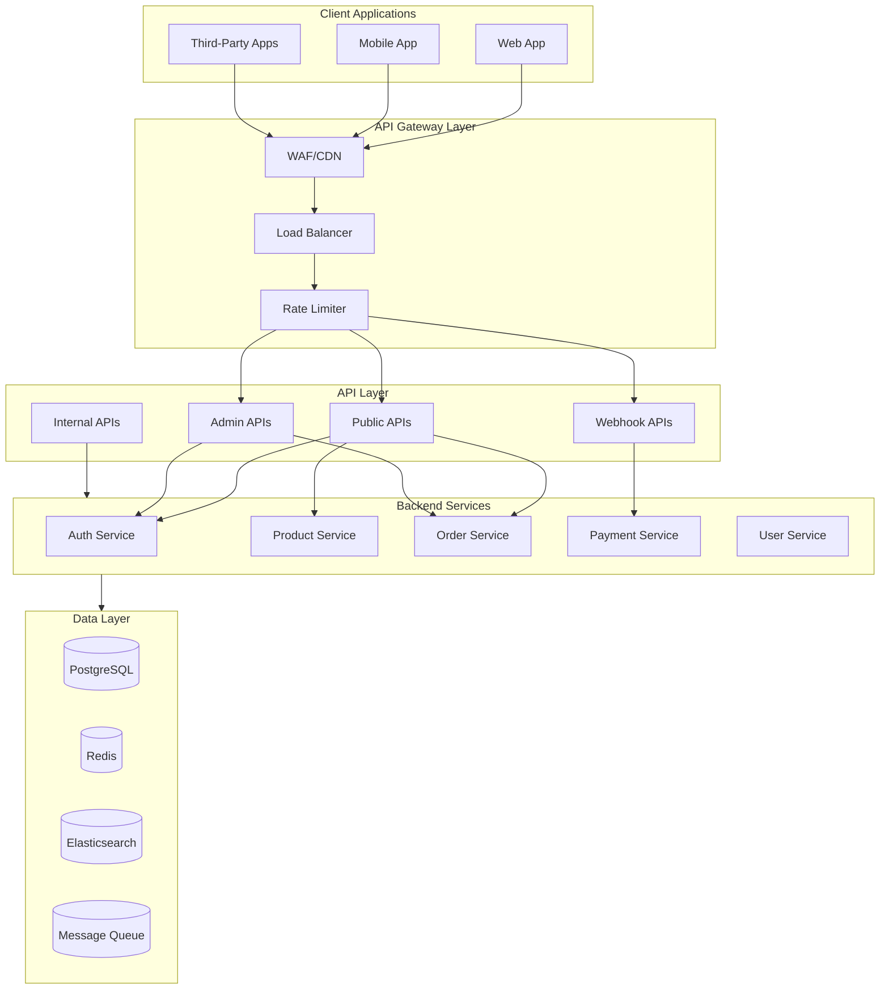
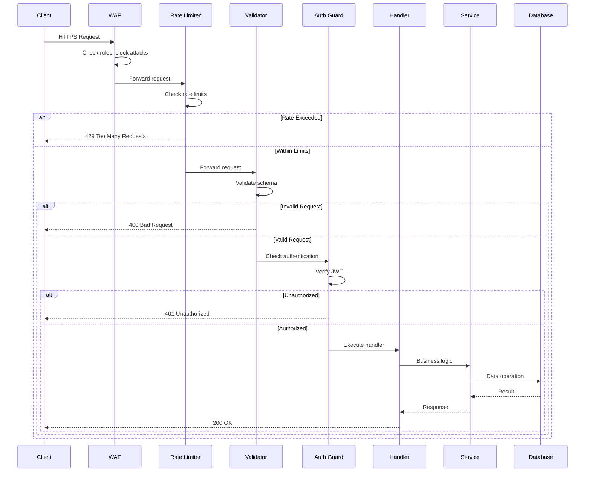
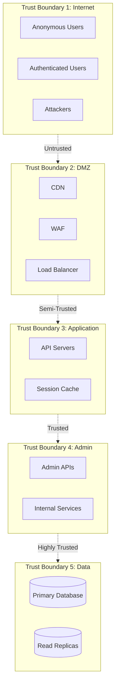
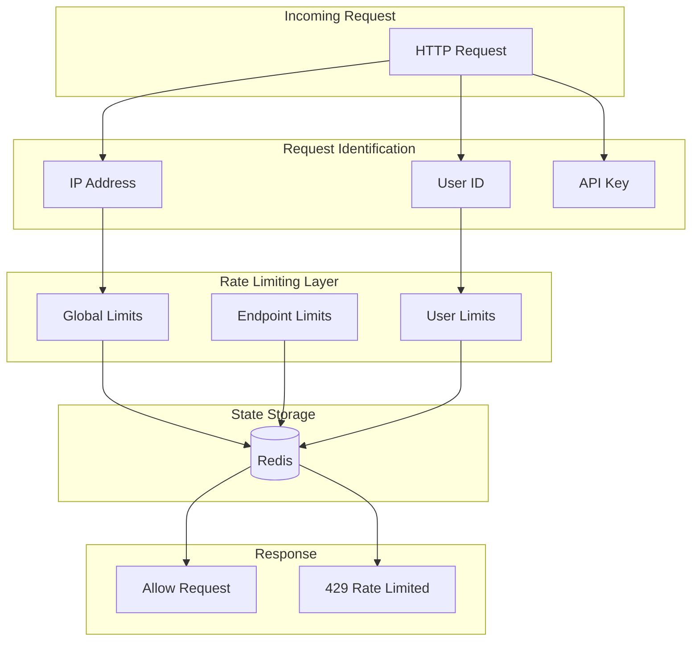
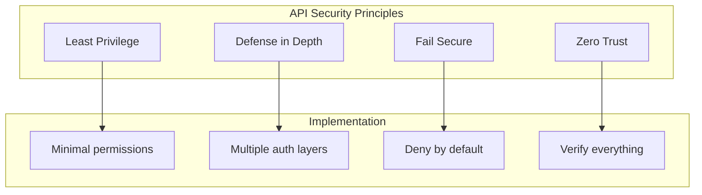

# Threat Model: API Security

## Document Information

| Field | Value |
|-------|-------|
| **Document Version** | 1.0 |
| **Last Updated** | 2026-01-05 |
| **Status** | Active |
| **Owner** | Security Team |
| **Review Cycle** | Quarterly |

---

## 1. Executive Summary

This threat model analyzes the API layer of the Broxiva e-commerce platform. The API serves as the primary interface between clients and backend services, handling public-facing requests, administrative operations, and third-party webhooks. This document identifies potential threats using STRIDE methodology and maps mitigations to OWASP Top 10 categories.

---

## 2. System Overview

### 2.1 Architecture Overview



### 2.2 API Categories

```mermaid
flowchart LR
    subgraph Public["Public APIs"]
        P1[/products]
        P2[/categories]
        P3[/search]
        P4[/auth]
        P5[/checkout]
    end

    subgraph Protected["Protected APIs"]
        PR1[/orders]
        PR2[/cart]
        PR3[/wishlist]
        PR4[/profile]
        PR5[/reviews]
    end

    subgraph Admin["Admin APIs"]
        A1[/admin/products]
        A2[/admin/orders]
        A3[/admin/users]
        A4[/admin/analytics]
        A5[/admin/settings]
    end

    subgraph Webhooks["Webhook APIs"]
        W1[/webhooks/stripe]
        W2[/webhooks/paypal]
        W3[/webhooks/shipping]
    end
```

### 2.3 Data Flow Diagram - API Request



---

## 3. Trust Boundaries



---

## 4. Entry Points

### 4.1 Public API Endpoints

| ID | Endpoint | Method | Auth | Description |
|----|----------|--------|------|-------------|
| EP-API-01 | /api/products | GET | None | List products |
| EP-API-02 | /api/products/:id | GET | None | Get product details |
| EP-API-03 | /api/categories | GET | None | List categories |
| EP-API-04 | /api/search | GET | None | Search products |
| EP-API-05 | /api/auth/* | POST | Varies | Authentication endpoints |
| EP-API-06 | /api/health | GET | None | Health check |

### 4.2 Protected API Endpoints

| ID | Endpoint | Method | Auth | Description |
|----|----------|--------|------|-------------|
| EP-API-10 | /api/cart | ALL | JWT | Cart operations |
| EP-API-11 | /api/orders | ALL | JWT | Order management |
| EP-API-12 | /api/checkout | POST | JWT | Checkout process |
| EP-API-13 | /api/profile | ALL | JWT | User profile |
| EP-API-14 | /api/wishlist | ALL | JWT | Wishlist management |
| EP-API-15 | /api/reviews | POST | JWT | Submit reviews |

### 4.3 Admin API Endpoints

| ID | Endpoint | Method | Auth | Description |
|----|----------|--------|------|-------------|
| EP-API-20 | /api/admin/products | ALL | Admin | Product management |
| EP-API-21 | /api/admin/orders | ALL | Admin | Order management |
| EP-API-22 | /api/admin/users | ALL | Admin | User management |
| EP-API-23 | /api/admin/analytics | GET | Admin | Analytics data |
| EP-API-24 | /api/admin/settings | ALL | Admin | System settings |
| EP-API-25 | /api/admin/cache | ALL | Admin | Cache management |

### 4.4 Webhook Endpoints

| ID | Endpoint | Method | Auth | Description |
|----|----------|--------|------|-------------|
| EP-API-30 | /api/webhooks/stripe | POST | Signature | Stripe events |
| EP-API-31 | /api/webhooks/paypal | POST | Signature | PayPal events |
| EP-API-32 | /api/webhooks/shipping | POST | Signature | Shipping updates |
| EP-API-33 | /api/webhooks/kyc | POST | Signature | KYC provider updates |

---

## 5. Assets at Risk

| Asset ID | Asset | Classification | Impact if Compromised |
|----------|-------|----------------|----------------------|
| AST-API-01 | API Authentication Secrets | Secret | Full API access |
| AST-API-02 | User Session Data | Confidential | Account takeover |
| AST-API-03 | Business Logic | Proprietary | Competitive advantage |
| AST-API-04 | Customer Data via API | PII | Privacy breach |
| AST-API-05 | Admin Functionality | Privileged | System compromise |
| AST-API-06 | Rate Limiting State | Operational | DoS vulnerability |
| AST-API-07 | API Keys (Third-party) | Secret | Service abuse |
| AST-API-08 | Webhook Secrets | Secret | Data injection |
| AST-API-09 | Internal API Endpoints | Confidential | Lateral movement |
| AST-API-10 | API Documentation | Confidential | Attack surface mapping |

---

## 6. OWASP Top 10 Mapping

### 6.1 OWASP Top 10 2021 Coverage

| Rank | Category | Applicable Threats | Status |
|------|----------|-------------------|--------|
| A01 | Broken Access Control | T-API-01, T-API-02, T-API-09 | High Priority |
| A02 | Cryptographic Failures | T-API-07 | Addressed |
| A03 | Injection | T-API-03, T-API-04 | Addressed |
| A04 | Insecure Design | T-API-08 | Medium Priority |
| A05 | Security Misconfiguration | T-API-05, T-API-06 | Medium Priority |
| A06 | Vulnerable Components | T-API-10 | Monitored |
| A07 | Auth Failures | See Auth Threat Model | Addressed |
| A08 | Data Integrity Failures | T-API-11 | Medium Priority |
| A09 | Logging Failures | T-API-12 | High Priority |
| A10 | SSRF | T-API-13 | Addressed |

---

## 7. STRIDE Threat Analysis

### 7.1 Spoofing

#### T-API-01: JWT Token Forgery

| Attribute | Value |
|-----------|-------|
| **Threat ID** | T-API-01 |
| **Category** | Spoofing |
| **OWASP** | A01: Broken Access Control |
| **Description** | Attacker forges or steals JWT to access protected endpoints |
| **Entry Point** | All protected endpoints |
| **Assets at Risk** | AST-API-02, AST-API-04 |
| **Likelihood** | Medium |
| **Impact** | High |
| **Risk Rating** | High |

**Attack Scenario:**
1. Attacker captures JWT from XSS or insecure storage
2. Uses token to access victim's resources
3. Performs actions as victim

**Existing Controls:**
- [x] JWT signature verification
- [x] Token expiration
- [x] Token blacklisting on logout
- [x] Secure token storage guidance

**Recommended Controls:**
- [ ] Implement token binding
- [ ] Add refresh token rotation
- [ ] Device fingerprint validation

---

#### T-API-02: Webhook Source Spoofing

| Attribute | Value |
|-----------|-------|
| **Threat ID** | T-API-02 |
| **Category** | Spoofing |
| **OWASP** | A01: Broken Access Control |
| **Description** | Attacker sends fake webhook events to manipulate system state |
| **Entry Point** | EP-API-30 to EP-API-33 |
| **Assets at Risk** | AST-API-08, System integrity |
| **Likelihood** | Medium |
| **Impact** | Critical |
| **Risk Rating** | High |

**Attack Scenario:**
1. Attacker discovers webhook endpoint
2. Crafts fake payment success event
3. Order marked as paid without payment

**Existing Controls:**
- [x] Webhook signature verification (Stripe, PayPal)
- [x] HTTPS only
- [x] Event logging

**Recommended Controls:**
- [ ] IP allowlisting for webhook sources
- [ ] Secondary verification via API call
- [ ] Webhook event replay protection

---

### 7.2 Tampering

#### T-API-03: SQL Injection

| Attribute | Value |
|-----------|-------|
| **Threat ID** | T-API-03 |
| **Category** | Tampering |
| **OWASP** | A03: Injection |
| **Description** | Attacker injects SQL through API parameters |
| **Entry Point** | EP-API-04 (Search), EP-API-20-24 (Admin) |
| **Assets at Risk** | AST-API-04, Database integrity |
| **Likelihood** | Low |
| **Impact** | Critical |
| **Risk Rating** | Medium |

**Attack Scenario:**
1. Attacker crafts malicious search query
2. SQL injection bypasses ORM
3. Data exfiltration or manipulation

**Existing Controls:**
- [x] Prisma ORM with parameterized queries
- [x] Input validation
- [x] WAF rules for SQL injection

**Recommended Controls:**
- [ ] SAST scanning for raw queries
- [ ] Database user privilege restriction
- [ ] SQL query logging and monitoring

---

#### T-API-04: NoSQL Injection

| Attribute | Value |
|-----------|-------|
| **Threat ID** | T-API-04 |
| **Category** | Tampering |
| **OWASP** | A03: Injection |
| **Description** | Attacker injects malicious operators in query parameters |
| **Entry Point** | EP-API-04 (Search with Elasticsearch) |
| **Assets at Risk** | AST-API-04, Search index |
| **Likelihood** | Low |
| **Impact** | High |
| **Risk Rating** | Medium |

**Attack Scenario:**
1. Attacker sends JSON operators in search params
2. Elasticsearch query manipulation
3. Unauthorized data access

**Existing Controls:**
- [x] Input type validation
- [x] Query sanitization

**Recommended Controls:**
- [ ] Strict input schemas
- [ ] Elasticsearch query DSL validation
- [ ] Query complexity limits

---

#### T-API-05: Mass Assignment

| Attribute | Value |
|-----------|-------|
| **Threat ID** | T-API-05 |
| **Category** | Tampering |
| **OWASP** | A05: Security Misconfiguration |
| **Description** | Attacker submits unexpected fields to modify protected attributes |
| **Entry Point** | EP-API-13 (Profile), EP-API-20 (Admin) |
| **Assets at Risk** | AST-API-04, User roles |
| **Likelihood** | Medium |
| **Impact** | High |
| **Risk Rating** | High |

**Attack Scenario:**
1. User updates profile
2. Includes "role": "ADMIN" in request body
3. Server blindly applies all fields
4. User gains admin privileges

**Existing Controls:**
- [x] DTOs with explicit fields
- [x] Validation decorators

**Recommended Controls:**
- [ ] Strict whitelist of updateable fields
- [ ] Audit logging for sensitive field changes
- [ ] Type coercion protection

---

### 7.3 Repudiation

#### T-API-06: Insufficient Audit Logging

| Attribute | Value |
|-----------|-------|
| **Threat ID** | T-API-06 |
| **Category** | Repudiation |
| **OWASP** | A09: Logging Failures |
| **Description** | Actions cannot be traced due to inadequate logging |
| **Entry Point** | All endpoints |
| **Assets at Risk** | AST-API-05, Accountability |
| **Likelihood** | Medium |
| **Impact** | Medium |
| **Risk Rating** | Medium |

**Attack Scenario:**
1. Admin performs malicious actions
2. Insufficient logs to identify perpetrator
3. Cannot prove who did what

**Existing Controls:**
- [x] Request logging interceptor
- [x] Authentication event logging
- [x] Error logging

**Recommended Controls:**
- [ ] Structured audit logging for all state changes
- [ ] Immutable audit log storage
- [ ] User action correlation

---

### 7.4 Information Disclosure

#### T-API-07: Sensitive Data Exposure in API Response

| Attribute | Value |
|-----------|-------|
| **Threat ID** | T-API-07 |
| **Category** | Information Disclosure |
| **OWASP** | A02: Cryptographic Failures |
| **Description** | API returns sensitive data not needed by client |
| **Entry Point** | EP-API-11 (Orders), EP-API-22 (Users) |
| **Assets at Risk** | AST-API-04, User PII |
| **Likelihood** | Medium |
| **Impact** | High |
| **Risk Rating** | High |

**Attack Scenario:**
1. API returns full user object
2. Includes password hash, internal IDs
3. Data exposed in browser dev tools

**Existing Controls:**
- [x] Select statements exclude password
- [x] DTOs for response shaping

**Recommended Controls:**
- [ ] Response interceptor to filter sensitive fields
- [ ] GraphQL field-level authorization
- [ ] Regular API response audits

---

#### T-API-08: Excessive Data Exposure via GraphQL/REST

| Attribute | Value |
|-----------|-------|
| **Threat ID** | T-API-08 |
| **Category** | Information Disclosure |
| **OWASP** | A04: Insecure Design |
| **Description** | API allows clients to request more data than needed |
| **Entry Point** | All query endpoints |
| **Assets at Risk** | AST-API-04, Server resources |
| **Likelihood** | High |
| **Impact** | Medium |
| **Risk Rating** | High |

**Attack Scenario:**
1. Attacker requests nested relations deeply
2. Server returns excessive data
3. Performance degradation, data leakage

**Existing Controls:**
- [x] Pagination defaults
- [x] Query limits

**Recommended Controls:**
- [ ] Query depth limiting
- [ ] Query complexity analysis
- [ ] Field-level rate limiting

---

#### T-API-09: IDOR (Insecure Direct Object Reference)

| Attribute | Value |
|-----------|-------|
| **Threat ID** | T-API-09 |
| **Category** | Information Disclosure |
| **OWASP** | A01: Broken Access Control |
| **Description** | Attacker accesses other users' data by manipulating IDs |
| **Entry Point** | EP-API-11 (Orders), EP-API-13 (Profile) |
| **Assets at Risk** | AST-API-04, User data |
| **Likelihood** | High |
| **Impact** | High |
| **Risk Rating** | Critical |

**Attack Scenario:**
1. User views order: /orders/123
2. Changes to /orders/124
3. Sees another user's order details

**Existing Controls:**
- [x] User ownership checks
- [x] JWT user ID verification

**Recommended Controls:**
- [ ] UUID instead of sequential IDs
- [ ] Automated IDOR testing
- [ ] Resource-level access logging

---

### 7.5 Denial of Service

#### T-API-10: API Rate Limit Bypass

| Attribute | Value |
|-----------|-------|
| **Threat ID** | T-API-10 |
| **Category** | Denial of Service |
| **OWASP** | A06: Vulnerable Components |
| **Description** | Attacker bypasses rate limiting to abuse API |
| **Entry Point** | All endpoints |
| **Assets at Risk** | AST-API-06, Service availability |
| **Likelihood** | Medium |
| **Impact** | High |
| **Risk Rating** | High |

**Attack Scenario:**
1. Attacker rotates IP addresses
2. Bypasses per-IP rate limits
3. Overwhelms API with requests

**Existing Controls:**
- [x] Per-IP rate limiting
- [x] Per-user rate limiting
- [x] ThrottlerGuard implementation

**Recommended Controls:**
- [ ] Bot detection and CAPTCHA
- [ ] Token bucket algorithm
- [ ] Distributed rate limiting

---

#### T-API-11: Resource Exhaustion via Complex Queries

| Attribute | Value |
|-----------|-------|
| **Threat ID** | T-API-11 |
| **Category** | Denial of Service |
| **OWASP** | A08: Data Integrity Failures |
| **Description** | Attacker sends complex queries consuming server resources |
| **Entry Point** | EP-API-04 (Search), EP-API-23 (Analytics) |
| **Assets at Risk** | Server resources, Availability |
| **Likelihood** | Medium |
| **Impact** | Medium |
| **Risk Rating** | Medium |

**Attack Scenario:**
1. Attacker sends regex search: ".*a.*b.*c.*d.*e.*"
2. Elasticsearch hangs on complex regex
3. Search service becomes unavailable

**Existing Controls:**
- [x] Query timeouts
- [x] Resource limits

**Recommended Controls:**
- [ ] Query complexity scoring
- [ ] Regex restrictions
- [ ] Async query processing

---

### 7.6 Elevation of Privilege

#### T-API-12: Broken Function Level Authorization

| Attribute | Value |
|-----------|-------|
| **Threat ID** | T-API-12 |
| **Category** | Elevation of Privilege |
| **OWASP** | A01: Broken Access Control |
| **Description** | Regular user accesses admin-only endpoints |
| **Entry Point** | EP-API-20 to EP-API-25 (Admin endpoints) |
| **Assets at Risk** | AST-API-05, System integrity |
| **Likelihood** | Low |
| **Impact** | Critical |
| **Risk Rating** | High |

**Attack Scenario:**
1. Regular user discovers admin endpoint URL
2. Sends request with valid user JWT
3. Missing role check allows access
4. User modifies system settings

**Existing Controls:**
- [x] Role guards on admin endpoints
- [x] JWT role claims
- [x] Endpoint-level authorization

**Recommended Controls:**
- [ ] Defense in depth: multiple authorization checks
- [ ] Admin endpoint obfuscation
- [ ] Admin action alerting

---

#### T-API-13: Server-Side Request Forgery (SSRF)

| Attribute | Value |
|-----------|-------|
| **Threat ID** | T-API-13 |
| **Category** | Elevation of Privilege |
| **OWASP** | A10: SSRF |
| **Description** | Attacker tricks server into making requests to internal resources |
| **Entry Point** | Image upload, URL preview features |
| **Assets at Risk** | AST-API-09, Internal services |
| **Likelihood** | Low |
| **Impact** | High |
| **Risk Rating** | Medium |

**Attack Scenario:**
1. User submits URL for product image
2. URL points to internal metadata service
3. Server fetches internal data
4. Attacker receives sensitive information

**Existing Controls:**
- [x] URL validation
- [x] Domain allowlisting for external fetches

**Recommended Controls:**
- [ ] Disable internal IP fetching
- [ ] Use proxy for external requests
- [ ] Metadata service restrictions

---

## 8. Rate Limiting and Abuse Prevention

### 8.1 Current Rate Limiting Configuration

| Endpoint Category | Limit | Window | Key |
|-------------------|-------|--------|-----|
| Authentication | 5 req | 1 min | IP |
| Password Reset | 3 req | 1 min | IP |
| Public APIs | 100 req | 1 min | IP |
| Protected APIs | 60 req | 1 min | User |
| Admin APIs | 30 req | 1 min | User |
| Webhooks | None | - | Signature |

### 8.2 Rate Limiting Architecture



### 8.3 Abuse Prevention Strategies

| Strategy | Implementation | Status |
|----------|----------------|--------|
| IP Rate Limiting | ThrottlerGuard | Active |
| User Rate Limiting | Custom guard | Active |
| Bot Detection | CloudFlare Bot Management | Planned |
| CAPTCHA | hCaptcha integration | Partial |
| API Key Quotas | Per-key limits | Planned |
| Geographic Blocking | CloudFlare | Available |

---

## 9. Risk Matrix

| Threat ID | Threat | OWASP | Likelihood | Impact | Risk | Priority |
|-----------|--------|-------|------------|--------|------|----------|
| T-API-09 | IDOR | A01 | High | High | Critical | P1 |
| T-API-01 | JWT Token Forgery | A01 | Medium | High | High | P1 |
| T-API-02 | Webhook Spoofing | A01 | Medium | Critical | High | P1 |
| T-API-05 | Mass Assignment | A05 | Medium | High | High | P2 |
| T-API-07 | Sensitive Data Exposure | A02 | Medium | High | High | P2 |
| T-API-08 | Excessive Data Exposure | A04 | High | Medium | High | P2 |
| T-API-10 | Rate Limit Bypass | A06 | Medium | High | High | P2 |
| T-API-12 | Broken Function Auth | A01 | Low | Critical | High | P2 |
| T-API-03 | SQL Injection | A03 | Low | Critical | Medium | P3 |
| T-API-04 | NoSQL Injection | A03 | Low | High | Medium | P3 |
| T-API-06 | Insufficient Logging | A09 | Medium | Medium | Medium | P3 |
| T-API-11 | Resource Exhaustion | A08 | Medium | Medium | Medium | P3 |
| T-API-13 | SSRF | A10 | Low | High | Medium | P3 |

---

## 10. Existing Controls Summary

### 10.1 Authentication & Authorization

| Control | Status | Description |
|---------|--------|-------------|
| JWT Authentication | Implemented | Bearer token validation |
| Role-Based Access | Implemented | Role guards on endpoints |
| CSRF Protection | Implemented | Token-based CSRF prevention |
| Session Management | Implemented | Redis-based sessions |

### 10.2 Input Validation

| Control | Status | Description |
|---------|--------|-------------|
| Schema Validation | Implemented | class-validator decorators |
| Type Coercion | Implemented | class-transformer |
| SQL Injection Prevention | Implemented | Prisma ORM |
| XSS Prevention | Implemented | Output encoding |

### 10.3 Rate Limiting

| Control | Status | Description |
|---------|--------|-------------|
| IP Rate Limiting | Implemented | ThrottlerModule |
| User Rate Limiting | Implemented | Per-user limits |
| Endpoint Limits | Implemented | Custom throttle decorators |

### 10.4 Security Headers

| Header | Status | Value |
|--------|--------|-------|
| Strict-Transport-Security | Implemented | max-age=31536000; includeSubDomains |
| X-Content-Type-Options | Implemented | nosniff |
| X-Frame-Options | Implemented | DENY |
| Content-Security-Policy | Implemented | Strict policy |
| X-XSS-Protection | Implemented | 1; mode=block |

---

## 11. Recommended Controls

### 11.1 High Priority (P1)

| Recommendation | Threat Addressed | OWASP | Effort | Impact |
|----------------|------------------|-------|--------|--------|
| Automated IDOR testing | T-API-09 | A01 | Medium | High |
| UUID for resource IDs | T-API-09 | A01 | High | High |
| Webhook IP allowlisting | T-API-02 | A01 | Low | High |
| Token binding implementation | T-API-01 | A01 | High | High |

### 11.2 Medium Priority (P2-P3)

| Recommendation | Threat Addressed | OWASP | Effort | Impact |
|----------------|------------------|-------|--------|--------|
| Response field filtering | T-API-07 | A02 | Medium | High |
| Query complexity analysis | T-API-08, T-API-11 | A04 | Medium | Medium |
| Bot detection | T-API-10 | A06 | Medium | High |
| Structured audit logging | T-API-06 | A09 | High | Medium |
| Mass assignment testing | T-API-05 | A05 | Low | High |

---

## 12. API Security Best Practices

### 12.1 Design Principles



### 12.2 API Versioning Security

| Practice | Description | Status |
|----------|-------------|--------|
| Version deprecation | Sunset old versions | Policy defined |
| Security patches | Apply to all versions | Process defined |
| Breaking changes | Document security implications | Template exists |

### 12.3 Error Handling

| Requirement | Implementation |
|-------------|----------------|
| No stack traces in production | Configured |
| Generic error messages | Implemented |
| Error logging with context | Implemented |
| Rate limit on error responses | Planned |

---

## 13. Testing Requirements

### 13.1 Security Testing

| Test Type | Frequency | Scope |
|-----------|-----------|-------|
| OWASP ZAP Scan | Weekly | All APIs |
| Penetration Testing | Quarterly | Full API |
| IDOR Testing | Per release | Protected endpoints |
| Authorization Testing | Per release | All roles |
| Rate Limit Testing | Monthly | All endpoints |

### 13.2 Acceptance Criteria

- [ ] No OWASP Top 10 vulnerabilities
- [ ] All endpoints have appropriate authentication
- [ ] Rate limiting effective across all paths
- [ ] No sensitive data in API responses
- [ ] Webhooks verified by signature
- [ ] IDOR vulnerabilities addressed
- [ ] Comprehensive audit logging

---

## 14. Residual Risks

### 14.1 Accepted Risks

| Risk | Residual Level | Rationale |
|------|----------------|-----------|
| API abuse by legitimate users | Low | Rate limiting mitigates |
| Zero-day in dependencies | Low | Monitoring and patching process |
| Sophisticated targeted attacks | Medium | Defense in depth provides layers |

### 14.2 Risk Acceptance Criteria

- **Critical**: No critical risks accepted
- **High**: Must have compensating controls
- **Medium**: Accepted with monitoring
- **Low**: Generally accepted

---

## 15. References

- OWASP Top 10 2021
- OWASP API Security Top 10
- OWASP REST Security Cheat Sheet
- CWE-285: Improper Authorization
- CWE-862: Missing Authorization
- CWE-918: Server-Side Request Forgery

---

## 16. Document History

| Version | Date | Author | Changes |
|---------|------|--------|---------|
| 1.0 | 2026-01-05 | Security Team | Initial document |

---

## 17. Approval

| Role | Name | Date | Signature |
|------|------|------|-----------|
| Security Lead | | | |
| Engineering Lead | | | |
| API Product Owner | | | |
