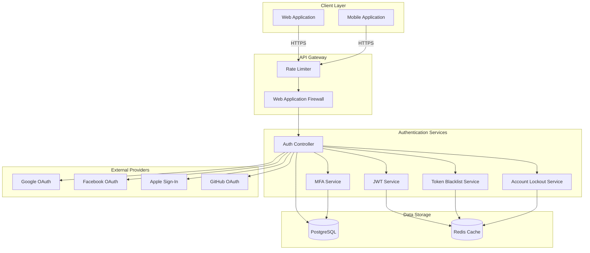
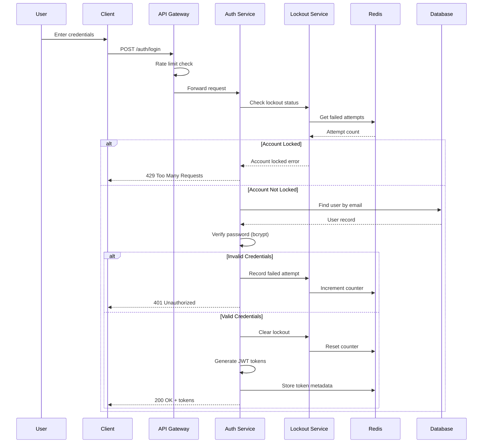
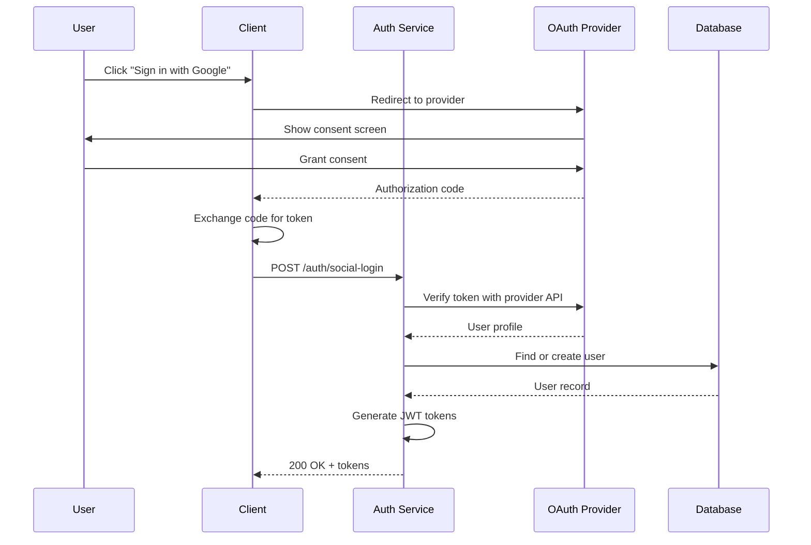
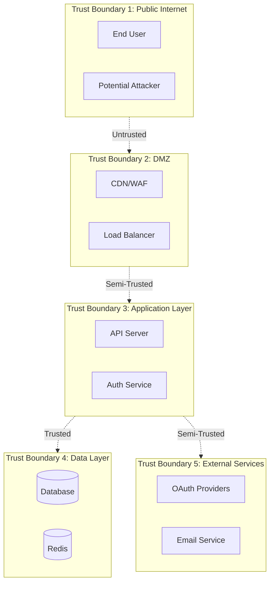

# Threat Model: Authentication System

## Document Information

| Field | Value |
|-------|-------|
| **Document Version** | 1.0 |
| **Last Updated** | 2026-01-05 |
| **Status** | Active |
| **Owner** | Security Team |
| **Review Cycle** | Quarterly |

---

## 1. Executive Summary

This threat model analyzes the authentication system of the Broxiva e-commerce platform. The authentication system is a critical security boundary that protects user accounts, personal data, and financial information. This document identifies potential threats, vulnerabilities, and mitigations using the STRIDE methodology.

---

## 2. System Overview

### 2.1 Architecture Overview

### 2.2 Data Flow Diagram - Login Flow

### 2.3 Data Flow Diagram - OAuth Flow

---

## 3. Trust Boundaries

### Trust Boundary Descriptions

| Boundary | Description | Trust Level |
|----------|-------------|-------------|
| TB1 | Public Internet | Untrusted |
| TB2 | DMZ (CDN, WAF, Load Balancer) | Semi-Trusted |
| TB3 | Application Layer | Trusted |
| TB4 | Data Layer | Highly Trusted |
| TB5 | External OAuth Providers | Semi-Trusted |

---

## 4. Entry Points

| ID | Entry Point | Protocol | Authentication Required | Description |
|----|-------------|----------|------------------------|-------------|
| EP-A01 | POST /auth/register | HTTPS | No | New user registration |
| EP-A02 | POST /auth/login | HTTPS | No | User login with credentials |
| EP-A03 | POST /auth/logout | HTTPS | Yes (JWT) | User logout |
| EP-A04 | POST /auth/refresh | HTTPS | No (Refresh Token) | Token refresh |
| EP-A05 | POST /auth/forgot-password | HTTPS | No | Password reset request |
| EP-A06 | POST /auth/reset-password | HTTPS | No (Reset Token) | Password reset |
| EP-A07 | POST /auth/social-login | HTTPS | No (OAuth Token) | OAuth login |
| EP-A08 | POST /auth/google | HTTPS | No (Google Token) | Google login |
| EP-A09 | POST /auth/facebook | HTTPS | No (Facebook Token) | Facebook login |
| EP-A10 | POST /auth/apple | HTTPS | No (Apple Token) | Apple Sign-In |
| EP-A11 | POST /auth/github | HTTPS | No (GitHub Token) | GitHub login |
| EP-A12 | POST /auth/mfa/setup | HTTPS | Yes (JWT) | MFA setup initiation |
| EP-A13 | POST /auth/mfa/verify | HTTPS | Yes (JWT) | MFA verification |
| EP-A14 | GET /auth/mfa/status | HTTPS | Yes (JWT) | MFA status check |
| EP-A15 | POST /auth/mfa/disable | HTTPS | Yes (JWT) | Disable MFA |
| EP-A16 | POST /auth/verify-email | HTTPS | No (Email Token) | Email verification |
| EP-A17 | POST /auth/resend-verification | HTTPS | No | Resend verification email |

---

## 5. Assets at Risk

| Asset ID | Asset | Classification | Impact if Compromised |
|----------|-------|----------------|----------------------|
| AST-A01 | User credentials (passwords) | Confidential | Account takeover, identity theft |
| AST-A02 | JWT access tokens | Confidential | Unauthorized access to user data |
| AST-A03 | JWT refresh tokens | Confidential | Persistent unauthorized access |
| AST-A04 | Password reset tokens | Confidential | Account takeover |
| AST-A05 | MFA secrets (TOTP) | Confidential | MFA bypass |
| AST-A06 | MFA backup codes | Confidential | MFA bypass |
| AST-A07 | OAuth tokens | Confidential | Social account compromise |
| AST-A08 | User email addresses | PII | Phishing, spam, enumeration |
| AST-A09 | Session data | Confidential | Session hijacking |
| AST-A10 | API keys (OAuth client secrets) | Secret | Service impersonation |

---

## 6. Threat Actors

### 6.1 Script Kiddies

| Attribute | Description |
|-----------|-------------|
| **Motivation** | Fame, curiosity, easy targets |
| **Capability** | Low - uses automated tools |
| **Resources** | Limited |
| **Attack Methods** | Credential stuffing, automated scanners, known exploits |
| **Typical Targets** | Low-hanging fruit, unpatched systems |

### 6.2 Organized Crime

| Attribute | Description |
|-----------|-------------|
| **Motivation** | Financial gain |
| **Capability** | Medium to High |
| **Resources** | Significant (botnets, stolen credential databases) |
| **Attack Methods** | Large-scale credential stuffing, phishing campaigns, account takeover |
| **Typical Targets** | User accounts with stored payment methods |

### 6.3 Competitors

| Attribute | Description |
|-----------|-------------|
| **Motivation** | Business intelligence, disruption |
| **Capability** | Medium |
| **Resources** | Moderate |
| **Attack Methods** | Social engineering, insider recruitment, API abuse |
| **Typical Targets** | Pricing data, customer lists, business processes |

### 6.4 Nation-State Actors

| Attribute | Description |
|-----------|-------------|
| **Motivation** | Espionage, disruption |
| **Capability** | Very High |
| **Resources** | Extensive |
| **Attack Methods** | Advanced persistent threats, zero-days, supply chain attacks |
| **Typical Targets** | High-value targets, critical infrastructure |

### 6.5 Malicious Insiders

| Attribute | Description |
|-----------|-------------|
| **Motivation** | Financial gain, revenge, ideology |
| **Capability** | High (legitimate access) |
| **Resources** | Internal system access |
| **Attack Methods** | Privilege abuse, data exfiltration, backdoors |
| **Typical Targets** | Sensitive data, credentials, system access |

---

## 7. STRIDE Threat Analysis

### 7.1 Spoofing

#### T-A01: Credential Stuffing Attack

| Attribute | Value |
|-----------|-------|
| **Threat ID** | T-A01 |
| **Category** | Spoofing |
| **Description** | Attacker uses leaked credentials from other breaches to attempt login |
| **Entry Point** | EP-A02 (POST /auth/login) |
| **Assets at Risk** | AST-A01, AST-A02 |
| **Threat Actors** | Organized Crime, Script Kiddies |
| **Likelihood** | High |
| **Impact** | High |
| **Risk Rating** | Critical |

**Attack Scenario:**
1. Attacker obtains credential database from dark web
2. Automated tool attempts logins at scale
3. Successful logins yield account access

**Existing Controls:**
- [x] Rate limiting: 5 requests/minute per IP on login endpoint
- [x] Account lockout after 5 failed attempts
- [x] CAPTCHA (can be implemented)
- [x] Password breach detection (can be implemented)

**Recommended Controls:**
- [ ] Implement haveibeenpwned API integration
- [ ] Device fingerprinting for anomaly detection
- [ ] Geographic anomaly detection
- [ ] Require MFA for suspicious login patterns

---

#### T-A02: OAuth Token Theft

| Attribute | Value |
|-----------|-------|
| **Threat ID** | T-A02 |
| **Category** | Spoofing |
| **Description** | Attacker intercepts or forges OAuth tokens to impersonate users |
| **Entry Point** | EP-A07 to EP-A11 (Social login endpoints) |
| **Assets at Risk** | AST-A07, AST-A02 |
| **Threat Actors** | Organized Crime |
| **Likelihood** | Medium |
| **Impact** | High |
| **Risk Rating** | High |

**Attack Scenario:**
1. Attacker performs man-in-the-middle attack
2. Intercepts OAuth token during redirect
3. Uses stolen token to authenticate

**Existing Controls:**
- [x] Server-side token verification with provider APIs
- [x] Token signature verification for Apple Sign-In
- [x] Facebook app secret verification
- [x] HTTPS enforced for all communications

**Recommended Controls:**
- [ ] Implement OAuth state parameter validation
- [ ] Add PKCE for mobile OAuth flows
- [ ] Monitor for token reuse from different IPs

---

#### T-A03: Session Hijacking

| Attribute | Value |
|-----------|-------|
| **Threat ID** | T-A03 |
| **Category** | Spoofing |
| **Description** | Attacker steals valid JWT token to impersonate authenticated user |
| **Entry Point** | All authenticated endpoints |
| **Assets at Risk** | AST-A02, AST-A03 |
| **Threat Actors** | Organized Crime, Script Kiddies |
| **Likelihood** | Medium |
| **Impact** | High |
| **Risk Rating** | High |

**Attack Scenario:**
1. Attacker exploits XSS vulnerability
2. Steals JWT from localStorage/memory
3. Uses token from different device

**Existing Controls:**
- [x] Short-lived access tokens (configurable)
- [x] Token blacklist for logout
- [x] Refresh token rotation
- [x] CSRF protection for sensitive endpoints

**Recommended Controls:**
- [ ] Bind tokens to device fingerprint
- [ ] Implement token binding (DPoP)
- [ ] Add session activity monitoring

---

### 7.2 Tampering

#### T-A04: Password Reset Token Manipulation

| Attribute | Value |
|-----------|-------|
| **Threat ID** | T-A04 |
| **Category** | Tampering |
| **Description** | Attacker attempts to modify or predict password reset tokens |
| **Entry Point** | EP-A06 (POST /auth/reset-password) |
| **Assets at Risk** | AST-A04, AST-A01 |
| **Threat Actors** | Organized Crime |
| **Likelihood** | Low |
| **Impact** | Critical |
| **Risk Rating** | Medium |

**Attack Scenario:**
1. Attacker analyzes reset token structure
2. Attempts to predict or modify tokens
3. Gains ability to reset victim's password

**Existing Controls:**
- [x] Cryptographically random tokens (32 bytes)
- [x] Tokens hashed with bcrypt before storage
- [x] Token expiration (1 hour)
- [x] Single-use tokens

**Recommended Controls:**
- [ ] Add token signing (HMAC)
- [ ] Log all password reset attempts
- [ ] Notify user of password changes

---

#### T-A05: JWT Tampering

| Attribute | Value |
|-----------|-------|
| **Threat ID** | T-A05 |
| **Category** | Tampering |
| **Description** | Attacker modifies JWT payload to escalate privileges |
| **Entry Point** | All authenticated endpoints |
| **Assets at Risk** | AST-A02 |
| **Threat Actors** | Script Kiddies, Organized Crime |
| **Likelihood** | Low |
| **Impact** | Critical |
| **Risk Rating** | Medium |

**Attack Scenario:**
1. Attacker decodes JWT payload
2. Modifies role claim to "ADMIN"
3. Re-encodes without valid signature

**Existing Controls:**
- [x] JWT signature verification
- [x] HS256 signing algorithm
- [x] Role validation on server side

**Recommended Controls:**
- [ ] Implement RS256 for token signing
- [ ] Add token binding
- [ ] Audit role changes

---

### 7.3 Repudiation

#### T-A06: Untraceable Account Actions

| Attribute | Value |
|-----------|-------|
| **Threat ID** | T-A06 |
| **Category** | Repudiation |
| **Description** | User denies performing account actions due to insufficient logging |
| **Entry Point** | All authentication endpoints |
| **Assets at Risk** | All assets |
| **Threat Actors** | Malicious Users |
| **Likelihood** | Medium |
| **Impact** | Medium |
| **Risk Rating** | Medium |

**Attack Scenario:**
1. User makes purchase with stolen card
2. Claims account was compromised
3. Insufficient logs to prove user's actions

**Existing Controls:**
- [x] Basic authentication logging
- [x] IP address tracking
- [x] User agent capture

**Recommended Controls:**
- [ ] Comprehensive audit logging
- [ ] Device fingerprinting
- [ ] Action signing for high-value operations

---

### 7.4 Information Disclosure

#### T-A07: User Enumeration

| Attribute | Value |
|-----------|-------|
| **Threat ID** | T-A07 |
| **Category** | Information Disclosure |
| **Description** | Attacker discovers valid usernames through response differences |
| **Entry Point** | EP-A01, EP-A02, EP-A05 |
| **Assets at Risk** | AST-A08 |
| **Threat Actors** | Script Kiddies, Organized Crime |
| **Likelihood** | High |
| **Impact** | Medium |
| **Risk Rating** | High |

**Attack Scenario:**
1. Attacker submits registration with existing email
2. Different error message reveals email exists
3. Builds list of valid accounts for targeted attacks

**Existing Controls:**
- [x] Generic error messages for forgot password
- [x] Generic messages for email verification resend
- [x] Timing attack mitigation (bcrypt comparison)

**Recommended Controls:**
- [ ] Uniform error messages across all endpoints
- [ ] Consistent response times for all paths
- [ ] Rate limit enumeration attempts

---

#### T-A08: Timing Attack on Password Comparison

| Attribute | Value |
|-----------|-------|
| **Threat ID** | T-A08 |
| **Category** | Information Disclosure |
| **Description** | Attacker measures response times to infer password correctness |
| **Entry Point** | EP-A02 (POST /auth/login) |
| **Assets at Risk** | AST-A01 |
| **Threat Actors** | Advanced attackers |
| **Likelihood** | Low |
| **Impact** | Medium |
| **Risk Rating** | Low |

**Attack Scenario:**
1. Attacker sends many login attempts
2. Measures response time differences
3. Infers password character by character

**Existing Controls:**
- [x] Bcrypt constant-time comparison
- [x] Failed attempt recorded even for non-existent users

**Recommended Controls:**
- [ ] Add random delay to all auth responses
- [ ] Monitor for timing attack patterns

---

#### T-A09: MFA Secret Exposure

| Attribute | Value |
|-----------|-------|
| **Threat ID** | T-A09 |
| **Category** | Information Disclosure |
| **Description** | MFA secrets exposed through insecure storage or transmission |
| **Entry Point** | EP-A12 (POST /auth/mfa/setup) |
| **Assets at Risk** | AST-A05, AST-A06 |
| **Threat Actors** | Malicious Insiders, Advanced attackers |
| **Likelihood** | Low |
| **Impact** | High |
| **Risk Rating** | Medium |

**Attack Scenario:**
1. Attacker gains database access
2. Extracts MFA secrets
3. Generates valid TOTP codes

**Existing Controls:**
- [x] Secrets stored in database (encrypted at rest)
- [x] Backup codes hashed with bcrypt
- [x] HTTPS for transmission

**Recommended Controls:**
- [ ] Encrypt MFA secrets at application level
- [ ] HSM for key management
- [ ] Audit access to MFA secrets

---

### 7.5 Denial of Service

#### T-A10: Account Lockout Abuse

| Attribute | Value |
|-----------|-------|
| **Threat ID** | T-A10 |
| **Category** | Denial of Service |
| **Description** | Attacker intentionally locks out legitimate user accounts |
| **Entry Point** | EP-A02 (POST /auth/login) |
| **Assets at Risk** | User availability |
| **Threat Actors** | Competitors, Script Kiddies |
| **Likelihood** | Medium |
| **Impact** | Medium |
| **Risk Rating** | Medium |

**Attack Scenario:**
1. Attacker knows victim's email
2. Repeatedly fails login attempts
3. Account gets locked, denying legitimate access

**Existing Controls:**
- [x] Lockout based on both email and IP
- [x] Configurable lockout duration
- [x] Rate limiting

**Recommended Controls:**
- [ ] CAPTCHA after initial failures
- [ ] Notify user of lockout
- [ ] Admin unlock capability

---

#### T-A11: Password Reset Flood

| Attribute | Value |
|-----------|-------|
| **Threat ID** | T-A11 |
| **Category** | Denial of Service |
| **Description** | Attacker floods email system with password reset requests |
| **Entry Point** | EP-A05 (POST /auth/forgot-password) |
| **Assets at Risk** | Email service availability, user experience |
| **Threat Actors** | Script Kiddies, Competitors |
| **Likelihood** | Medium |
| **Impact** | Low |
| **Risk Rating** | Low |

**Attack Scenario:**
1. Attacker automates password reset requests
2. Overwhelms email system
3. Legitimate reset emails delayed

**Existing Controls:**
- [x] Rate limiting: 3 requests/minute on forgot-password
- [x] Generic response regardless of email existence

**Recommended Controls:**
- [ ] Per-email rate limiting
- [ ] CAPTCHA for repeated requests
- [ ] Email deduplication

---

### 7.6 Elevation of Privilege

#### T-A12: Role Escalation via API

| Attribute | Value |
|-----------|-------|
| **Threat ID** | T-A12 |
| **Category** | Elevation of Privilege |
| **Description** | Attacker exploits API to change their role to admin |
| **Entry Point** | User management endpoints |
| **Assets at Risk** | System integrity |
| **Threat Actors** | Malicious Users, Insiders |
| **Likelihood** | Low |
| **Impact** | Critical |
| **Risk Rating** | High |

**Attack Scenario:**
1. Attacker discovers user update endpoint
2. Includes role field in request body
3. Server accepts and updates role

**Existing Controls:**
- [x] Role assignment only in admin endpoints
- [x] JWT role claims from server, not client
- [x] Role guards on admin endpoints

**Recommended Controls:**
- [ ] Strict input validation (whitelist fields)
- [ ] Audit all role changes
- [ ] Require MFA for role changes

---

#### T-A13: MFA Bypass

| Attribute | Value |
|-----------|-------|
| **Threat ID** | T-A13 |
| **Category** | Elevation of Privilege |
| **Description** | Attacker bypasses MFA requirement to access account |
| **Entry Point** | EP-A02, EP-A13 |
| **Assets at Risk** | User accounts |
| **Threat Actors** | Organized Crime |
| **Likelihood** | Low |
| **Impact** | Critical |
| **Risk Rating** | Medium |

**Attack Scenario:**
1. Attacker gains password access
2. Exploits race condition in MFA check
3. Authenticates without MFA code

**Existing Controls:**
- [x] MFA verification in auth flow
- [x] Backup codes hashed individually

**Recommended Controls:**
- [ ] Implement MFA challenge-response flow
- [ ] Separate session for MFA pending users
- [ ] Monitor for MFA bypass attempts

---

## 8. Risk Matrix

| Threat ID | Threat | Likelihood | Impact | Risk Score | Priority |
|-----------|--------|------------|--------|------------|----------|
| T-A01 | Credential Stuffing | High | High | Critical | P1 |
| T-A02 | OAuth Token Theft | Medium | High | High | P2 |
| T-A03 | Session Hijacking | Medium | High | High | P2 |
| T-A07 | User Enumeration | High | Medium | High | P2 |
| T-A12 | Role Escalation | Low | Critical | High | P2 |
| T-A04 | Reset Token Manipulation | Low | Critical | Medium | P3 |
| T-A05 | JWT Tampering | Low | Critical | Medium | P3 |
| T-A06 | Untraceable Actions | Medium | Medium | Medium | P3 |
| T-A09 | MFA Secret Exposure | Low | High | Medium | P3 |
| T-A10 | Account Lockout Abuse | Medium | Medium | Medium | P3 |
| T-A13 | MFA Bypass | Low | Critical | Medium | P3 |
| T-A08 | Timing Attack | Low | Medium | Low | P4 |
| T-A11 | Password Reset Flood | Medium | Low | Low | P4 |

---

## 9. Existing Controls Summary

### 9.1 Authentication Controls

| Control | Status | Description |
|---------|--------|-------------|
| Password Hashing | Implemented | Bcrypt with cost factor 10 |
| Rate Limiting | Implemented | Per-endpoint rate limits |
| Account Lockout | Implemented | IP and email-based lockout |
| Token Blacklisting | Implemented | Redis-based blacklist |
| MFA Support | Implemented | TOTP with backup codes |
| OAuth Verification | Implemented | Server-side token verification |

### 9.2 Token Security

| Control | Status | Description |
|---------|--------|-------------|
| JWT Signing | Implemented | HS256 algorithm |
| Token Expiration | Implemented | Configurable TTL |
| Refresh Token Rotation | Implemented | New token on refresh |
| Unique Token IDs (jti) | Implemented | UUID per token |

### 9.3 Infrastructure Controls

| Control | Status | Description |
|---------|--------|-------------|
| HTTPS | Required | TLS 1.2+ enforced |
| CORS | Configured | Restricted origins |
| CSRF Protection | Implemented | Token-based |
| Security Headers | Configured | HSTS, CSP, etc. |

---

## 10. Recommended Controls

### 10.1 High Priority (P1-P2)

| Recommendation | Threat Addressed | Effort | Impact |
|----------------|------------------|--------|--------|
| Implement haveibeenpwned integration | T-A01 | Medium | High |
| Add device fingerprinting | T-A01, T-A03 | High | High |
| Implement PKCE for OAuth | T-A02 | Medium | High |
| Upgrade to RS256 signing | T-A05 | Medium | Medium |
| Uniform error responses | T-A07 | Low | Medium |

### 10.2 Medium Priority (P3)

| Recommendation | Threat Addressed | Effort | Impact |
|----------------|------------------|--------|--------|
| Comprehensive audit logging | T-A06 | Medium | Medium |
| Application-level encryption for MFA | T-A09 | High | Medium |
| CAPTCHA for lockout prevention | T-A10 | Low | Medium |
| MFA challenge-response flow | T-A13 | High | Medium |

### 10.3 Low Priority (P4)

| Recommendation | Threat Addressed | Effort | Impact |
|----------------|------------------|--------|--------|
| Random delay in responses | T-A08 | Low | Low |
| Email deduplication | T-A11 | Low | Low |

---

## 11. Residual Risks

After implementing all recommended controls, the following residual risks remain:

### 11.1 Accepted Risks

| Risk | Residual Risk Level | Rationale |
|------|---------------------|-----------|
| Advanced phishing attacks | Medium | Cannot fully prevent social engineering |
| Zero-day vulnerabilities | Low | Accept inherent risk; compensate with monitoring |
| Insider threats | Low | Background checks and access controls in place |

### 11.2 Risk Acceptance Criteria

- **Critical**: No critical risks accepted
- **High**: No high risks accepted without compensating controls
- **Medium**: May be accepted with documented justification
- **Low**: Generally accepted with monitoring

---

## 12. Testing Requirements

### 12.1 Security Testing

| Test Type | Frequency | Coverage |
|-----------|-----------|----------|
| Penetration Testing | Quarterly | All authentication endpoints |
| Credential Stuffing Simulation | Monthly | Login endpoint |
| MFA Bypass Testing | Quarterly | MFA flow |
| Token Security Testing | Quarterly | JWT handling |

### 12.2 Acceptance Criteria

- [ ] All authentication endpoints rate limited
- [ ] No user enumeration possible through error messages
- [ ] Token expiration enforced
- [ ] MFA cannot be bypassed
- [ ] Account lockout functions correctly
- [ ] OAuth tokens verified with provider

---

## 13. References

- OWASP Authentication Cheat Sheet
- NIST Digital Identity Guidelines (SP 800-63B)
- STRIDE Threat Modeling Methodology
- CWE-287: Improper Authentication
- CWE-307: Improper Restriction of Excessive Authentication Attempts

---

## 14. Document History

| Version | Date | Author | Changes |
|---------|------|--------|---------|
| 1.0 | 2026-01-05 | Security Team | Initial document |

---

## 15. Approval

| Role | Name | Date | Signature |
|------|------|------|-----------|
| Security Lead | | | |
| Engineering Lead | | | |
| Product Owner | | | |
