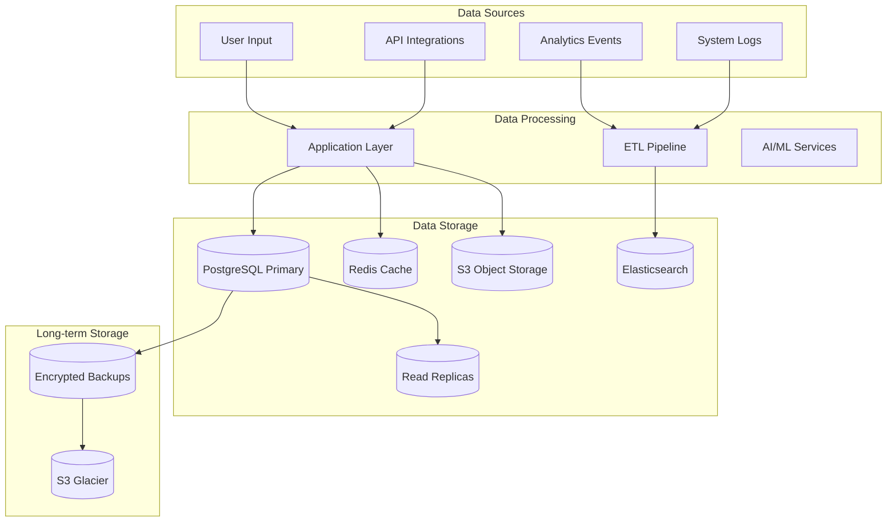
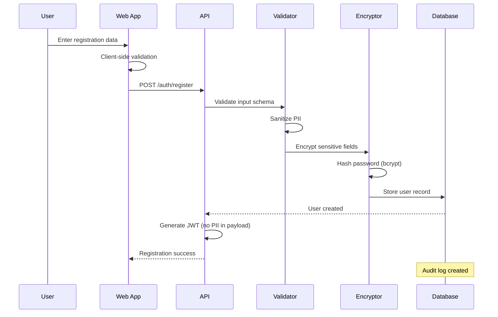
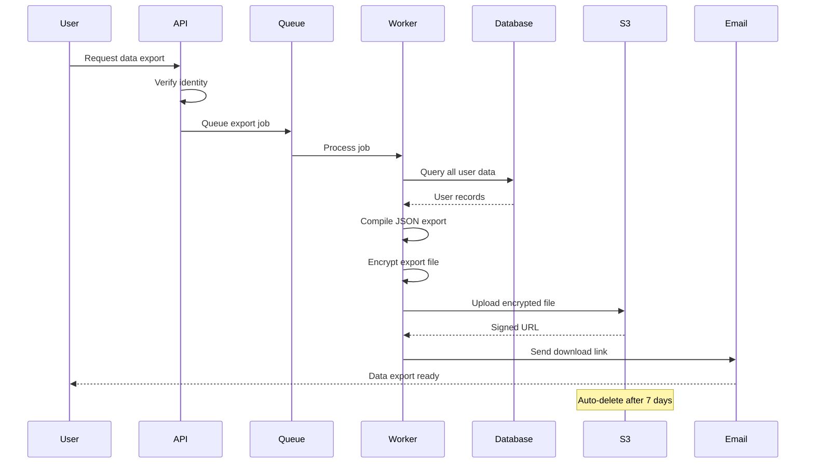
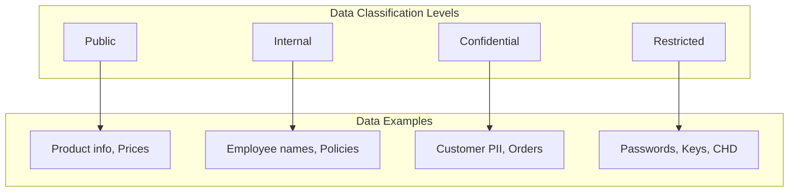
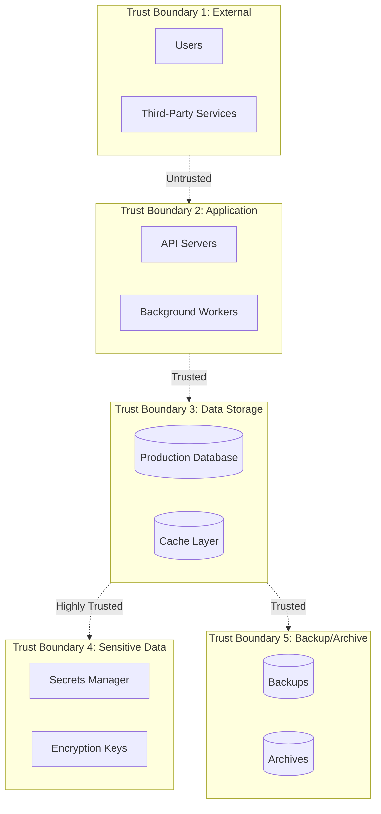
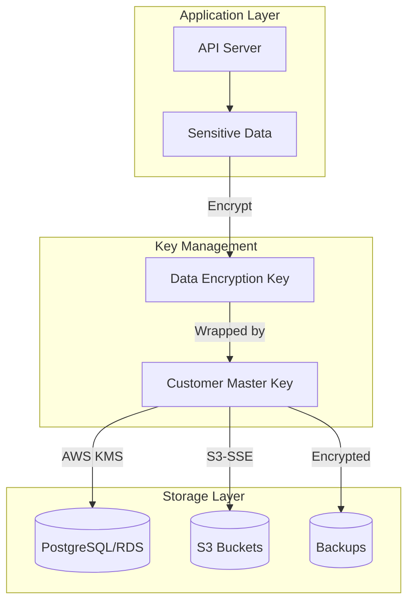
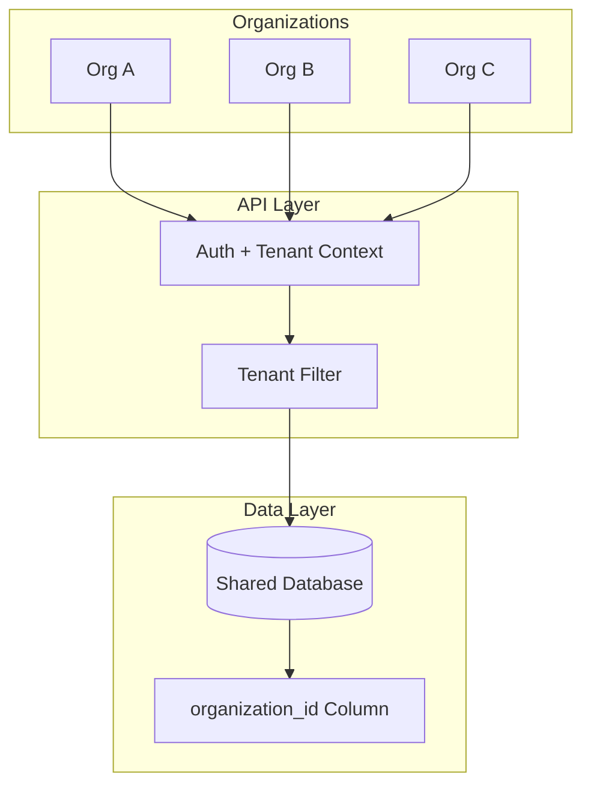

# Threat Model: Data Handling and Privacy

## Document Information

| Field | Value |
|-------|-------|
| **Document Version** | 1.0 |
| **Last Updated** | 2026-01-05 |
| **Status** | Active |
| **Owner** | Security Team |
| **Review Cycle** | Quarterly |
| **Compliance** | GDPR, CCPA, SOC 2 |

---

## 1. Executive Summary

This threat model analyzes the data handling practices of the Broxiva e-commerce platform. The platform processes various categories of data including personally identifiable information (PII), payment data, and business-sensitive information. This document identifies threats to data confidentiality, integrity, and availability using the STRIDE methodology.

---

## 2. System Overview

### 2.1 Data Architecture Overview

### 2.2 Data Flow - User Registration

### 2.3 Data Flow - Data Export (GDPR)

---

## 3. Data Classification

### 3.1 Classification Levels

### 3.2 Data Inventory

| Data Category | Classification | Storage Location | Encryption | Retention |
|---------------|----------------|------------------|------------|-----------|
| Passwords | Restricted | PostgreSQL | bcrypt hash | Account lifetime |
| API Keys | Restricted | HashiCorp Vault | AES-256 | Until rotated |
| Payment Tokens | Restricted | Stripe (external) | Stripe managed | Per Stripe policy |
| Email Addresses | Confidential | PostgreSQL | At rest (RDS) | Account + 2 years |
| Names | Confidential | PostgreSQL | At rest (RDS) | Account + 2 years |
| Phone Numbers | Confidential | PostgreSQL | At rest (RDS) | Account + 2 years |
| Addresses | Confidential | PostgreSQL | At rest (RDS) | Account + 2 years |
| Order History | Confidential | PostgreSQL | At rest (RDS) | 7 years (legal) |
| IP Addresses | Internal | Logs/Redis | Transit only | 90 days |
| Product Data | Public | PostgreSQL/Elastic | At rest | Indefinite |
| Analytics | Internal | Analytics DB | At rest | 2 years |
| Session Data | Confidential | Redis | Transit | 24 hours |

---

## 4. Trust Boundaries

---

## 5. Entry Points

| ID | Entry Point | Data Type | Classification | Description |
|----|-------------|-----------|----------------|-------------|
| EP-D01 | User Registration | PII | Confidential | Name, email, password |
| EP-D02 | Profile Update | PII | Confidential | Address, phone |
| EP-D03 | Order Placement | PII + Financial | Confidential | Shipping, payment |
| EP-D04 | Data Export Request | All user data | Confidential | GDPR export |
| EP-D05 | Data Deletion Request | All user data | Confidential | GDPR deletion |
| EP-D06 | Admin Data Access | All data | Restricted | Admin operations |
| EP-D07 | Analytics Collection | Behavioral | Internal | User tracking |
| EP-D08 | File Upload | User content | Confidential | Images, documents |
| EP-D09 | API Integration | Business data | Confidential | Partner data sync |
| EP-D10 | Backup/Restore | All data | Restricted | System operations |

---

## 6. Assets at Risk

| Asset ID | Asset | Classification | Impact if Compromised |
|----------|-------|----------------|----------------------|
| AST-D01 | User PII (names, emails) | Confidential | Privacy breach, regulatory fines |
| AST-D02 | User addresses | Confidential | Physical security risk |
| AST-D03 | Order history | Confidential | Business intelligence theft |
| AST-D04 | Payment information | Restricted | Financial fraud |
| AST-D05 | Password hashes | Restricted | Account compromise |
| AST-D06 | Session tokens | Confidential | Session hijacking |
| AST-D07 | Analytics data | Internal | Competitive intelligence |
| AST-D08 | Database backups | Restricted | Complete data breach |
| AST-D09 | Encryption keys | Restricted | All encrypted data compromised |
| AST-D10 | Audit logs | Internal | Cover tracks for attacks |

---

## 7. STRIDE Threat Analysis

### 7.1 Spoofing

#### T-D01: Database Credential Theft

| Attribute | Value |
|-----------|-------|
| **Threat ID** | T-D01 |
| **Category** | Spoofing |
| **Description** | Attacker obtains database credentials to access data directly |
| **Entry Point** | Application configuration, environment variables |
| **Assets at Risk** | AST-D01 to AST-D05 |
| **Likelihood** | Low |
| **Impact** | Critical |
| **Risk Rating** | High |

**Attack Scenario:**
1. Attacker compromises application server
2. Extracts database credentials from environment
3. Connects directly to database
4. Exfiltrates all data

**Existing Controls:**
- [x] Environment variable isolation
- [x] IAM roles for RDS access
- [x] VPC network isolation

**Recommended Controls:**
- [ ] Secrets manager integration (Vault/AWS Secrets Manager)
- [ ] Database credential rotation
- [ ] Connection monitoring and alerting

---

### 7.2 Tampering

#### T-D02: Data Integrity Attack

| Attribute | Value |
|-----------|-------|
| **Threat ID** | T-D02 |
| **Category** | Tampering |
| **Description** | Attacker modifies data to cause business harm |
| **Entry Point** | SQL injection, admin access compromise |
| **Assets at Risk** | AST-D03, AST-D07 |
| **Likelihood** | Low |
| **Impact** | High |
| **Risk Rating** | Medium |

**Attack Scenario:**
1. Attacker exploits SQL injection
2. Modifies product prices to $0
3. Orders placed at zero cost
4. Financial loss occurs

**Existing Controls:**
- [x] Parameterized queries (Prisma)
- [x] Input validation
- [x] Transaction logging

**Recommended Controls:**
- [ ] Database triggers for critical field changes
- [ ] Real-time integrity monitoring
- [ ] Cryptographic checksums on critical data

---

#### T-D03: Backup Tampering

| Attribute | Value |
|-----------|-------|
| **Threat ID** | T-D03 |
| **Category** | Tampering |
| **Description** | Attacker corrupts or modifies database backups |
| **Entry Point** | Backup storage access |
| **Assets at Risk** | AST-D08, Data recovery capability |
| **Likelihood** | Low |
| **Impact** | Critical |
| **Risk Rating** | Medium |

**Attack Scenario:**
1. Attacker gains access to backup storage
2. Modifies or deletes backups
3. During incident, restore fails
4. Data loss occurs

**Existing Controls:**
- [x] Encrypted backups
- [x] Access logging on S3

**Recommended Controls:**
- [ ] Immutable backup storage (S3 Object Lock)
- [ ] Backup integrity verification
- [ ] Geographically distributed backups

---

### 7.3 Repudiation

#### T-D04: Audit Log Tampering

| Attribute | Value |
|-----------|-------|
| **Threat ID** | T-D04 |
| **Category** | Repudiation |
| **Description** | Attacker modifies audit logs to cover tracks |
| **Entry Point** | Log storage access |
| **Assets at Risk** | AST-D10, Forensic capability |
| **Likelihood** | Medium |
| **Impact** | High |
| **Risk Rating** | High |

**Attack Scenario:**
1. Attacker compromises system
2. Deletes or modifies audit logs
3. Investigation cannot determine attack timeline
4. Attacker denies involvement

**Existing Controls:**
- [x] Centralized logging
- [x] Log retention policies

**Recommended Controls:**
- [ ] Write-once log storage
- [ ] Log signing
- [ ] Real-time log shipping to separate system

---

### 7.4 Information Disclosure

#### T-D05: Mass Data Breach

| Attribute | Value |
|-----------|-------|
| **Threat ID** | T-D05 |
| **Category** | Information Disclosure |
| **Description** | Attacker exfiltrates large volumes of PII |
| **Entry Point** | Database access, API exploitation |
| **Assets at Risk** | AST-D01, AST-D02, AST-D03 |
| **Likelihood** | Medium |
| **Impact** | Critical |
| **Risk Rating** | Critical |

**Attack Scenario:**
1. Attacker exploits application vulnerability
2. Dumps entire user table
3. PII of millions of users exposed
4. Regulatory fines and reputation damage

**Existing Controls:**
- [x] Access controls
- [x] Network segmentation
- [x] Encryption at rest

**Recommended Controls:**
- [ ] Data loss prevention (DLP)
- [ ] Abnormal query detection
- [ ] Database activity monitoring

---

#### T-D06: Unintended Data Exposure in Logs

| Attribute | Value |
|-----------|-------|
| **Threat ID** | T-D06 |
| **Category** | Information Disclosure |
| **Description** | PII accidentally logged and exposed |
| **Entry Point** | Application logging |
| **Assets at Risk** | AST-D01, AST-D04 |
| **Likelihood** | Medium |
| **Impact** | High |
| **Risk Rating** | High |

**Attack Scenario:**
1. Developer logs request body for debugging
2. Sensitive data included in logs
3. Logs accessible to broad team
4. PII exposure without breach

**Existing Controls:**
- [x] Log level configuration
- [x] PII redaction guidelines

**Recommended Controls:**
- [ ] Automated PII detection in logs
- [ ] Log sanitization middleware
- [ ] Regular log audits

---

#### T-D07: Multi-Tenant Data Leakage

| Attribute | Value |
|-----------|-------|
| **Threat ID** | T-D07 |
| **Category** | Information Disclosure |
| **Description** | One tenant/organization accesses another's data |
| **Entry Point** | API queries, shared infrastructure |
| **Assets at Risk** | AST-D01, AST-D03, AST-D07 |
| **Likelihood** | Medium |
| **Impact** | High |
| **Risk Rating** | High |

**Attack Scenario:**
1. Organization A queries orders API
2. Bug in tenant filter allows access to Org B data
3. Competitive intelligence leaked
4. Trust violation between tenants

**Existing Controls:**
- [x] Tenant ID in all queries
- [x] Row-level security considerations

**Recommended Controls:**
- [ ] Database row-level security
- [ ] Automated tenant isolation testing
- [ ] Query logging per tenant

---

#### T-D08: Encryption Key Exposure

| Attribute | Value |
|-----------|-------|
| **Threat ID** | T-D08 |
| **Category** | Information Disclosure |
| **Description** | Encryption keys compromised, exposing encrypted data |
| **Entry Point** | Key storage, application memory |
| **Assets at Risk** | AST-D09, All encrypted data |
| **Likelihood** | Low |
| **Impact** | Critical |
| **Risk Rating** | High |

**Attack Scenario:**
1. Attacker gains access to key storage
2. Extracts encryption keys
3. Decrypts all stored data
4. Complete data breach

**Existing Controls:**
- [x] AWS KMS for encryption keys
- [x] IAM policies for key access

**Recommended Controls:**
- [ ] HSM for key operations
- [ ] Key rotation automation
- [ ] Envelope encryption

---

### 7.5 Denial of Service

#### T-D09: Database Resource Exhaustion

| Attribute | Value |
|-----------|-------|
| **Threat ID** | T-D09 |
| **Category** | Denial of Service |
| **Description** | Attacker overwhelms database with expensive queries |
| **Entry Point** | Search, analytics endpoints |
| **Assets at Risk** | Database availability |
| **Likelihood** | Medium |
| **Impact** | High |
| **Risk Rating** | High |

**Attack Scenario:**
1. Attacker sends complex search queries
2. Database CPU/memory exhausted
3. All database operations slow or fail
4. Service unavailable

**Existing Controls:**
- [x] Query timeouts
- [x] Connection pooling
- [x] Read replicas

**Recommended Controls:**
- [ ] Query complexity limits
- [ ] Query queue management
- [ ] Auto-scaling database

---

#### T-D10: Storage Exhaustion

| Attribute | Value |
|-----------|-------|
| **Threat ID** | T-D10 |
| **Category** | Denial of Service |
| **Description** | Attacker fills storage to cause failures |
| **Entry Point** | File upload, data creation |
| **Assets at Risk** | System availability |
| **Likelihood** | Medium |
| **Impact** | Medium |
| **Risk Rating** | Medium |

**Attack Scenario:**
1. Attacker uploads large files repeatedly
2. Storage quota exhausted
3. New data cannot be stored
4. Service degradation

**Existing Controls:**
- [x] File size limits
- [x] Storage monitoring

**Recommended Controls:**
- [ ] Per-user storage quotas
- [ ] Automated cleanup of orphaned files
- [ ] Storage alerting

---

### 7.6 Elevation of Privilege

#### T-D11: Privilege Escalation via Data Manipulation

| Attribute | Value |
|-----------|-------|
| **Threat ID** | T-D11 |
| **Category** | Elevation of Privilege |
| **Description** | Attacker modifies user role data to gain admin access |
| **Entry Point** | Direct database access, mass assignment |
| **Assets at Risk** | AST-D01, System integrity |
| **Likelihood** | Low |
| **Impact** | Critical |
| **Risk Rating** | Medium |

**Attack Scenario:**
1. Attacker exploits vulnerability
2. Updates own user record role to ADMIN
3. Gains administrative access
4. System fully compromised

**Existing Controls:**
- [x] Role changes require admin auth
- [x] Audit logging for role changes

**Recommended Controls:**
- [ ] Database triggers to prevent role changes
- [ ] Separate admin authentication
- [ ] Real-time alerting on role changes

---

## 8. Data Classification Threats

### 8.1 Threats by Classification Level

| Classification | Threat Examples | Protection Required |
|----------------|-----------------|---------------------|
| **Restricted** | Key theft, credential exposure | Encryption, HSM, strict access |
| **Confidential** | PII breach, order data leak | Encryption, access control, audit |
| **Internal** | IP theft, business intelligence | Access control, DLP |
| **Public** | Defacement, misinformation | Integrity controls, monitoring |

### 8.2 Data Handling Requirements

```mermaid
flowchart LR
    subgraph Collection["Data Collection"]
        C1[Minimize collection]
        C2[Consent required]
        C3[Purpose specification]
    end

    subgraph Processing["Data Processing"]
        P1[Encryption in transit]
        P2[Access logging]
        P3[Data minimization]
    end

    subgraph Storage["Data Storage"]
        S1[Encryption at rest]
        S2[Access controls]
        S3[Retention limits]
    end

    subgraph Disposal["Data Disposal"]
        D1[Secure deletion]
        D2[Backup purging]
        D3[Verification]
    end

    Collection --> Processing
    Processing --> Storage
    Storage --> Disposal
```

---

## 9. Encryption Architecture

### 9.1 Encryption at Rest

### 9.2 Encryption in Transit

| Connection | Protocol | Minimum Version |
|------------|----------|-----------------|
| Client to API | HTTPS | TLS 1.2 |
| API to Database | SSL/TLS | TLS 1.2 |
| API to Redis | TLS | TLS 1.2 |
| API to S3 | HTTPS | TLS 1.2 |
| Internal Services | mTLS | TLS 1.2 |

### 9.3 Field-Level Encryption

| Field | Encryption Method | Key Management |
|-------|-------------------|----------------|
| Passwords | bcrypt (hash) | N/A |
| API Secrets | AES-256-GCM | AWS KMS |
| PII (optional) | AES-256-GCM | AWS KMS |
| Backup Data | AES-256 | AWS KMS |

---

## 10. Multi-Tenancy Security

### 10.1 Tenant Isolation Model

### 10.2 Tenant Isolation Controls

| Control | Implementation | Status |
|---------|----------------|--------|
| Row-Level Security | Prisma middleware | Implemented |
| Tenant ID in JWT | Token claims | Implemented |
| Query Filtering | Automatic WHERE clause | Implemented |
| Cross-Tenant Testing | Automated tests | Partial |
| Tenant Data Export | Scoped to tenant | Implemented |

### 10.3 Multi-Tenant Risks

| Risk | Mitigation | Status |
|------|------------|--------|
| Query forgetting tenant filter | Default scope middleware | Active |
| Admin bypassing isolation | Explicit admin scope | Active |
| Cache key collisions | Tenant prefix in keys | Active |
| Log data mixing | Tenant ID in log context | Active |

---

## 11. Risk Matrix

| Threat ID | Threat | Likelihood | Impact | Risk | Priority |
|-----------|--------|------------|--------|------|----------|
| T-D05 | Mass Data Breach | Medium | Critical | Critical | P1 |
| T-D01 | Database Credential Theft | Low | Critical | High | P1 |
| T-D04 | Audit Log Tampering | Medium | High | High | P1 |
| T-D06 | PII in Logs | Medium | High | High | P2 |
| T-D07 | Multi-Tenant Leakage | Medium | High | High | P2 |
| T-D08 | Key Exposure | Low | Critical | High | P2 |
| T-D09 | Database DoS | Medium | High | High | P2 |
| T-D02 | Data Integrity Attack | Low | High | Medium | P3 |
| T-D03 | Backup Tampering | Low | Critical | Medium | P3 |
| T-D10 | Storage Exhaustion | Medium | Medium | Medium | P3 |
| T-D11 | Privilege Escalation | Low | Critical | Medium | P3 |

---

## 12. Existing Controls Summary

### 12.1 Data Protection

| Control | Status | Description |
|---------|--------|-------------|
| Encryption at Rest | Implemented | RDS encryption, S3-SSE |
| Encryption in Transit | Implemented | TLS 1.2+ everywhere |
| Password Hashing | Implemented | bcrypt cost 10 |
| Token Management | Implemented | Short-lived JWTs |

### 12.2 Access Controls

| Control | Status | Description |
|---------|--------|-------------|
| RBAC | Implemented | Role-based access |
| Tenant Isolation | Implemented | Row-level filtering |
| Admin Segregation | Implemented | Separate admin auth |
| Audit Logging | Implemented | All data access logged |

### 12.3 Compliance Controls

| Control | Status | Regulation |
|---------|--------|------------|
| Data Export | Implemented | GDPR Article 20 |
| Data Deletion | Implemented | GDPR Article 17 |
| Consent Management | Implemented | GDPR Article 7 |
| Data Breach Notification | Process defined | GDPR Article 33 |

---

## 13. Recommended Controls

### 13.1 High Priority (P1)

| Recommendation | Threat Addressed | Effort | Impact |
|----------------|------------------|--------|--------|
| Database activity monitoring | T-D05, T-D01 | High | High |
| Secrets manager integration | T-D01 | Medium | High |
| Immutable audit logs | T-D04 | Medium | High |
| Automated PII detection | T-D06 | Medium | High |

### 13.2 Medium Priority (P2-P3)

| Recommendation | Threat Addressed | Effort | Impact |
|----------------|------------------|--------|--------|
| HSM for key management | T-D08 | High | High |
| Database row-level security | T-D07 | High | High |
| Query complexity limits | T-D09 | Medium | Medium |
| Per-user storage quotas | T-D10 | Low | Medium |
| Backup integrity verification | T-D03 | Medium | Medium |

---

## 14. Data Lifecycle Security

### 14.1 Data Lifecycle Stages

```mermaid
flowchart LR
    subgraph Create["Creation"]
        C1[Input Validation]
        C2[Consent Capture]
        C3[Classification]
    end

    subgraph Store["Storage"]
        S1[Encryption]
        S2[Access Control]
        S3[Backup]
    end

    subgraph Use["Usage"]
        U1[Access Logging]
        U2[Minimization]
        U3[Anonymization]
    end

    subgraph Archive["Archival"]
        A1[Retention Policy]
        A2[Secure Archive]
        A3[Index Removal]
    end

    subgraph Delete["Deletion"]
        D1[Secure Wipe]
        D2[Backup Purge]
        D3[Verification]
    end

    Create --> Store
    Store --> Use
    Use --> Archive
    Archive --> Delete
```

### 14.2 Data Retention Policy

| Data Type | Active Retention | Archive Retention | Deletion Method |
|-----------|------------------|-------------------|-----------------|
| User Accounts | Account lifetime | 2 years | Anonymization |
| Order Data | 2 years | 7 years (legal) | Secure delete |
| Payment Data | 90 days | N/A (tokenized) | N/A |
| Logs | 90 days | 1 year | Auto-expire |
| Analytics | 2 years | 3 years | Aggregation |
| Backups | 30 days | 1 year | Secure delete |

---

## 15. Testing Requirements

### 15.1 Security Testing

| Test Type | Frequency | Scope |
|-----------|-----------|-------|
| Data Discovery Scan | Monthly | All databases |
| Access Control Testing | Per release | All data endpoints |
| Encryption Validation | Quarterly | All storage |
| Tenant Isolation Testing | Per release | Multi-tenant features |
| Backup Restore Testing | Monthly | All backups |

### 15.2 Acceptance Criteria

- [ ] All PII encrypted at rest
- [ ] All sensitive data encrypted in transit
- [ ] Audit logging for all data access
- [ ] Tenant isolation verified
- [ ] GDPR export/deletion functional
- [ ] Backup integrity verified
- [ ] No PII in logs

---

## 16. Residual Risks

### 16.1 Accepted Risks

| Risk | Residual Level | Rationale |
|------|----------------|-----------|
| Insider threat | Medium | Background checks, monitoring |
| Zero-day vulnerabilities | Low | Monitoring, patching process |
| Third-party breach | Low | Vendor security assessment |

### 16.2 Transferred Risks

| Risk | Transfer Mechanism |
|------|-------------------|
| Card data breach | Stripe (tokenization) |
| Infrastructure security | AWS shared responsibility |
| KYC data handling | Third-party provider SLA |

---

## 17. References

- GDPR (General Data Protection Regulation)
- CCPA (California Consumer Privacy Act)
- SOC 2 Type II Requirements
- NIST SP 800-53 (Data Protection controls)
- CWE-311: Missing Encryption
- CWE-312: Cleartext Storage

---

## 18. Document History

| Version | Date | Author | Changes |
|---------|------|--------|---------|
| 1.0 | 2026-01-05 | Security Team | Initial document |

---

## 19. Approval

| Role | Name | Date | Signature |
|------|------|------|-----------|
| Security Lead | | | |
| Data Protection Officer | | | |
| Engineering Lead | | | |
