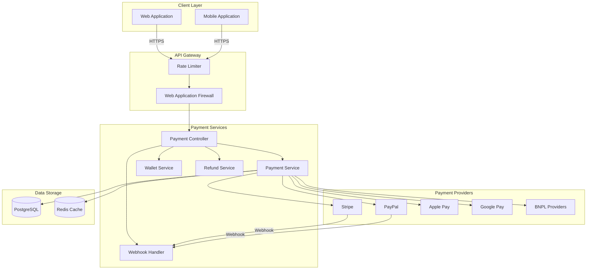
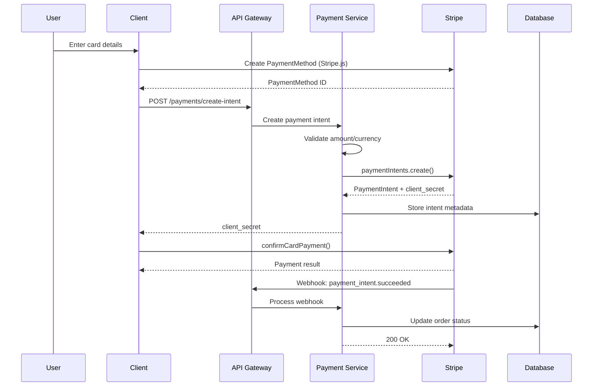
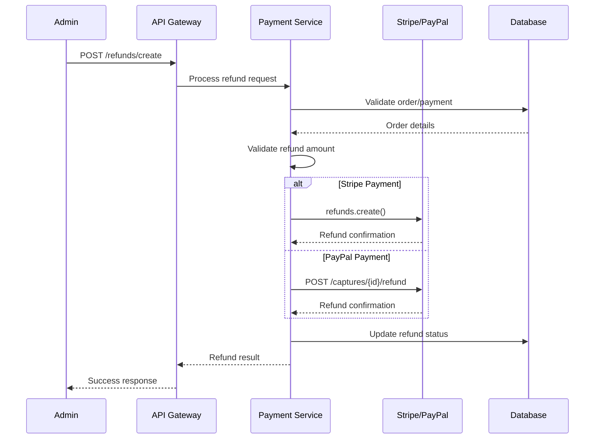
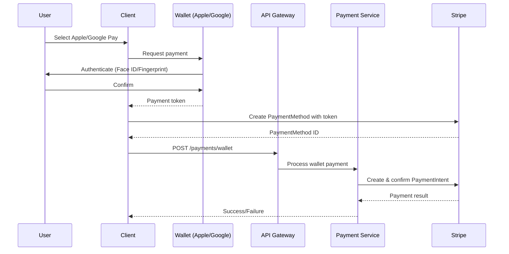
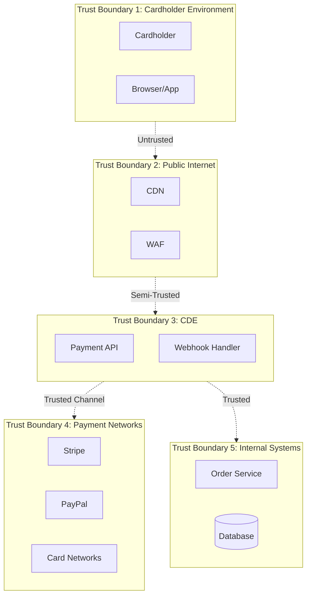
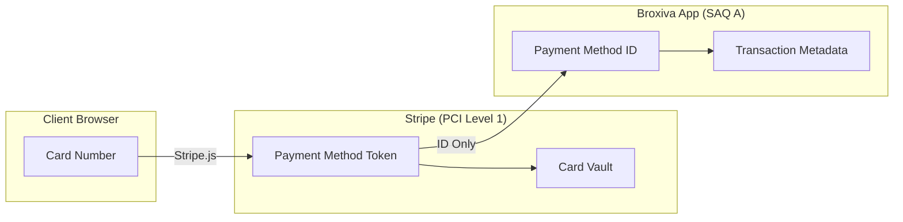

# Threat Model: Payment Processing System

## Document Information

| Field | Value |
|-------|-------|
| **Document Version** | 1.0 |
| **Last Updated** | 2026-01-05 |
| **Status** | Active |
| **Owner** | Security Team |
| **Review Cycle** | Quarterly |
| **Compliance** | PCI-DSS v4.0 |

---

## 1. Executive Summary

This threat model analyzes the payment processing system of the Broxiva e-commerce platform. The payment system handles sensitive cardholder data and financial transactions, requiring strict adherence to PCI-DSS compliance standards. This document identifies potential threats using STRIDE methodology and maps mitigations to PCI-DSS requirements.

---

## 2. System Overview

### 2.1 Architecture Overview

### 2.2 Data Flow Diagram - Checkout Flow

### 2.3 Data Flow Diagram - Refund Flow

### 2.4 Data Flow Diagram - Wallet Payment (Apple Pay/Google Pay)

---

## 3. Trust Boundaries

### Trust Boundary Descriptions

| Boundary | Description | PCI-DSS Scope |
|----------|-------------|---------------|
| TB1 | Cardholder Environment | Out of Scope (client-side tokenization) |
| TB2 | Public Internet | Network Segmentation Required |
| TB3 | Cardholder Data Environment (CDE) | In Scope |
| TB4 | Payment Provider Networks | Validated Third Party |
| TB5 | Internal Systems | Reduced Scope (no CHD) |

---

## 4. Entry Points

| ID | Entry Point | Protocol | Auth Required | PCI Scope |
|----|-------------|----------|---------------|-----------|
| EP-P01 | POST /payments/create-intent | HTTPS | Yes (JWT) | In Scope |
| EP-P02 | POST /payments/webhook | HTTPS | No (Signature) | In Scope |
| EP-P03 | POST /payments/paypal/webhook | HTTPS | No (Signature) | In Scope |
| EP-P04 | POST /checkout | HTTPS | Yes (JWT) | In Scope |
| EP-P05 | POST /refunds | HTTPS | Yes (Admin) | In Scope |
| EP-P06 | GET /payments/{id} | HTTPS | Yes (JWT) | In Scope |
| EP-P07 | POST /payments/apple-pay | HTTPS | Yes (JWT) | In Scope |
| EP-P08 | POST /payments/google-pay | HTTPS | Yes (JWT) | In Scope |
| EP-P09 | POST /subscriptions/create | HTTPS | Yes (JWT) | In Scope |
| EP-P10 | POST /wallet/add-funds | HTTPS | Yes (JWT) | In Scope |

---

## 5. Assets at Risk

| Asset ID | Asset | Classification | Impact if Compromised |
|----------|-------|----------------|----------------------|
| AST-P01 | Payment Intent Client Secrets | Confidential | Payment manipulation |
| AST-P02 | Stripe API Keys | Secret | Full payment access |
| AST-P03 | PayPal Client Credentials | Secret | Full PayPal access |
| AST-P04 | Webhook Signing Secrets | Secret | Webhook spoofing |
| AST-P05 | Transaction Records | Confidential/PII | Financial fraud, compliance violation |
| AST-P06 | Refund Capabilities | Privileged | Financial loss |
| AST-P07 | Customer Payment Method IDs | Confidential | Payment abuse |
| AST-P08 | Order Financial Data | Confidential | Business intelligence theft |
| AST-P09 | Apple Merchant ID/Certificate | Secret | Apple Pay fraud |
| AST-P10 | Subscription Records | Confidential/PII | Revenue manipulation |

---

## 6. Threat Actors

### 6.1 Carders / Payment Fraudsters

| Attribute | Description |
|-----------|-------------|
| **Motivation** | Financial gain through stolen cards |
| **Capability** | Medium - specialized tools and stolen data |
| **Resources** | Access to stolen card databases |
| **Attack Methods** | Card testing, carding, chargebacks |
| **Typical Targets** | Checkout, payment processing |

### 6.2 Organized Crime (Fraud Rings)

| Attribute | Description |
|-----------|-------------|
| **Motivation** | Large-scale financial fraud |
| **Capability** | High - coordinated operations |
| **Resources** | Significant (botnets, money mules, stolen identities) |
| **Attack Methods** | Account takeover, refund fraud, friendly fraud |
| **Typical Targets** | High-value transactions, refund systems |

### 6.3 Malicious Insiders

| Attribute | Description |
|-----------|-------------|
| **Motivation** | Financial gain, revenge |
| **Capability** | High (system access) |
| **Resources** | Internal system knowledge and access |
| **Attack Methods** | Unauthorized refunds, data theft, manipulation |
| **Typical Targets** | Refund system, payment records |

### 6.4 Competitors

| Attribute | Description |
|-----------|-------------|
| **Motivation** | Business disruption, intelligence |
| **Capability** | Medium |
| **Resources** | Moderate |
| **Attack Methods** | DoS during sales, price scraping via checkout |
| **Typical Targets** | Checkout availability, pricing data |

---

## 7. STRIDE Threat Analysis

### 7.1 Spoofing

#### T-P01: Stolen Card Usage

| Attribute | Value |
|-----------|-------|
| **Threat ID** | T-P01 |
| **Category** | Spoofing |
| **Description** | Attacker uses stolen credit card data to make purchases |
| **Entry Point** | EP-P01, EP-P04 |
| **Assets at Risk** | AST-P05, Platform reputation |
| **Threat Actors** | Carders, Organized Crime |
| **Likelihood** | High |
| **Impact** | High |
| **Risk Rating** | Critical |

**Attack Scenario:**
1. Attacker obtains stolen card data from dark web
2. Tests cards on platform with small purchases
3. Makes fraudulent purchases on valid cards
4. Receives goods before chargeback

**Existing Controls:**
- [x] Stripe Radar for fraud detection
- [x] 3D Secure support (SCA)
- [x] AVS verification
- [x] CVV verification

**PCI-DSS Mapping:** Req 6.4 (Input validation), Req 10.2 (Audit trails)

**Recommended Controls:**
- [ ] Implement velocity checks on card testing
- [ ] Machine learning fraud scoring
- [ ] Device fingerprinting
- [ ] Manual review queue for high-risk transactions

---

#### T-P02: Webhook Spoofing

| Attribute | Value |
|-----------|-------|
| **Threat ID** | T-P02 |
| **Category** | Spoofing |
| **Description** | Attacker sends fake webhook to manipulate order status |
| **Entry Point** | EP-P02, EP-P03 |
| **Assets at Risk** | AST-P04, AST-P05 |
| **Threat Actors** | Organized Crime, Malicious Insiders |
| **Likelihood** | Medium |
| **Impact** | Critical |
| **Risk Rating** | High |

**Attack Scenario:**
1. Attacker discovers webhook endpoint
2. Crafts fake payment_intent.succeeded event
3. Sends to webhook endpoint
4. Order marked as paid without actual payment

**Existing Controls:**
- [x] Stripe webhook signature verification
- [x] PayPal webhook signature verification
- [x] HTTPS only for webhooks

**PCI-DSS Mapping:** Req 4.1 (Encryption), Req 6.5 (Secure coding)

**Recommended Controls:**
- [ ] Webhook IP allowlisting
- [ ] Idempotency checks for webhooks
- [ ] Secondary verification via API call

---

#### T-P03: Friendly Fraud (Chargeback Fraud)

| Attribute | Value |
|-----------|-------|
| **Threat ID** | T-P03 |
| **Category** | Spoofing |
| **Description** | Customer disputes legitimate charge to get refund while keeping goods |
| **Entry Point** | External (card network) |
| **Assets at Risk** | AST-P05, Revenue |
| **Threat Actors** | Malicious Customers, Organized Crime |
| **Likelihood** | High |
| **Impact** | Medium |
| **Risk Rating** | High |

**Attack Scenario:**
1. Customer places legitimate order
2. Receives goods
3. Files chargeback claiming fraud
4. Gets refund from bank, keeps goods

**Existing Controls:**
- [x] Order confirmation emails
- [x] Delivery tracking
- [x] Transaction logging

**PCI-DSS Mapping:** Req 10 (Logging and monitoring)

**Recommended Controls:**
- [ ] Delivery signature requirement for high-value orders
- [ ] Customer fraud scoring
- [ ] Comprehensive dispute evidence collection
- [ ] Blacklist repeat offenders

---

### 7.2 Tampering

#### T-P04: Payment Amount Manipulation

| Attribute | Value |
|-----------|-------|
| **Threat ID** | T-P04 |
| **Category** | Tampering |
| **Description** | Attacker manipulates payment amount during checkout |
| **Entry Point** | EP-P01, EP-P04 |
| **Assets at Risk** | AST-P05, Revenue |
| **Threat Actors** | Malicious Users |
| **Likelihood** | Medium |
| **Impact** | High |
| **Risk Rating** | High |

**Attack Scenario:**
1. Attacker intercepts checkout request
2. Modifies amount field to lower value
3. Payment processed for incorrect amount
4. Order fulfilled at original value

**Existing Controls:**
- [x] Server-side price calculation
- [x] Amount validation against order total
- [x] Idempotency keys for payment intents

**PCI-DSS Mapping:** Req 6.5 (Secure coding), Req 8.3 (Strong authentication)

**Recommended Controls:**
- [ ] Signed cart data
- [ ] Server-side cart validation before payment
- [ ] Alert on amount mismatches

---

#### T-P05: Refund Amount Manipulation

| Attribute | Value |
|-----------|-------|
| **Threat ID** | T-P05 |
| **Category** | Tampering |
| **Description** | Insider or attacker manipulates refund to exceed original payment |
| **Entry Point** | EP-P05 |
| **Assets at Risk** | AST-P06, Revenue |
| **Threat Actors** | Malicious Insiders |
| **Likelihood** | Low |
| **Impact** | High |
| **Risk Rating** | Medium |

**Attack Scenario:**
1. Malicious admin processes refund
2. Modifies refund amount to exceed payment
3. Platform loses excess funds

**Existing Controls:**
- [x] Stripe/PayPal enforce refund <= payment
- [x] Admin authentication required
- [x] Refund amount validation

**PCI-DSS Mapping:** Req 7 (Access control), Req 10.2 (Audit trails)

**Recommended Controls:**
- [ ] Dual approval for refunds over threshold
- [ ] Real-time refund monitoring
- [ ] Anomaly detection for refund patterns

---

#### T-P06: Cart Price Manipulation

| Attribute | Value |
|-----------|-------|
| **Threat ID** | T-P06 |
| **Category** | Tampering |
| **Description** | Attacker manipulates product prices in cart |
| **Entry Point** | EP-P04 |
| **Assets at Risk** | Revenue |
| **Threat Actors** | Malicious Users |
| **Likelihood** | Medium |
| **Impact** | Medium |
| **Risk Rating** | Medium |

**Attack Scenario:**
1. Attacker adds item to cart
2. Intercepts request, modifies price
3. Checkout proceeds with tampered price

**Existing Controls:**
- [x] Server-side price lookup
- [x] Cart validation at checkout

**PCI-DSS Mapping:** Req 6.5 (Input validation)

**Recommended Controls:**
- [ ] Cryptographic cart signing
- [ ] Price reconciliation before payment

---

### 7.3 Repudiation

#### T-P07: Disputed Transaction Denial

| Attribute | Value |
|-----------|-------|
| **Threat ID** | T-P07 |
| **Category** | Repudiation |
| **Description** | Customer denies making transaction, insufficient evidence to prove |
| **Entry Point** | All payment endpoints |
| **Assets at Risk** | Revenue, Transaction records |
| **Threat Actors** | Malicious Customers |
| **Likelihood** | Medium |
| **Impact** | Medium |
| **Risk Rating** | Medium |

**Attack Scenario:**
1. Customer makes purchase
2. Later claims they did not authorize
3. Insufficient logs to prove transaction
4. Chargeback upheld

**Existing Controls:**
- [x] Transaction logging
- [x] IP address capture
- [x] User agent logging

**PCI-DSS Mapping:** Req 10.2 (Audit logging), Req 10.3 (Log content)

**Recommended Controls:**
- [ ] Device fingerprinting
- [ ] Behavioral analytics
- [ ] Session recording for high-value transactions

---

### 7.4 Information Disclosure

#### T-P08: Payment API Key Exposure

| Attribute | Value |
|-----------|-------|
| **Threat ID** | T-P08 |
| **Category** | Information Disclosure |
| **Description** | API keys leaked through logs, errors, or code |
| **Entry Point** | N/A (internal) |
| **Assets at Risk** | AST-P02, AST-P03 |
| **Threat Actors** | Malicious Insiders, External Attackers |
| **Likelihood** | Low |
| **Impact** | Critical |
| **Risk Rating** | High |

**Attack Scenario:**
1. API key accidentally logged
2. Log system compromised
3. Attacker extracts API keys
4. Full payment system access

**Existing Controls:**
- [x] Environment variable configuration
- [x] Keys not logged
- [x] Production key validation

**PCI-DSS Mapping:** Req 3.4 (Protect stored data), Req 8.2 (Credentials management)

**Recommended Controls:**
- [ ] Secrets management system (HashiCorp Vault)
- [ ] Key rotation automation
- [ ] Log scanning for secrets

---

#### T-P09: Transaction History Exposure

| Attribute | Value |
|-----------|-------|
| **Threat ID** | T-P09 |
| **Category** | Information Disclosure |
| **Description** | Unauthorized access to customer transaction history |
| **Entry Point** | EP-P06 |
| **Assets at Risk** | AST-P05, Customer PII |
| **Threat Actors** | Malicious Users, Competitors |
| **Likelihood** | Medium |
| **Impact** | High |
| **Risk Rating** | High |

**Attack Scenario:**
1. Attacker manipulates payment ID in request
2. IDOR vulnerability allows access to other users' transactions
3. Extracts financial data

**Existing Controls:**
- [x] JWT authentication
- [x] User ownership validation

**PCI-DSS Mapping:** Req 7.1 (Access control), Req 8.1 (Authentication)

**Recommended Controls:**
- [ ] Strict IDOR testing
- [ ] UUID for payment IDs (non-sequential)
- [ ] Access logging and monitoring

---

### 7.5 Denial of Service

#### T-P10: Checkout Flood Attack

| Attribute | Value |
|-----------|-------|
| **Threat ID** | T-P10 |
| **Category** | Denial of Service |
| **Description** | Attacker floods checkout to disrupt sales |
| **Entry Point** | EP-P01, EP-P04 |
| **Assets at Risk** | System availability, Revenue |
| **Threat Actors** | Competitors, Hacktivists |
| **Likelihood** | Medium |
| **Impact** | High |
| **Risk Rating** | High |

**Attack Scenario:**
1. Attacker launches distributed attack
2. Floods checkout endpoints
3. Legitimate customers cannot complete purchases
4. Revenue loss during attack

**Existing Controls:**
- [x] Rate limiting per IP
- [x] WAF protection

**PCI-DSS Mapping:** Req 6.6 (WAF), Req 11.4 (Intrusion detection)

**Recommended Controls:**
- [ ] Bot detection
- [ ] Checkout queue system
- [ ] Auto-scaling during attacks

---

#### T-P11: Inventory Holding Attack

| Attribute | Value |
|-----------|-------|
| **Threat ID** | T-P11 |
| **Category** | Denial of Service |
| **Description** | Attacker holds inventory without completing purchase |
| **Entry Point** | EP-P04 |
| **Assets at Risk** | Inventory availability, Revenue |
| **Threat Actors** | Competitors, Scalpers |
| **Likelihood** | Medium |
| **Impact** | Medium |
| **Risk Rating** | Medium |

**Attack Scenario:**
1. Attacker adds high-demand items to cart
2. Creates multiple sessions holding inventory
3. Never completes purchase
4. Legitimate customers see "out of stock"

**Existing Controls:**
- [x] Cart expiration
- [x] Session limits

**Recommended Controls:**
- [ ] Soft reservation with time limits
- [ ] CAPTCHA for checkout
- [ ] Inventory release automation

---

### 7.6 Elevation of Privilege

#### T-P12: Unauthorized Refund Access

| Attribute | Value |
|-----------|-------|
| **Threat ID** | T-P12 |
| **Category** | Elevation of Privilege |
| **Description** | Non-admin user gains access to refund functionality |
| **Entry Point** | EP-P05 |
| **Assets at Risk** | AST-P06, Revenue |
| **Threat Actors** | Malicious Users, Insiders |
| **Likelihood** | Low |
| **Impact** | Critical |
| **Risk Rating** | High |

**Attack Scenario:**
1. Attacker discovers refund endpoint
2. Exploits authorization flaw
3. Issues unauthorized refunds
4. Financial loss

**Existing Controls:**
- [x] Admin role required
- [x] JWT role validation
- [x] Role guards on endpoints

**PCI-DSS Mapping:** Req 7.2 (Access control systems), Req 8.1 (User authentication)

**Recommended Controls:**
- [ ] MFA for refund operations
- [ ] IP allowlisting for admin functions
- [ ] Real-time alerting on refund activity

---

#### T-P13: Payment Provider Account Takeover

| Attribute | Value |
|-----------|-------|
| **Threat ID** | T-P13 |
| **Category** | Elevation of Privilege |
| **Description** | Attacker gains access to Stripe/PayPal merchant account |
| **Entry Point** | External (provider dashboard) |
| **Assets at Risk** | AST-P02, AST-P03, All payment data |
| **Threat Actors** | Organized Crime, Nation States |
| **Likelihood** | Low |
| **Impact** | Critical |
| **Risk Rating** | High |

**Attack Scenario:**
1. Attacker phishes admin credentials
2. Accesses Stripe dashboard
3. Changes payout destination
4. Steals all revenue

**Existing Controls:**
- [x] MFA on provider accounts
- [x] IP restrictions (recommended)

**PCI-DSS Mapping:** Req 8.3 (MFA), Req 12.3 (Service provider management)

**Recommended Controls:**
- [ ] Hardware security keys for provider access
- [ ] Regular access reviews
- [ ] Alerts on account changes

---

## 8. Fraud Vectors and Mitigations

### 8.1 Card Testing

| Vector | Description | Indicators | Mitigation |
|--------|-------------|------------|------------|
| Small amount testing | Multiple small charges to test card validity | Many $0.50-$1.00 charges | Velocity limits, ML detection |
| Auth-only testing | Authorization without capture | High auth decline rate | Block after threshold |
| BIN attacks | Testing cards from same BIN range | Sequential card numbers | BIN blocking |

### 8.2 Account Takeover Fraud

| Vector | Description | Indicators | Mitigation |
|--------|-------------|------------|------------|
| Payment method addition | Adding cards to compromised accounts | New cards from different geography | Verify new payment methods |
| Stored credential abuse | Using saved cards on stolen accounts | Changed shipping address | Require re-auth for changes |

### 8.3 Refund Fraud

| Vector | Description | Indicators | Mitigation |
|--------|-------------|------------|------------|
| Return fraud | Returning stolen/counterfeit goods | Pattern of high returns | Return verification |
| Refund arbitrage | Exploiting price differences | Same user, multiple refunds | Refund velocity limits |
| Double dipping | Chargeback + refund request | Timing of requests | Cross-reference systems |

---

## 9. PCI-DSS Compliance Mapping

### 9.1 Requirements Coverage

| Requirement | Description | Implementation Status |
|-------------|-------------|----------------------|
| **1. Network Security** | | |
| 1.1 | Install and maintain firewall | WAF configured |
| 1.2 | Deny unauthorized traffic | Security groups |
| **2. Secure Configuration** | | |
| 2.1 | Change vendor defaults | Implemented |
| 2.2 | Develop configuration standards | Documented |
| **3. Protect Stored Data** | | |
| 3.1 | Keep CHD storage minimal | No CHD stored (tokenization) |
| 3.4 | Render PAN unreadable | N/A (tokenized) |
| **4. Encrypt Transmission** | | |
| 4.1 | Use strong cryptography | TLS 1.2+ enforced |
| **5. Malware Protection** | | |
| 5.1 | Deploy anti-malware | Server protection |
| **6. Secure Development** | | |
| 6.1 | Establish patching process | Automated updates |
| 6.5 | Address common vulnerabilities | Code reviews, SAST |
| 6.6 | Address web threats | WAF, input validation |
| **7. Restrict Access** | | |
| 7.1 | Limit data access | RBAC implemented |
| 7.2 | Access control system | JWT + roles |
| **8. Authenticate Access** | | |
| 8.1 | Define and manage users | User management system |
| 8.2 | Ensure proper authentication | JWT + password |
| 8.3 | Implement MFA | Available for admin |
| **9. Restrict Physical Access** | | |
| 9.1-9.4 | Physical security | Cloud provider managed |
| **10. Logging and Monitoring** | | |
| 10.1 | Implement audit trails | Logging implemented |
| 10.2 | Automated audit trails | All transactions logged |
| 10.3 | Record audit trail entries | Comprehensive logging |
| **11. Test Security** | | |
| 11.2 | Network vulnerability scans | Quarterly scans |
| 11.3 | Penetration testing | Annual testing |
| **12. Maintain Policy** | | |
| 12.1 | Security policy | Documented |
| 12.3 | Usage policies | Defined |
| 12.10 | Incident response | Plan documented |

### 9.2 Tokenization Strategy

**Benefits:**
- No cardholder data (CHD) touches our servers
- Reduced PCI scope (SAQ A eligible)
- Stripe handles compliance for card storage

---

## 10. Risk Matrix

| Threat ID | Threat | Likelihood | Impact | Risk Score | Priority |
|-----------|--------|------------|--------|------------|----------|
| T-P01 | Stolen Card Usage | High | High | Critical | P1 |
| T-P02 | Webhook Spoofing | Medium | Critical | High | P1 |
| T-P03 | Friendly Fraud | High | Medium | High | P1 |
| T-P04 | Amount Manipulation | Medium | High | High | P2 |
| T-P08 | API Key Exposure | Low | Critical | High | P2 |
| T-P09 | Transaction Exposure | Medium | High | High | P2 |
| T-P10 | Checkout DoS | Medium | High | High | P2 |
| T-P12 | Unauthorized Refund | Low | Critical | High | P2 |
| T-P13 | Provider Account Takeover | Low | Critical | High | P2 |
| T-P05 | Refund Manipulation | Low | High | Medium | P3 |
| T-P06 | Cart Price Manipulation | Medium | Medium | Medium | P3 |
| T-P07 | Transaction Dispute | Medium | Medium | Medium | P3 |
| T-P11 | Inventory Holding | Medium | Medium | Medium | P3 |

---

## 11. Existing Controls Summary

### 11.1 Payment Security

| Control | Status | Description |
|---------|--------|-------------|
| Tokenization | Implemented | Stripe.js client-side tokenization |
| Webhook Signatures | Implemented | Stripe & PayPal verification |
| 3D Secure | Supported | SCA compliance |
| Fraud Detection | Implemented | Stripe Radar |
| Idempotency | Implemented | Prevents duplicate charges |

### 11.2 Access Controls

| Control | Status | Description |
|---------|--------|-------------|
| Authentication | Implemented | JWT required for payments |
| Authorization | Implemented | Role-based refund access |
| Rate Limiting | Implemented | Per-endpoint limits |

### 11.3 Data Protection

| Control | Status | Description |
|---------|--------|-------------|
| Encryption in Transit | Implemented | TLS 1.2+ |
| No CHD Storage | Implemented | Tokenization only |
| Audit Logging | Implemented | All transactions logged |

---

## 12. Recommended Controls

### 12.1 High Priority (P1)

| Recommendation | Threat Addressed | PCI Req | Effort | Impact |
|----------------|------------------|---------|--------|--------|
| ML fraud scoring | T-P01 | 6.5 | High | High |
| Device fingerprinting | T-P01, T-P07 | 10.2 | Medium | High |
| Webhook IP allowlisting | T-P02 | 1.2 | Low | High |
| Delivery signature for high-value | T-P03 | 10.2 | Medium | Medium |

### 12.2 Medium Priority (P2-P3)

| Recommendation | Threat Addressed | PCI Req | Effort | Impact |
|----------------|------------------|---------|--------|--------|
| Secrets management (Vault) | T-P08 | 3.4, 8.2 | High | High |
| Dual approval for refunds | T-P05, T-P12 | 7.1 | Medium | Medium |
| Bot detection | T-P10, T-P11 | 6.6 | Medium | Medium |
| Cryptographic cart signing | T-P04, T-P06 | 6.5 | Medium | Medium |

---

## 13. Residual Risks

### 13.1 Accepted Risks

| Risk | Residual Level | Rationale |
|------|----------------|-----------|
| Friendly fraud | Medium | Inherent in e-commerce; mitigated by evidence collection |
| Payment provider downtime | Low | SLA-backed; multi-provider strategy |
| Currency exchange fluctuations | Low | Business risk; real-time rates |

### 13.2 Transferred Risks

| Risk | Transfer Mechanism |
|------|-------------------|
| Card data breach | Stripe (PCI Level 1) |
| Payment fraud liability | 3D Secure (liability shift) |
| Provider security | Contractual SLA |

---

## 14. Testing Requirements

### 14.1 Security Testing

| Test Type | Frequency | Scope |
|-----------|-----------|-------|
| PCI ASV Scan | Quarterly | External network |
| Penetration Test | Annual | Payment flows |
| Fraud Testing | Monthly | Checkout process |
| Webhook Security Test | Quarterly | All webhook endpoints |

### 14.2 Acceptance Criteria

- [ ] No CHD stored in application
- [ ] Webhook signatures verified
- [ ] Rate limiting effective
- [ ] Refund access properly restricted
- [ ] Transaction logging complete
- [ ] 3D Secure enabled for applicable cards

---

## 15. References

- PCI-DSS v4.0 Requirements
- OWASP Testing Guide (Payment sections)
- Stripe Security Best Practices
- PayPal Security Guidelines
- CWE-284: Improper Access Control
- CWE-311: Missing Encryption

---

## 16. Document History

| Version | Date | Author | Changes |
|---------|------|--------|---------|
| 1.0 | 2026-01-05 | Security Team | Initial document |

---

## 17. Approval

| Role | Name | Date | Signature |
|------|------|------|-----------|
| Security Lead | | | |
| Payment Operations | | | |
| Compliance Officer | | | |
